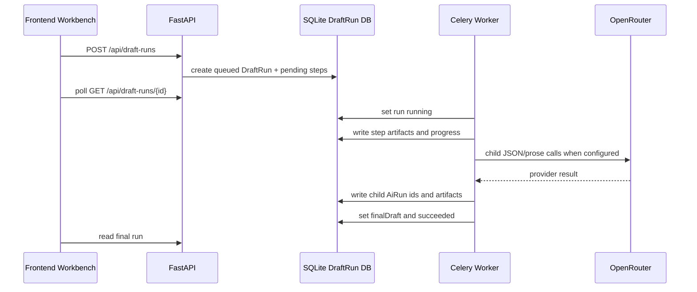
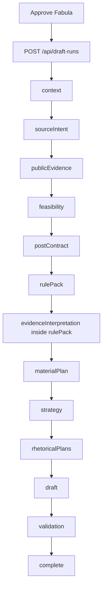
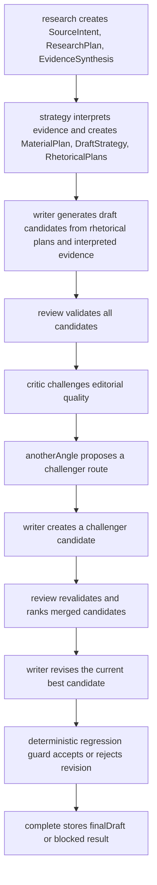
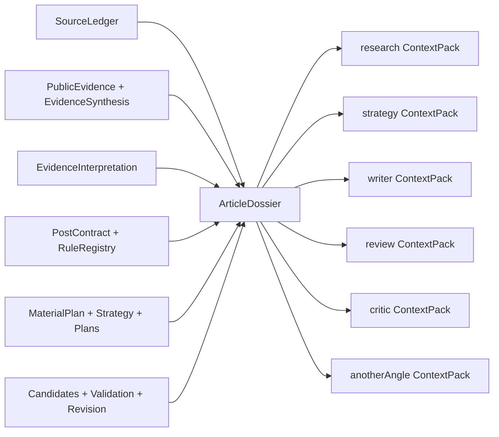

# DraftRun Pipeline AS IS

Current as of Slice 2.15.5: Alternative Angle Tournament.

This document is the maintained technical map of the current DraftRun generation
pipeline. It describes the running system as it exists now, not the target design.
Update this file and regenerate the PDF whenever a slice changes DraftRun steps,
artifacts, role model usage, context flow, retry/fallback behavior, validation,
ranking, revision, or trace semantics.

PDF quick-view copy: `docs/architecture/DRAFT_RUN_PIPELINE_AS_IS.pdf`.

Regenerate PDF:

```powershell
python scripts/generate-draft-run-pipeline-pdf.py
```

## 1. Core concepts

| Concept | Meaning | Stored where |
| --- | --- | --- |
| `DraftRun` | Parent orchestration run for one approved post fabula. It owns step order, status, final draft, and child `AiRun` ids. | `var/glavred-draft-runs.sqlite3` |
| `DraftRunStep` | One logical pipeline stage: context, source intent, public evidence, feasibility, contract, rules, planning, candidates, validation, complete. | `draft_run_steps.artifact_payload` |
| `AiRun` | One model/provider call or audited fallback inside a DraftRun. | `var/glavred-ai-runs.sqlite3` |
| `SourceLedger` | Claim/provenance inventory with allowed use, confidence, warnings, risks, and forbidden inferences. | `context` and enriched `publicEvidence` artifacts |
| `EvidenceInterpretation` | Editorial interpretation of accepted evidence: implications, tensions, usable examples, limits, forbidden overclaims, reader-value hooks, and rejected uses. | `rulePack.evidenceInterpretation`, child `AiRun` trace |
| `PostContract` | Locked editorial intent: thesis, audience, CTA, allowed claims, forbidden moves, size contract, topic/fabula obligations. | `postContract` artifact |
| `RuleRegistrySnapshot` | Machine-readable rules and validator bindings derived from contract, ledger, topic, fabula, and publisher rules. | `rulePack.ruleRegistrySnapshot` |
| `ArticleDossier` | DraftRun-local article memory built from artifacts. It is not workspace persistence and not vector storage. | selected step artifacts |
| `ContextPack` | Role-specific subset of ArticleDossier passed to LLM calls. | step artifacts and child `AiRun.requestPayload` |
| `EditorialCritiqueReport` | Report-only prosecutor/editor critique of candidate idea strength, tension, author stance, source integration, and reader value. | `validation.editorialCritiqueReport`, child `AiRun` trace |
| `AlternativeAngleTournament` | Critic-driven challenger route and candidate used to escape a weak local optimum. | `validation.alternativeAngleTournament`, child `AiRun` trace |
| `finalDraft` | The selected draft returned to the frontend after validation, ranking, and revision loop. | parent DraftRun |

## 2. Runtime topology



The frontend never treats a live queued/running DraftRun as a reason to call the
compatibility `/api/drafts/generate` fallback. Once the parent run exists, the parent
run is the source of truth until it succeeds, fails, or is shown as stale.

## 3. Current step order



The backend enum is:

`context -> sourceIntent -> publicEvidence -> feasibility -> postContract -> rulePack -> materialPlan -> strategy -> rhetoricalPlans -> draft -> validation -> complete`

## 4. Step-by-step technical flow

The role system is not a separate chat room. Roles interact through persisted
DraftRun artifacts. Each LLM call chooses a role model through
`DraftModelRoleResolver`, receives the artifact set and the role-specific
`ContextPack`, writes a child `AiRun`, and stores its result back into the parent
step artifact. The next role reads that artifact instead of relying on hidden
conversation state.

Role-aware execution map:

| Step | Active role | Model selection | Context passed to the role | Output consumed by |
| --- | --- | --- | --- | --- |
| `context` | none | no model | frontend snapshot only | source intent, ledger, feasibility |
| `sourceIntent` | `research` | `DRAFT_RESEARCH_MODEL`, then default | brief sources, context summary, initial ledger | public evidence |
| `publicEvidence` search | web search | `OPENROUTER_WEB_SEARCH_MODEL` | research plan tasks and built search query | evidence synthesis |
| `publicEvidence` synthesis | `research` | `DRAFT_RESEARCH_MODEL`, then default | accepted public evidence, initial ledger, context | enriched ledger, dossier |
| `feasibility` | none | no model | enriched ledger and warnings | contract or blocked completion |
| `postContract` | none | no model | brief, ledger, feasibility, size settings | rules, planning, validation |
| `rulePack` | none | no model | contract, ledger, publisher/topic/fabula rules | evidence interpretation, validation, revision |
| `evidenceInterpretation` inside `rulePack` | `strategy` | `DRAFT_STRATEGY_MODEL`, then default, repair, backup | enriched ledger, evidence synthesis, public evidence, contract, registry, strategy `ContextPack` | material plan, dossier, context packs |
| `materialPlan` | `strategy` | `DRAFT_STRATEGY_MODEL`, then default, repair, backup | strategy `ContextPack`, usable evidence candidates, evidence interpretation, contract, registry | draft strategy |
| `strategy` | `strategy` | `DRAFT_STRATEGY_MODEL`, then default | material plan, rules, contract, strategy `ContextPack` | rhetorical plans |
| `rhetoricalPlans` | `strategy` | `DRAFT_STRATEGY_MODEL`, then default, repair, backup | strategy, material plan, claim/rule ids | writer candidates |
| `draft` | `writer` | `DRAFT_WRITER_MODEL`, then default | writer `ContextPack`, one rhetorical plan, material evidence, contract | validation and ranking |
| `validation` lint | none | no model | candidates, contract, registry, ledger | LLM validation and ranking |
| `validation` LLM review | `review` | `DRAFT_REVIEW_MODEL`, then default, repair, backup | review `ContextPack`, candidates, deterministic findings | pairwise ranking |
| `validation` editorial critique | `critic` | `DRAFT_CRITIC_MODEL`, then default, repair, backup | critic `ContextPack`, candidates, evidence interpretation, validation findings | trace, dossier, future critique-aware ranking |
| `validation` alternative angle | `anotherAngle` then `writer` | `DRAFT_ANOTHER_ANGLE_MODEL` for route, `DRAFT_WRITER_MODEL` for challenger prose | initial validation, editorial critique, another-angle `ContextPack`, writer `ContextPack` | final validation and ranking |
| `validation` ranking | `review` | `DRAFT_REVIEW_MODEL`, then default, repair, backup | merged candidates, old scorecard, deterministic and LLM findings | revision loop |
| `validation` revision | `writer` | `DRAFT_WRITER_MODEL`, then default | current best candidate, repair goals, anti-regression constraints, writer `ContextPack` | regression guard and final draft |
| `complete` | none | no model | final DraftRun state | frontend |

Practical reading rule: when a step says `Role/model handoff: strategy`, it does
not mean that the strategy model talks directly to the writer model. It means the
strategy role writes a structured artifact, then the writer role later receives
that artifact plus its own compact context pack.

### 4.1 `context`

Purpose: build the normalized local context for the selected work item.

Input:

- approved `PostBrief`;
- `EditorialModel`;
- `draftContext` snapshot from frontend: work item, plan slot, candidate, signal,
  topic, fabula, publisher rules, author-position evidence, publication-size context.

Processing:

- `build_draft_run_context_summary(...)` normalizes the frontend snapshot;
- `SourceLedgerBuilder` builds the initial internal claim ledger.

Output:

- `contextSummary`;
- initial `sourceLedger`;
- `missingContext` and compatibility metadata when links are absent.

Role/model handoff:

- no LLM role is used;
- this step creates the first artifact boundary for later roles;
- downstream `research`, `strategy`, `writer`, and `review` calls never read the
  raw frontend workspace directly after this point.

Trace: `steps[].stepKey = context`.

### 4.2 `sourceIntent`

Purpose: convert approved brief sources into an explicit research plan.

Input:

- `PostBrief.sources`;
- context summary;
- initial SourceLedger.

Processing:

- `SourceIntentNormalizer` classifies URLs, named sources, human-language requests,
  proof needs, framing hints, exclusions, and unknown lines;
- `ResearchPlanService` may call OpenRouter through the `research` role;
- deterministic fallback preserves original wording when provider planning fails.

Output:

- normalized `sourceIntent`;
- `researchPlan`;
- child `AiRun` when OpenRouter is used.

Role/model handoff:

- active role: `research`;
- model resolver chooses `DRAFT_RESEARCH_MODEL` or falls back to
  `OPENROUTER_DEFAULT_MODEL`;
- the role receives sources, context summary, and the initial ledger;
- it returns a `ResearchPlan`, not proof;
- `publicEvidence` consumes the plan and decides what can actually be read or
  searched.

Trace: `sourceIntent` step and child `AiRun.requestPayload.draftRunStep = sourceIntentResearchPlan`.

### 4.3 `publicEvidence`

Purpose: execute available public evidence tasks and enrich the ledger.

Input:

- `sourceIntent` artifact;
- `researchPlan`;
- current context artifact.

Processing:

- exact URL tasks are read by the URL reader;
- public search tasks call OpenRouter web search only when web tools are enabled;
- disabled or unavailable search tasks remain explicit attempts, not proof;
- relevance guard rejects search-result drift;
- `EvidenceSynthesis` reconciles accepted public evidence into external claims;
- `SourceLedgerExternalEvidenceMerger` merges accepted external claims into the ledger;
- operation progress is persisted during URL/search/synthesis work.

Output:

- `PublicEvidenceBatch`: attempts, accepted evidence items, warnings;
- `EvidenceSynthesis`: external claims, decisions, warnings;
- enriched `SourceLedger`;
- initial `ArticleDossier` and all role `ContextPack`s.

Role/model handoff:

- public search uses the web-search model/config;
- evidence synthesis uses `research`.
- web search receives concrete URL/search tasks and built search queries;
- `research` synthesis receives accepted evidence candidates and decides how they
  should become external ledger claims;
- downstream roles consume the enriched ledger and dossier, not raw search output.

Trace:

- `publicEvidence` artifact;
- child `AiRun.requestPayload.draftRunStep = externalEvidenceSynthesis`;
- child web-search `AiRun` records when search is enabled.

AS IS limitation:

- public evidence retrieval and synthesis do not write prose directly. Accepted
  evidence is merged into the ledger here, then interpreted inside `rulePack` before
  material planning and writing.

### 4.4 `feasibility`

Purpose: decide whether it is safe to generate prose.

Input:

- enriched SourceLedger;
- context warnings;
- evidence availability.

Processing:

- deterministic quality gate classifies the run as feasible, feasible with
  constraints, needs research, needs human decision, or infeasible.

Output:

- `FeasibilityReport`;
- if blocked: `complete.status = blocked`, `finalDraft = null`, no local fallback.

Role/model handoff:

- no LLM role is used;
- this deterministic gate decides whether later roles are allowed to write prose;
- if blocked, `strategy`, `writer`, and `review` are not called.

Trace: `feasibility` step.

### 4.5 `postContract`

Purpose: lock what the post must preserve.

Input:

- approved brief;
- context summary;
- enriched SourceLedger;
- feasibility result;
- publication-size profile and fabula size intent.

Processing:

- `PostContractBuilder` resolves title, thesis, audience, value, goal, CTA,
  platform/date/time, topic/fabula ids, allowed claim ids, qualified claims,
  forbidden moves, evidence obligations, fabula obligations, risks, and
  `PublicationSizeContract`.

Output:

- provider-free `PostContract`.

Role/model handoff:

- no LLM role is used;
- this step creates the invariant contract that all later roles must preserve;
- `strategy` may plan within the contract, `writer` may execute it, and `review`
  evaluates candidates against it.

Trace: `postContract` step.

### 4.6 `rulePack`

Purpose: turn the contract and editorial rules into machine-readable rules.

Input:

- enriched context artifact;
- SourceLedger;
- FeasibilityReport;
- PostContract;
- topic/fabula/publisher rules.

Processing:

- `RuleRegistrySnapshot` is compiled first;
- compatibility `RulePack` is derived from the registry;
- `EvidenceInterpretationService` converts accepted internal/external evidence into
  editorial implications, tensions, examples, limits, forbidden overclaims, reader
  value hooks, and rejected evidence uses before material planning.

Output:

- `ruleRegistrySnapshot`;
- compatibility rule-pack fields;
- `evidenceInterpretation`;
- `attempts[]` for the interpretation provider/repair/backup path;
- updated `ArticleDossier` and `ContextPack`s.

Role/model handoff:

- rule compilation itself uses no LLM role;
- evidence interpretation uses the `strategy` role through `DRAFT_STRATEGY_MODEL`,
  then default, repair, optional backup, and finally deterministic fallback;
- this step translates editorial obligations into machine-readable rule ids and then
  translates evidence into usable editorial meaning;
- later role prompts receive rule ids and validator bindings so they do not work
  from anonymous prose constraints only;
- material planning and writing receive interpretation artifacts instead of raw
  citation snippets as their main source context.

Trace:

- `rulePack` step;
- child `AiRun.requestPayload.draftRunStep = evidenceInterpretation` when provider
  interpretation runs;
- `rulePack.evidenceInterpretation` readable section in `/ai-runs?runId=...`.

### 4.7 `materialPlan`

Purpose: decide what material is usable before strategy and writing.

Input:

- context summary;
- RulePack and RuleRegistry;
- EvidenceInterpretation;
- enriched SourceLedger;
- PostContract;
- strategy `ContextPack`.

Processing:

- material planner receives `usableEvidenceCandidates`;
- material planner receives `evidenceInterpretation` and should prefer implications,
  usable examples, limits, and forbidden overclaims over raw public snippets;
- it must either choose usable evidence or explain rejection reasons;
- accountability guard rejects empty/unexplained evidence selection;
- retry sequence: primary -> repair -> optional backup model -> emergency deterministic fallback.

Output:

- `MaterialPlan`;
- `availableEvidence`;
- `rejectedEvidence`;
- `claimsRequiringAttribution`;
- `qualifiedClaims`;
- `attempts[]`;
- accountability metadata;
- updated `ArticleDossier` and `ContextPack`s.

Role/model handoff:

- active role: `strategy`;
- model resolver chooses `DRAFT_STRATEGY_MODEL`, then default, then repair/backup
  where applicable;
- the role receives the strategy `ContextPack`, usable evidence candidates,
  ledger claim ids, contract, and registry;
- it must return selected or rejected evidence with reasons;
- `strategy` and `rhetoricalPlans` consume the material plan instead of scanning
  the whole ledger again.

Trace:

- `materialPlan` step;
- child `AiRun.requestPayload.draftRunStep = materialPlan`.

### 4.8 `strategy`

Purpose: define the main strategy for the post.

Input:

- context summary;
- RulePack;
- MaterialPlan;
- strategy `ContextPack`.

Processing:

- OpenRouter JSON call or deterministic fallback builds the draft strategy.

Output:

- `DraftStrategy`: thesis angle, opening move, argument sequence, fabula usage,
  CTA plan, forbidden moves, tone notes;
- updated `ArticleDossier` and `ContextPack`s.

Role/model handoff:

- active role: `strategy`;
- model resolver chooses `DRAFT_STRATEGY_MODEL` or default;
- the role receives MaterialPlan plus the strategy `ContextPack`;
- it creates the main route of argument, but cannot change the PostContract;
- `rhetoricalPlans` expands this strategy into several executable routes.

Trace: `strategy` step and child `AiRun.requestPayload.draftRunStep = strategy`.

### 4.9 `rhetoricalPlans`

Purpose: build several routes for executing the same contract.

Input:

- context summary;
- RulePack;
- MaterialPlan;
- DraftStrategy.

Processing:

- one JSON call returns 2-3 rhetorical plans;
- retry sequence: primary -> repair -> optional backup -> deterministic fallback.

Output:

- `RhetoricalPlanSet`;
- plan moves, claim ids to use/avoid, required rule ids, CTA route, risks;
- updated `ArticleDossier` and `ContextPack`s.

Role/model handoff:

- active role: `strategy`;
- model resolver chooses `DRAFT_STRATEGY_MODEL`, then repair/backup if JSON shape
  is invalid;
- the role receives contract, material plan, draft strategy, claim ids, rule ids,
  and the strategy `ContextPack`;
- it returns alternative rhetorical plans that the writer must execute;
- the writer must not invent a new route outside these plan artifacts.

Trace:

- `rhetoricalPlans` step;
- child `AiRun.requestPayload.draftRunStep = rhetoricalPlans`.

### 4.10 `draft`

Purpose: generate candidate drafts from rhetorical plans.

Input:

- request brief;
- context summary;
- RulePack;
- MaterialPlan;
- DraftStrategy;
- RhetoricalPlanSet;
- EvidenceInterpretation;
- writer `ContextPack`.

Processing:

- one candidate is generated per rhetorical plan;
- each provider failure falls back per candidate, not for the whole step;
- candidate publishability guard marks candidates eligible, penalized, or excluded;
- deterministic v1 selection creates an initial scorecard.

Output:

- `candidates[]`;
- `selection`;
- `scorecard`;
- child `AiRun` ids;
- updated `ArticleDossier` and `ContextPack`s.

Role/model handoff:

- active role: `writer`;
- model resolver chooses `DRAFT_WRITER_MODEL` or default;
- each candidate call receives one rhetorical plan, writer `ContextPack`, material
  evidence, evidence interpretation, allowed claim ids, forbidden moves, and size
  contract;
- candidates write prose, but selection still remains downstream responsibility;
- `review` receives all candidates plus validation context.

Trace:

- `draft` step;
- child `AiRun.requestPayload.draftRunStep = draftCandidate`.

AS IS behavior:

- writer prompts now receive interpreted implications, examples, limits, and forbidden
  overclaims, so public evidence should shape the argument instead of being pasted as
  a decorative citation block.

### 4.11 `validation`

Purpose: validate candidates, rank them, revise the selected candidate, and choose the final draft.

Input:

- draft artifact;
- context artifact;
- RulePack and RuleRegistry;
- MaterialPlan;
- review/writer context packs through child services.

Processing:

1. deterministic lint checks all candidates;
2. LLM validation checks all candidates and separates actionable findings from observations;
3. editorial critique challenges all candidates for idea strength, tension, author
   stance, source integration, generic prose, and reader value;
4. alternative-angle tournament may add one critic-driven challenger candidate;
5. final validation report is rebuilt when a challenger enters the pool;
6. pairwise ranking chooses the best candidate from the merged candidate pool;
7. bounded revision loop builds repair goals, revises, re-runs deterministic validation,
   compares previous best vs revised, and accepts only real improvement.

Output:

- deterministic validation report;
- `llmValidationReport`;
- `editorialCritiqueReport`;
- `alternativeAngleTournament`;
- `rankingRevision`;
- `revisionLoop`;
- final draft candidate decision;
- updated `ArticleDossier` and `ContextPack`s.

Role/model handoff:

- `review` for LLM validation and pairwise ranking;
- `critic` for report-only editorial critique;
- `anotherAngle` for challenger route generation;
- `writer` for directed revision.
- deterministic lint runs first without a model;
- `review` receives candidates, review `ContextPack`, deterministic findings,
  rules, ledger, and contract, then returns report-only findings and pairwise
  ranking;
- `critic` receives candidates, critic `ContextPack`, evidence interpretation, and
  validation context, then returns report-only critique findings and observations;
- `anotherAngle` receives the initial validation, editorial critique, dossier cards,
  and another-angle `ContextPack`, then returns one different contract-safe route;
- `writer` executes the alternative route into one challenger candidate;
- `writer` receives the current best candidate plus repair goals and constraints,
  then returns revised prose;
- regression guard decides whether the revised prose replaces the current best;
- `complete` receives only the final decision, not the whole model conversation.

Trace:

- `validation` step;
- child `AiRun.requestPayload.draftRunStep = llmValidation`;
- child `AiRun.requestPayload.draftRunStep = editorialCritique`;
- child `AiRun.requestPayload.draftRunStep = alternativeAngleRoute`;
- child `AiRun.requestPayload.draftRunStep = alternativeAngleCandidate`;
- child `AiRun.requestPayload.draftRunStep = pairwiseRanking`;
- child `AiRun.requestPayload.draftRunStep = directedRevision`.

### 4.12 `complete`

Purpose: mark the run result.

Output cases:

- normal success: parent DraftRun has `finalDraft`;
- quality-blocked success: parent DraftRun has `finalDraft = null` and `complete.status = blocked`;
- failure: parent DraftRun status is `failed` with a safe error.

Role/model handoff:

- no LLM role is used;
- this step only records the final orchestration outcome for the frontend and
  trace workbench.

## 5. Role model usage and handoff AS IS

The current role interaction is artifact-mediated. A role does not continue the
previous model's hidden conversation. It receives explicit artifacts and a
role-specific context pack, then writes a new artifact for the next role.



Role summary:

| Role | Used now | Receives | Must not do |
| --- | --- | --- | --- |
| `research` | source research planning and evidence synthesis | source intent, public evidence, context | invent facts or strengthen weak evidence |
| `strategy` | evidence interpretation, material plan, draft strategy, rhetorical plans | strategy context pack, rules, contract, material, evidence synthesis | change post thesis or bypass contract |
| `writer` | draft candidates and directed revisions | writer context pack, evidence interpretation, material plan, rhetorical plan, repair goals | create new claims or violate forbidden moves |
| `review` | LLM validation and pairwise ranking | review context pack, candidates, rules, ledger, validation reports | rewrite prose directly |
| `critic` | report-only editorial critique | critic context pack, evidence interpretation, candidates, validation context | rewrite prose or change final selection |
| `anotherAngle` | one critic-driven challenger route | another-angle context pack, initial validation, editorial critique, rejected/weak moves | act as technical backup or invent new evidence |

## 6. Context flow



Important AS IS rules:

- raw DraftRun trace is not the normal prompt context;
- `ArticleDossier` is rebuilt from selected artifacts;
- `ContextPack` selects up to 12 cards for one role;
- child `AiRun.requestPayload` stores the role model and context pack it received;
- context packs are local orchestration artifacts, not long-term memory.

## 7. Artifact catalog

| Artifact | Created by | Read by | Debug location |
| --- | --- | --- | --- |
| `SourceLedger` | context/publicEvidence | feasibility, contract, rules, planning, validation | `context.sourceLedger`, `publicEvidence.enrichedSourceLedger` |
| `SourceIntent` | sourceIntent | publicEvidence | `sourceIntent` step |
| `ResearchPlan` | sourceIntent | publicEvidence | `sourceIntent.researchPlan` |
| `PublicEvidenceBatch` | publicEvidence | evidence synthesis, trace | `publicEvidence.items`, `publicEvidence.attempts` |
| `EvidenceSynthesis` | publicEvidence | ledger merger, material planning, trace | `publicEvidence.evidenceSynthesis` |
| `EvidenceInterpretation` | rulePack | material plan, writer, dossier, trace | `rulePack.evidenceInterpretation` |
| `PostContract` | postContract | rules, planning, validation, revision | `postContract` step |
| `RuleRegistrySnapshot` | rulePack | material plan, validation, revision | `rulePack.ruleRegistrySnapshot` |
| `MaterialPlan` | materialPlan | strategy, writer, validation, ranking | `materialPlan.materialPlan` |
| `DraftStrategy` | strategy | rhetorical plans, writer | `strategy.draftStrategy` |
| `RhetoricalPlanSet` | rhetoricalPlans | draft candidates | `rhetoricalPlans.rhetoricalPlanSet` |
| `DraftCandidate` | draft | validation, ranking, revision | `draft.candidates[]` |
| `ValidationReport` | validation | ranking/revision, trace | `validation.candidateReports` |
| `LlmValidationReport` | validation | ranking/revision, trace | `validation.llmValidationReport` |
| `EditorialCritiqueReport` | validation | alternative-angle tournament, trace, dossier | `validation.editorialCritiqueReport` |
| `AlternativeAngleTournament` | validation | final validation/ranking, trace | `validation.alternativeAngleTournament` |
| `RankingRevision` | validation | final draft selection, trace | `validation.rankingRevision` |
| `ArticleDossier` | article memory service | context pack builder, trace | selected step artifacts |
| `ContextPack` | article memory service | child LLM services | step artifacts and child `AiRun.requestPayload` |

## 8. Retry, fallback, and blocked behavior

| Area | Behavior |
| --- | --- |
| live DraftRun | frontend keeps polling; no compatibility fallback while run is alive |
| stale DraftRun | diagnostic state after no timestamp progress; not automatic fallback |
| public search disabled | attempt is `notConfigured`; it is not proof |
| malformed JSON planning | repair retry, optional backup model, then deterministic fallback |
| malformed or empty evidence interpretation | repair retry, optional backup model, then deterministic interpretation fallback |
| editorial critique provider missing | `editorialCritiqueReport.status=not-run`; no fake critique |
| malformed editorial critique JSON | repair retry, optional backup model, then `not-run` for that candidate |
| alternative-angle provider missing | `alternativeAngleTournament.status=not-run`; original candidates continue |
| malformed alternative-angle route JSON | repair retry, optional backup model, then tournament `failed`; no deterministic fake angle |
| alternative-angle candidate provider failure | tournament `failed`; original candidates continue |
| material plan ignores evidence | accountability retry, optional backup model, then emergency fallback |
| candidate provider failure | fallback only for that candidate direction |
| fallback candidate selection | fallback is diagnostic unless publishability guard allows it |
| feasibility blocked | run succeeds with `finalDraft = null`; no local fallback |
| all invalid candidates | run succeeds as quality-blocked; no local fallback |
| revision regression | keep previous best candidate |

## 9. How to read a run trace

Open `/ai-runs?runId=<DraftRun ID>` and inspect in this order:

1. `context`: confirm source signal, candidate, topic, fabula, rules are present.
2. `sourceIntent`: confirm research requests were normalized correctly.
3. `publicEvidence`: confirm URL/search attempts, accepted evidence, rejected drift,
   evidence synthesis, and enriched ledger.
4. `feasibility`: confirm run was allowed or blocked for quality reasons.
5. `postContract`: confirm thesis, CTA, size, allowed claims, and forbidden moves.
6. `rulePack`: confirm rule registry exists and size/evidence rules are present.
7. `evidenceInterpretation`: inside `rulePack`, confirm implications, examples,
   limits, forbidden overclaims, rejected evidence uses, and attempts.
8. `materialPlan`: confirm selected evidence and explicit rejection reasons.
9. `strategy`: confirm the strategy does not change the contract.
10. `rhetoricalPlans`: confirm the plans are different routes, not new topics.
11. `draft`: compare candidates, source/fallback status, publishability, scorecard.
12. `validation`: inspect deterministic warnings, LLM findings, observations.
13. `editorialCritiqueReport`: inspect idea strength, tension, author stance, source
    integration, generic-prose risks, and recommended editorial moves.
14. `alternativeAngleTournament`: inspect challenger route, candidate, model attempts,
    and why it entered or failed to enter final ranking.
15. `rankingRevision`: inspect pairwise winner, revision cycles, accepted/rejected moves.
16. child `AiRun` detail: inspect prompt messages, role model, context pack, provider result.

## 10. Known AS IS limitations

- Editorial critique is active and feeds one alternative-angle challenger, but the
  deeper revision loop does not yet optimize directly against all critique findings.
- `anotherAngle` is active as one challenger route only, not as an autonomous debate
  loop or general fallback.
- `ArticleDossier` is a local compact memory artifact, not a vector store or
  cross-run RAG system.
- Revision loop improves against validator findings, but it does not yet run a deeper
  editorial debate about idea strength.
- The pipeline has detailed traceability, but the main editor UI still receives only
  one final draft and a compact status.

## 11. Maintenance rules

- This Markdown document and the PDF must be updated together.
- Regenerate the PDF after every edit:

  ```powershell
  python scripts/generate-draft-run-pipeline-pdf.py
  ```

- Future DraftRun planning, implementation, diagnostics, evaluation, and autofix work
  must read this document before changing or judging the pipeline.
- If current behavior differs from this document, update the document first or include
  the update in the same slice as the behavior change.
