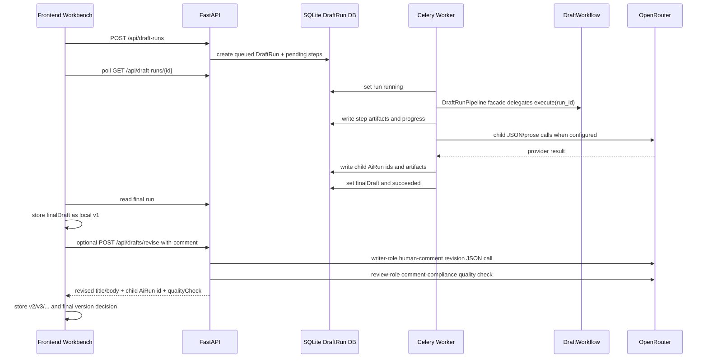
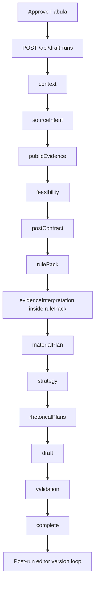
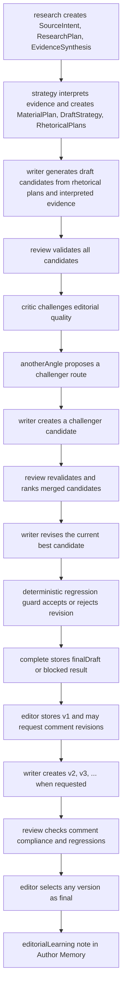
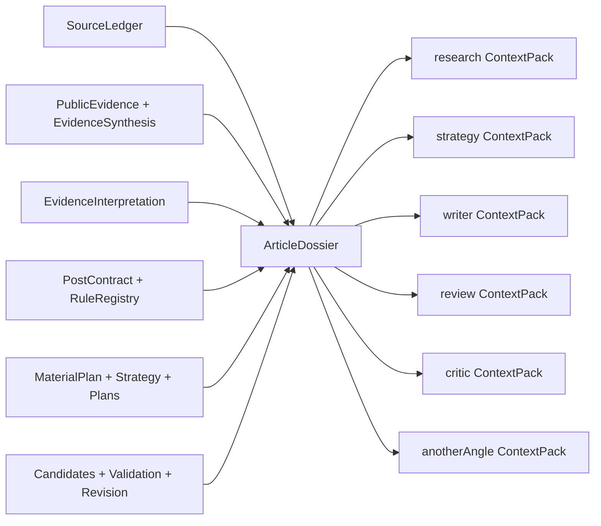

# DraftRun Pipeline AS IS

Current as of Slice 2.17.4.6.1.3.8: Writer and Alternative-Angle Dossier Migration.

This document is the maintained technical map of the current DraftRun generation
pipeline. It describes the running system as it exists now, not the target design.
Update this file and regenerate the PDF whenever a slice changes DraftRun steps,
artifacts, role model usage, context flow, retry/fallback behavior, validation,
ranking, revision, or trace semantics.

PDF quick-view copy: `docs/architecture/DRAFT_RUN_PIPELINE_AS_IS.pdf`.

Regenerate PDF:

```powershell
python scripts/generate-draft-run-pipeline-pdf.py
```

## How AS IS Participates in DoD

This document is not only a trace map. For any complex DraftRun slice it is an
acceptance contract:

1. Before planning or implementation, the slice DoD must cite the AS IS sections it
   preserves, changes, or intentionally supersedes.
2. Provider-heavy changes must derive their requirements from the current step order,
   role handoff, context flow, payload budget, operation envelope, runtime budget,
   and quality/fidelity rules in this document.
3. The slice DoD must name the runtime evidence that will prove the behavior: step
   artifact path, child `AiRun.requestPayload`, `operationEnvelope`, `payloadBudget`,
   `runtimeBudget`, `qualityFidelity`, diagnostics script output, or known debt entry.
4. At the end of the slice, the implementer must state either "AS IS unchanged" with
   the reason, or update this Markdown and regenerate
   `docs/architecture/DRAFT_RUN_PIPELINE_AS_IS.pdf`.
5. If the current AS IS behavior is known to be weaker than the target design, the
   document must say so as known debt and link the repair slice or TO BE/ADR. Do not
   describe a target state as if it already exists.

Minimum DoD input from this document:

- step order and persisted artifact handoff;
- which role/model receives which provider projection;
- whether the current provider call has direct budget proof;
- where provider retry, repair, backup, fallback, not-run, and incidents are visible;
- whether `DraftRun.status=succeeded` is enough for the claim being tested. It is not
  enough for editorial quality; use `qualityFidelity`.

## 1. Core concepts

| Concept | Meaning | Stored where |
| --- | --- | --- |
| `DraftRun` | Parent orchestration run for one approved post fabula. It owns step order, status, final draft, and child `AiRun` ids. | `var/glavred-draft-runs.sqlite3` |
| `DraftRunStep` | One logical pipeline stage: context, source intent, public evidence, feasibility, contract, rules, planning, candidates, validation, complete. | `draft_run_steps.artifact_payload` |
| `AiRun` | One model/provider call or audited fallback inside a DraftRun. | `var/glavred-ai-runs.sqlite3` |
| `SourceLedger` | Claim/provenance inventory with allowed use, confidence, warnings, risks, and forbidden inferences. | `context` and enriched `publicEvidence` artifacts |
| `EvidenceInterpretation` | Editorial interpretation of accepted evidence: implications, tensions, usable examples, limits, forbidden overclaims, reader-value hooks, and rejected uses. | `rulePack.evidenceInterpretation`, child `AiRun` trace |
| `PostContract` | Locked editorial intent: thesis, audience, CTA, allowed claims, forbidden moves, size contract, topic/fabula obligations. | `postContract` artifact |
| `RuleRegistrySnapshot` | Machine-readable rules and validator bindings derived from contract, ledger, topic, fabula, and publisher rules. | `rulePack.ruleRegistrySnapshot` |
| `ArticleDossier` | DraftRun-local article memory built from artifacts. It is not workspace persistence and not vector storage. | selected step artifacts |
| `ContextPack` | Role-specific subset of ArticleDossier passed to LLM calls. | step artifacts and child `AiRun.requestPayload` |
| `EditorialCritiqueReport` | Report-only prosecutor/editor critique of candidate idea strength, tension, author stance, source integration, and reader value. | `validation.editorialCritiqueReport`, child `AiRun` trace |
| `AlternativeAngleTournament` | Critic-driven challenger route and candidate used to escape a weak local optimum. | `validation.alternativeAngleTournament`, child `AiRun` trace |
| `RevisionLoop` | Bounded editorial optimization loop: validator repair goals plus editorial goals, old-vs-new dimension scoring, accepted/rejected revisions, and rejected moves. | `validation.rankingRevision.revisionLoop` |
| `FinalQualityGate` | Last machine acceptance layer for the delivered final draft as public prose; combines deterministic checks with an independent final-gate model review and may run bounded writer repair cycles if actionable gate findings require it. It separates real missing attribution from diagnostic attribution handoff noise. | `validation.rankingRevision.finalQualityGate` |
| `DraftRunBudget` | Effective research/execution caps derived from `Fabula.researchDepth` and backend execution mode. | `context.draftRunBudget`, downstream budget metadata |
| `PayloadBudget` | Provider-input boundary for LLM calls: operation profile, execution mode, prompt/token estimates, sent/trimmed counts, suppressed fields, semantic inputs, quality risk, and over-budget incidents. | child `AiRun.requestPayload.payloadBudget`, attempts, `operationEnvelope.payloadStats` |
| `ProviderDossier` | Typed, operation-family projection assembled from rich artifacts through deterministic context access. It records required/optional inputs, actual `sent` data, handles, counts, suppressed fields, readiness, and quality risk. Planning, writer/alternative-angle, review, ranking, revision, and final-quality runtime call sites are connected; Slice `3.9` is live-accepted by run `7bf3a7b9-4646-4b32-8bfd-cc5b200a1b47`. | provider-free replay/audit output; migrated child `AiRun.requestPayload.providerDossier` and `providerInput` |
| `ValidationRuntimeBudget` | Runtime boundary for the validation/revision loop: wall-clock, LLM-call, revision-cycle, pairwise-round, final-repair, non-improvement, heartbeat, slow-but-healthy, and canonical stop-reason accounting. | `validation.progress.runtimeBudget`, `validation.rankingRevision.runtimeBudget`, `validation.rankingRevision.revisionLoop.runtimeBudget` |
| `ProviderOperationRuntime` | Step-local progress boundary for a currently running provider operation outside the validation runtime loop. It records operation id, operation kind, operation start time, model role, selected model, prompt/token estimate when available, provider wait seconds, stale budget, and slow-but-healthy state. | `steps[].artifactPayload.progress`, `scripts/analyze_draft_run_reliability.py` runtime diagnostics |
| `SQLiteRuntimeStorageGuard` | Local durability/error-handling guard for DraftRun and child AiRun SQLite stores. It applies timeout, busy-timeout, local WAL or Docker-bind `DELETE` journal mode, normal synchronous mode, foreign keys, controlled connection open/commit/rollback, integrity checks, and storage diagnostics for malformed/unavailable DB files. | `backend.app.infrastructure.sqlite_runtime`, `SQLITE_JOURNAL_MODE`, `scripts/check_sqlite_integrity.py` |
| `QualityFidelityReport` | Final per-run distinction between technical completion, provider retry/backup/fallback recovery, evidence fidelity, validation/final-gate issue lifecycle, editorial publishability, and overall clean/degraded/attention verdict. A succeeded DraftRun is not trusted quality by itself: open critical issues block clean success, and unresolved final-gate warnings can only be publishable with caution. | `validation.rankingRevision.qualityFidelity`, `complete.qualityFidelity`, diagnostics helper output |
| `ProviderReliabilityReport` | Cross-run provider reliability summary and remediation map for retry, backup, fallback, timeout, malformed JSON, schema failure, payload/runtime budget, degraded, failed, and open critical patterns. | `python scripts/analyze_draft_run_reliability.py --run-id ...` |
| `finalDraft` | The selected draft returned to the frontend after validation, ranking, revision loop, and final quality gate. | parent DraftRun |
| `DraftVersion` | Immutable editor-facing version of the delivered draft. `v1` is the machine final draft; later versions come from human-comment revisions or manual edits. | local workspace `postDraft.versions[]` |
| `HumanCommentRevisionQualityCheck` | Diagnostic review of one human-comment revision: comment compliance, source-marker preservation, public-prose health, internal jargon leaks, and base-version regression risks. It never blocks saving the version. | local workspace `postDraft.versions[].qualityCheck`, child `AiRun` trace |
| `EditorDecisionSnapshot` | Human final-selection record linking the chosen version to machine trace summaries, unresolved risks, comments, and manual edit counts. | local workspace `finalText.editorDecisionSnapshot` |
| `EditorialLearningAuthorNote` | Auto-created author-memory note summarizing what the editor appears to have taught the system through final version choice, comments, manual edits, rejected versions, and quality checks. Starts as `pendingReview`; only accepted notes influence author-position inference. | local workspace `authorNotes[]`, type `editorialLearning` |

## 2. Runtime topology

Runtime entrypoints are compatibility-preserving:

- the Celery/API path still enters the drafting runtime through
  `backend.app.application.draft_run_pipeline.DraftRunPipeline`;
- `DraftRunPipeline` is now a thin facade that keeps the previous constructor and
  `execute(run_id)` method;
- sequencing is delegated to
  `backend.app.drafting.application.workflow.DraftWorkflow` through an ordered
  `DraftStepRegistry`;
- context/artifact, source/evidence, evidence-contract, planning, generation,
  validation, revision, final-quality, and HITL services now have canonical owners
  under `backend.app.drafting.application`;
- old `backend.app.application.*` imports for migrated runtime modules are thin
  compatibility shims only;
- prompt text, provider calls, artifact payloads, progress semantics, child `AiRun`
  persistence, and blocked/failure behavior are unchanged.



The frontend never treats a live queued/running DraftRun as a reason to call the
compatibility `/api/drafts/generate` fallback. Once the parent run exists, the parent
run is the source of truth until it succeeds, fails, or is shown as stale.

## 3. Current step order



The backend enum is:

`context -> sourceIntent -> publicEvidence -> feasibility -> postContract -> rulePack -> materialPlan -> strategy -> rhetoricalPlans -> draft -> validation -> complete`

The ordered runtime registry uses the same sequence. It is a package-boundary
refactor, not a semantic step change.

## 4. Step-by-step technical flow

The role system is not a separate chat room. Roles interact through persisted
DraftRun artifacts. Each LLM call chooses a role model through
`DraftModelRoleResolver`, receives the artifact set and the role-specific
`ContextPack`, writes a child `AiRun`, and stores its result back into the parent
step artifact. The next role reads that artifact instead of relying on hidden
conversation state.

Role-aware execution map:

| Step | Active role | Model selection | Context passed to the role | Output consumed by |
| --- | --- | --- | --- | --- |
| `context` | none | no model | frontend snapshot only | source intent, ledger, feasibility, DraftRun budget |
| `sourceIntent` | `research` | `DRAFT_RESEARCH_MODEL`, then default | brief sources, context summary, initial ledger, DraftRun budget | public evidence |
| `publicEvidence` search | web search | `OPENROUTER_WEB_SEARCH_MODEL` | budget-capped research tasks and built search query | evidence synthesis |
| `publicEvidence` synthesis | `research` | `DRAFT_RESEARCH_MODEL`, then default | accepted public evidence, initial ledger, context | enriched ledger, dossier |
| `feasibility` | none | no model | enriched ledger and warnings | contract or blocked completion |
| `postContract` | none | no model | brief, ledger, feasibility, size settings | rules, planning, validation |
| `rulePack` | none | no model | contract, ledger, publisher/topic/fabula rules | evidence interpretation, validation, revision |
| `evidenceInterpretation` inside `rulePack` | `strategy` | `DRAFT_STRATEGY_MODEL`, then default, repair, backup | compact enriched ledger, evidence synthesis, accepted public evidence, contract, relevant rule subset, strategy `ContextPack`, timeout envelope | material plan, dossier, context packs |
| `materialPlan` | `strategy` | `DRAFT_STRATEGY_MODEL`, then default, repair, backup | strategy `ContextPack`, usable evidence candidates, evidence interpretation, contract, registry | draft strategy |
| `strategy` | `strategy` | `DRAFT_STRATEGY_MODEL`, then default | material plan, rules, contract, strategy `ContextPack` | rhetorical plans |
| `rhetoricalPlans` | `strategy` | `DRAFT_STRATEGY_MODEL`, then default, repair, backup | strategy, material plan, claim/rule ids | writer candidates |
| `draft` | `writer` | `DRAFT_WRITER_MODEL`, then default, repair, backup, domain-safe fallback | writer `ContextPack`, one rhetorical plan, material evidence, contract, writer generation params | validation and ranking |
| `validation` lint | none | no model | candidates, contract, registry, ledger | LLM validation and ranking |
| `validation` LLM review | `review` | `DRAFT_REVIEW_MODEL`, then default, repair, backup | review `ContextPack`, candidates, deterministic findings | pairwise ranking |
| `validation` editorial critique | `critic` | `DRAFT_CRITIC_MODEL`, then default, repair, backup | critic `ContextPack`, candidates, evidence interpretation, validation findings | trace, dossier, future critique-aware ranking |
| `validation` alternative angle | `anotherAngle` then `writer` | `DRAFT_ANOTHER_ANGLE_MODEL` for route, `DRAFT_WRITER_MODEL` for challenger prose, repair, backup, no fake challenger fallback | initial validation, editorial critique, another-angle `ContextPack`, writer `ContextPack`, another-angle/writer generation params | final validation and ranking |
| `validation` ranking | `review` | `DRAFT_REVIEW_MODEL`, then default, repair, backup | merged candidates, old scorecard, deterministic and LLM findings | revision loop |
| `validation` revision | `writer` | `DRAFT_WRITER_MODEL`, then default, repair, backup, failed/not-run if no usable JSON | current best candidate, repair goals, anti-regression constraints, writer `ContextPack`, revision generation params | regression guard and final draft |
| `validation` final quality gate | `finalGate`, then optional `writer` | `DRAFT_FINAL_GATE_MODEL`, or independent critic/review/default fallback; `DRAFT_WRITER_MODEL` for bounded final repair cycles | delivered final candidate, `FinalQualityContract`, validation reports, critique, evidence interpretation, ledger, contract, rule registry, material plan | accepted public draft or rejected repair trace |
| `complete` | none | no model | final DraftRun state | frontend |
| post-run human comment revision | `writer` | `DRAFT_WRITER_MODEL`, then default, repair, backup, failed if no usable JSON | selected `DraftVersion`, editor comment, compact machine trace context from final quality gate, revision loop, alternative angle, validation, contract/material evidence | new local `DraftVersion`; not a new DraftRun |
| post-run human revision quality check | `review` | `DRAFT_REVIEW_MODEL`, then default, repair, backup, `notRun` if no usable JSON | base version, revised version, editor comment, compact machine trace context, source markers and public-prose constraints | `DraftVersion.qualityCheck`; child `AiRun`, not a DraftRun step |

Practical reading rule: when a step says `Role/model handoff: strategy`, it does
not mean that the strategy model talks directly to the writer model. It means the
strategy role writes a structured artifact, then the writer role later receives
that artifact plus its own compact context pack.

### 4.1 `context`

Purpose: build the normalized local context for the selected work item.

Input:

- approved `PostBrief`;
- `EditorialModel`;
- `draftContext` snapshot from frontend: work item, plan slot, candidate, signal,
  topic, fabula, publisher rules, author-position evidence, publication-size context.

Processing:

- `build_draft_run_context_summary(...)` normalizes the frontend snapshot;
- `SourceLedgerBuilder` builds the initial internal claim ledger.
- `DraftRunBudgetResolver` combines `fabula.researchDepth` with
  `DRAFT_RUN_EXECUTION_MODE`.

Output:

- `contextSummary`;
- initial `sourceLedger`;
- `draftRunBudget`;
- `missingContext` and compatibility metadata when links are absent.

Role/model handoff:

- no LLM role is used;
- this step creates the first artifact boundary for later roles;
- downstream `research`, `strategy`, `writer`, and `review` calls never read the
  raw frontend workspace directly after this point.

Trace: `steps[].stepKey = context`.

### 4.2 `sourceIntent`

Purpose: convert approved brief sources into an explicit research plan.

Input:

- `PostBrief.sources`;
- context summary;
- initial SourceLedger.

Processing:

- `SourceIntentNormalizer` classifies URLs, named sources, human-language requests,
  proof needs, framing hints, exclusions, and unknown lines;
- `ResearchPlanService` may call OpenRouter through the `research` role;
- deterministic fallback preserves original wording when provider planning fails;
- `source_research_budgeting` caps executable verification tasks and records
  `budgetTrace.budgetSkipped` instead of silently dropping them.

Output:

- normalized `sourceIntent`;
- `researchPlan`;
- `draftRunBudget` and `budgetTrace`;
- child `AiRun` when OpenRouter is used.

Role/model handoff:

- active role: `research`;
- model resolver chooses `DRAFT_RESEARCH_MODEL` or falls back to
  `OPENROUTER_DEFAULT_MODEL`;
- the role receives sources, context summary, and the initial ledger;
- it returns a `ResearchPlan`, not proof;
- `publicEvidence` consumes the plan and decides what can actually be read or
  searched.

Trace: `sourceIntent` step and child `AiRun.requestPayload.draftRunStep = sourceIntentResearchPlan`.

### 4.3 `publicEvidence`

Purpose: execute available public evidence tasks and enrich the ledger.

Input:

- `sourceIntent` artifact;
- `researchPlan`;
- current context artifact.

Processing:

- exact URL tasks are read by the URL reader;
- public search tasks call OpenRouter web search only when web tools are enabled;
- retrieval tasks, URL reads, and search result counts are capped by `DraftRunBudget`;
- disabled or unavailable search tasks remain explicit attempts, not proof;
- relevance guard rejects search-result drift;
- `EvidenceSynthesis` reconciles accepted public evidence into external claims;
- `SourceLedgerExternalEvidenceMerger` merges accepted external claims into the ledger;
- accepted evidence items and external ledger claims are trimmed by budget before
  downstream planning;
- operation progress is persisted during URL/search/synthesis work.

Output:

- `PublicEvidenceBatch`: attempts, accepted evidence items, warnings;
- `EvidenceSynthesis`: external claims, decisions, warnings;
- enriched `SourceLedger`;
- budget metadata: used counts, cap hits, skipped tasks, trimmed evidence/claims;
- initial `ArticleDossier` and all role `ContextPack`s.

Role/model handoff:

- public search uses the web-search model/config;
- evidence synthesis uses `research`.
- web search receives concrete URL/search tasks and built search queries;
- `research` synthesis receives accepted evidence candidates and decides how they
  should become external ledger claims;
- downstream roles consume the enriched ledger and dossier, not raw search output.

Trace:

- `publicEvidence` artifact;
- child `AiRun.requestPayload.draftRunStep = externalEvidenceSynthesis`;
- child web-search `AiRun` records when search is enabled.

AS IS limitation:

- public evidence retrieval and synthesis do not write prose directly. Accepted
  evidence is merged into the ledger here, then interpreted inside `rulePack` before
  material planning and writing.

### 4.4 `feasibility`

Purpose: decide whether it is safe to generate prose.

Input:

- enriched SourceLedger;
- context warnings;
- evidence availability.

Processing:

- deterministic quality gate classifies the run as feasible, feasible with
  constraints, needs research, needs human decision, or infeasible.

Output:

- `FeasibilityReport`;
- if blocked: `complete.status = blocked`, `finalDraft = null`, no local fallback.

Role/model handoff:

- no LLM role is used;
- this deterministic gate decides whether later roles are allowed to write prose;
- if blocked, `strategy`, `writer`, and `review` are not called.

Trace: `feasibility` step.

### 4.5 `postContract`

Purpose: lock what the post must preserve.

Input:

- approved brief;
- context summary;
- enriched SourceLedger;
- feasibility result;
- publication-size profile and fabula size intent.

Processing:

- `PostContractBuilder` resolves title, thesis, audience, value, goal, CTA,
  platform/date/time, topic/fabula ids, allowed claim ids, qualified claims,
  forbidden moves, evidence obligations, fabula obligations, risks, and
  `PublicationSizeContract`.

Output:

- provider-free `PostContract`.

Role/model handoff:

- no LLM role is used;
- this step creates the invariant contract that all later roles must preserve;
- `strategy` may plan within the contract, `writer` may execute it, and `review`
  evaluates candidates against it.

Trace: `postContract` step.

### 4.6 `rulePack`

Purpose: turn the contract and editorial rules into machine-readable rules.

Input:

- enriched context artifact;
- SourceLedger;
- FeasibilityReport;
- PostContract;
- topic/fabula/publisher rules.

Processing:

- `rulePack` is marked `running` before provider-backed evidence interpretation, so a
  long JSON retry path is visible as `rulePack`, not as stale `postContract`;
- `RuleRegistrySnapshot` is compiled first;
- compatibility `RulePack` is derived from the registry;
- the provider request is compacted before JSON generation: full `ruleRegistrySnapshot`
  stays in the artifact, while the model receives relevant hard/critical/evidence/
  style/attribution/topic/fabula rules, accepted public evidence summaries, external
  ledger claims, evidence synthesis, and the locked contract;
- each provider attempt runs inside `DRAFT_EVIDENCE_INTERPRETATION_TIMEOUT_SECONDS`
  so a stuck strategy-model call can fail, write a child `AiRun`, and continue to
  repair/backup/fallback instead of leaving `rulePack` running forever;
- `EvidenceInterpretationService` converts accepted internal/external evidence into
  editorial implications, tensions, examples, limits, forbidden overclaims, reader
  value hooks, and rejected evidence uses before material planning;
- `EvidenceInterpretationFidelityPolicy` classifies the interpretation as
  `sufficient`, `partial`, `weak`, or `missing`. Retry/repair and backup acceptance
  are recovery signals, not evidence degradation by themselves. Deterministic
  fallback always lowers evidence fidelity, and missing accepted evidence blocks a
  trusted editorial verdict.

Output:

- `ruleRegistrySnapshot`;
- compatibility rule-pack fields;
- `evidenceInterpretation`;
- `evidenceInterpretationFidelity`;
- `attempts[]` for the interpretation provider/repair/backup path;
- updated `ArticleDossier` and `ContextPack`s.

Role/model handoff:

- rule compilation itself uses no LLM role;
- evidence interpretation uses the `strategy` role through `DRAFT_STRATEGY_MODEL`,
  then default, repair, optional backup, and finally deterministic fallback;
- this step translates editorial obligations into machine-readable rule ids and then
  translates evidence into usable editorial meaning;
- later role prompts receive rule ids and validator bindings so they do not work
  from anonymous prose constraints only;
- material planning and writing receive interpretation artifacts instead of raw
  citation snippets as their main source context.

Trace:

- `rulePack` step;
- child `AiRun.requestPayload.draftRunStep = evidenceInterpretation` when provider
  interpretation runs;
- `artifactPayload.progress.operations[]` contains `evidenceInterpretation`
  primary/repair/backup attempts while the step is running;
- child `AiRun.requestPayload.inputStats` records original/compact rule counts, claim
  counts, evidence counts, prompt char estimate, selected model, and timeout seconds;
- attempt records may include `status=timeout` plus operation timing notes such as
  prompt build, provider request, JSON/shape validation, and AiRun persistence;
- `rulePack.evidenceInterpretation` readable section in `/ai-runs?runId=...`.

### 4.7 `materialPlan`

Purpose: decide what material is usable before strategy and writing.

Input:

- context summary;
- RulePack and RuleRegistry;
- EvidenceInterpretation;
- enriched SourceLedger;
- PostContract;
- strategy `ContextPack`.

Processing:

- material planner receives `usableEvidenceCandidates`;
- the candidate list is capped by `DraftRunBudget.maxUsableEvidenceCandidates`;
- material planner receives `evidenceInterpretation` and should prefer implications,
  usable examples, limits, and forbidden overclaims over raw public snippets;
- it must either choose usable evidence or explain rejection reasons;
- accountability guard rejects empty/unexplained evidence selection;
- retry sequence: primary -> repair -> optional backup model -> emergency deterministic fallback.

Output:

- `MaterialPlan`;
- `availableEvidence`;
- `rejectedEvidence`;
- `claimsRequiringAttribution`;
- `qualifiedClaims`;
- `attempts[]`;
- accountability metadata;
- updated `ArticleDossier` and `ContextPack`s.

Role/model handoff:

- active role: `strategy`;
- model resolver chooses `DRAFT_STRATEGY_MODEL`, then default, then repair/backup
  where applicable;
- the role receives the strategy `ContextPack`, usable evidence candidates,
  ledger claim ids, contract, and registry;
- it must return selected or rejected evidence with reasons;
- `strategy` and `rhetoricalPlans` consume the material plan instead of scanning
  the whole ledger again.

Trace:

- `materialPlan` step;
- child `AiRun.requestPayload.draftRunStep = materialPlan`.

### 4.8 `strategy`

Purpose: define the main strategy for the post.

Input:

- context summary;
- RulePack;
- MaterialPlan;
- strategy `ContextPack`.

Processing:

- OpenRouter JSON call or deterministic fallback builds the draft strategy.

Output:

- `DraftStrategy`: thesis angle, opening move, argument sequence, fabula usage,
  CTA plan, forbidden moves, tone notes;
- updated `ArticleDossier` and `ContextPack`s.

Role/model handoff:

- active role: `strategy`;
- model resolver chooses `DRAFT_STRATEGY_MODEL` or default;
- the role receives MaterialPlan plus the strategy `ContextPack`;
- it creates the main route of argument, but cannot change the PostContract;
- `rhetoricalPlans` expands this strategy into several executable routes.

Trace: `strategy` step and child `AiRun.requestPayload.draftRunStep = strategy`.

### 4.9 `rhetoricalPlans`

Purpose: build several routes for executing the same contract.

Input:

- context summary;
- RulePack;
- MaterialPlan;
- DraftStrategy.

Processing:

- one JSON call returns 2-3 rhetorical plans;
- retry sequence: primary -> repair -> optional backup -> deterministic fallback.

Output:

- `RhetoricalPlanSet`;
- plan moves, claim ids to use/avoid, required rule ids, CTA route, risks;
- updated `ArticleDossier` and `ContextPack`s.

Role/model handoff:

- active role: `strategy`;
- model resolver chooses `DRAFT_STRATEGY_MODEL`, then repair/backup if JSON shape
  is invalid;
- the role receives contract, material plan, draft strategy, claim ids, rule ids,
  and the strategy `ContextPack`;
- it returns alternative rhetorical plans that the writer must execute;
- the writer must not invent a new route outside these plan artifacts.

Trace:

- `rhetoricalPlans` step;
- child `AiRun.requestPayload.draftRunStep = rhetoricalPlans`.

### 4.10 `draft`

Purpose: generate candidate drafts from rhetorical plans.

Input:

- request brief;
- context summary;
- RulePack;
- MaterialPlan;
- DraftStrategy;
- RhetoricalPlanSet;
- EvidenceInterpretation;
- writer `ContextPack`.

Processing:

- one candidate is generated per rhetorical plan;
- the executed candidate count is capped by `DraftRunBudget.maxDraftCandidates`
  before provider calls are attempted;
- each provider failure falls back per candidate, not for the whole step;
- candidate publishability guard marks candidates eligible, penalized, or excluded;
- deterministic v1 selection creates an initial scorecard.

Output:

- `candidates[]`;
- `selection`;
- `scorecard`;
- child `AiRun` ids;
- updated `ArticleDossier` and `ContextPack`s.

Role/model handoff:

- active role: `writer`;
- model resolver chooses `DRAFT_WRITER_MODEL` or default;
- each candidate call reloads persisted artifacts through `DraftRunContextAccessService`
  and receives one `WriterDossierFactory` projection: rhetorical route, compact
  planning decisions, evidence/claim/rule handles, forbidden moves, and size/style
  contract;
- the standard writer projection retains one route, four curated evidence items, two
  claim handles, and five relevant rules; omitted optional detail stays trace-visible
  through dossier counts and handles rather than entering the provider prompt;
- each JSON candidate attempt follows the universal retry sequence: primary writer
  model, repair prompt, optional backup model, then domain-safe deterministic fallback
  only if provider attempts are exhausted;
- primary writer attempts use `DRAFT_WRITER_TEMPERATURE` and `DRAFT_WRITER_TOP_P`;
- repair and backup attempts use `DRAFT_JSON_REPAIR_TEMPERATURE`, not the creative
  writer temperature;
- writer prompts forbid leaking internal artifact names such as `SourceLedger`,
  `publicEvidence`, `validators`, `RuleRegistry`, or `PostContract` as unexplained
  public dev-jargon;
- candidates write prose, but selection still remains downstream responsibility;
- `review` receives all candidates plus validation context.

Trace:

- `draft` step;
- child `AiRun.requestPayload.draftRunStep = draftCandidate`;
- direct `providerInput`, `providerDossier.runtimeMigrated=true`, `payloadBudget`,
  `inputStats`, and `payloadStats` for every primary/repair/backup attempt.

AS IS behavior:

- writer prompts now receive interpreted implications, examples, limits, and forbidden
  overclaims, so public evidence should shape the argument instead of being pasted as
  a decorative citation block;
- each provider attempt is visible through child `AiRun` audit with model role,
  selected model, attempt label, repair/backup marker, generation params, and safe
  validation error.

### 4.11 `validation`

Purpose: validate candidates, rank them, revise the selected candidate, and choose the final draft.

Input:

- draft artifact;
- context artifact;
- RulePack and RuleRegistry;
- MaterialPlan;
- review/writer context packs through child services.

Processing:

1. deterministic lint checks all candidates;
2. LLM validation checks all candidates and separates actionable findings from observations;
3. editorial critique challenges all candidates for idea strength, tension, author
   stance, source integration, generic prose, and reader value;
4. alternative-angle tournament may add one critic-driven challenger candidate; both
   route JSON and challenger-prose JSON use primary/repair/backup attempts, and no
   fake deterministic challenger is invented when all attempts fail;
5. final validation report is extended when a challenger enters the pool: initial
   candidate reports are reused, provider-heavy validation runs only for the new
   challenger, and the reports are merged into one final candidate-pool report;
6. pairwise ranking chooses the best candidate from the merged candidate pool;
7. deep revision loop builds validator and editorial goals, revises, re-runs
   deterministic validation, compares previous best vs revised across editorial
   dimensions, and accepts only targeted improvement without regression. Accepted
   cycles record concrete reasons such as resolved goals, clear pairwise win, and no
   deterministic regression;
8. final quality gate builds a `FinalQualityContract` from Fabula research depth,
   publication kind, post contract, rule registry, and material plan. It checks the
   delivered candidate with deterministic public-prose rules and an independent
   `finalGate` model review. If it leaks internal pipeline names, reads like a source
   dump, loses author stance relative to the contract, or misses reader value, the
   gate creates bounded final repair instructions for the writer. The number of final
   repair cycles is controlled by `DRAFT_FINAL_REPAIR_MAX_ITERATIONS` (default `2`).
   A repaired draft is accepted only when deterministic regression and gate findings
   improve. Attribution warnings are actionable only when they resolve to source-backed
   claim ids with expected markers that are missing from the final body. Free-text
   attribution requirements that cannot be resolved become diagnostic handoff noise;
   if the independent final-gate review passes source integration, that diagnostic
   noise does not launch final repair;
9. validation and final-gate warnings/critical findings are folded into
   `qualityFidelity.issueLifecycle`. Each item is classified as `resolved`,
   `suppressed`, `acceptedRisk`, or `open`. Accepted final repair resolves the
   gate issue it repaired. Explicit suppression or accepted risk remains visible in
   trace. Open critical findings block trusted editorial quality, and an unresolved
   final-gate warning prevents `cleanSuccess` even when `DraftRun.status` is
   `succeeded`;
10. provider-heavy validation sub-operations persist progress as they run; if a late
   operation fails, the operation is marked `failed`, safe error details are saved,
   and the previous best candidate is kept when one exists.

Output:

- deterministic validation report;
- `llmValidationReport`;
- `editorialCritiqueReport`;
- `alternativeAngleTournament`;
- `rankingRevision`;
- `revisionLoop` with editorial goals, dimension scores, rejected moves, and stop
  reason;
- `finalQualityGate` with final quality contract, independent review attempts,
  final-draft status, public-prose status, source-dump risk, actionable attribution
  findings, diagnostic attribution noise, attribution review closure, final repair
  goals, repair cycles, repair result, and gate-level final decision;
- `qualityFidelity.issueLifecycle` with lifecycle status and reason for validation
  and final-gate warning/critical issues, including synthetic final-gate items when
  the gate status is `warning` or `critical`;
- `progress` with nested validation operations, child `AiRun` ids, failed-operation
  status, and safe error details when a provider-heavy sub-operation fails;
- final draft candidate decision;
- updated `ArticleDossier` and `ContextPack`s.

Role/model handoff:

- `review` for LLM validation and pairwise ranking;
- `critic` for report-only editorial critique;
- `anotherAngle` for challenger route generation;
- `finalGate` for independent final public-prose acceptance;
- `writer` for directed revision and final public-prose repair.
- deterministic lint runs first without a model;
- `review` receives candidates, review `ContextPack`, deterministic findings,
  rules, ledger, and contract, then returns report-only findings and pairwise
  ranking;
- `critic` receives candidates, critic `ContextPack`, evidence interpretation, and
  validation context, then returns report-only critique findings and observations;
- `anotherAngle` receives an `AlternativeAngleDossierFactory` projection with compact
  candidate summaries, critique signals, validation issues, rejected moves, contract
  invariants, and supporting handles, then returns one different contract-safe route;
- route input is bounded to three candidate summaries, three critique summaries, three
  validation issues, two rejected moves, two evidence items, and two rules; each
  retained rejected-move handle resolves through the persisted editorial critique;
- the accepted route is persisted into the running validation artifact before
  `WriterDossierFactory(alternativeAngleCandidate)` resolves it for challenger prose;
- `finalGate` receives the delivered final candidate, `FinalQualityContract`,
  deterministic gate findings, validation context, evidence interpretation, ledger,
  rule registry, material plan, and attribution requirement resolution, then returns
  independent findings, observations, and final repair goals;
- `writer` may execute bounded final public-prose repair cycles after the revision
  loop if `finalQualityGate` returns `warning` or `critical`;
- `writer` receives the current best candidate plus validator repair goals,
  editorial goals, rejected moves, dossier/context pack, and constraints, then returns
  revised prose;
- directed revision attempts use `DRAFT_REVISION_TEMPERATURE` and
  `DRAFT_REVISION_TOP_P`; malformed-JSON repair and backup attempts use the JSON
  repair temperature;
- regression guard checks deterministic health, and `review` compares old-vs-new by
  idea strength, tension, reader value, author stance, source integration, structure,
  and validator health;
- acceptance policy decides whether the revised prose replaces the current best;
- `complete` receives only the final decision, not the whole model conversation.

Trace:

- `validation` step;
- child `AiRun.requestPayload.draftRunStep = llmValidation`;
- child `AiRun.requestPayload.draftRunStep = editorialCritique`;
- child `AiRun.requestPayload.draftRunStep = alternativeAngleRoute`;
- child `AiRun.requestPayload.draftRunStep = alternativeAngleCandidate`;
- child `AiRun.requestPayload.draftRunStep = pairwiseRanking`;
- child `AiRun.requestPayload.draftRunStep = directedRevision`.

### 4.12 `complete`

Purpose: mark the run result.

Output cases:

- normal success: parent DraftRun has `finalDraft`;
- quality-blocked success: parent DraftRun has `finalDraft = null` and `complete.status = blocked`;
- failure: parent DraftRun status is `failed` with a safe error.

Role/model handoff:

- no LLM role is used;
- this step only records the final orchestration outcome for the frontend and
  trace workbench.

### 4.13 Post-run editor version loop

Purpose: let the human editor keep improving or manually editing the delivered
machine draft without mutating older versions.

Inputs:

- parent `DraftRun.finalDraft`, stored locally as `DraftVersion v1` with
  `source=machineFinal`;
- active draft version chosen by the editor;
- optional editor comment;
- optional compact machine trace context from the parent DraftRun: final quality
  gate summary, revision loop summary, alternative-angle outcome, validation
  summary, unresolved risks, post contract, and material evidence.

Behavior:

- the editor can switch between saved versions;
- manual text edits are local until the user saves them as a new
  `source=manualEdit` version;
- one click on `Улучшить по комментарию` calls
  `POST /api/drafts/revise-with-comment`;
- that endpoint is not a new DraftRun. It is a post-run writer-role JSON call with
  child `AiRun` audit and existing JSON retry discipline;
- after a successful writer revision, the endpoint runs a lightweight `review` role
  quality check. It evaluates whether the revised version followed the editor
  comment, preserved visible source markers from the base version, avoided internal
  pipeline jargon, and did not regress as public prose;
- quality check failure or provider unavailability does not cancel the created
  version. The version receives `qualityCheck.status = notRun` with attempt metadata;
- provider failure does not create a fake version;
- the editor can mark any saved version as final, including `v1` after later
  versions exist;
- final version selection creates or updates one deterministic
  `editorialLearning` note in Author Memory. The note is visible immediately with
  status `pendingReview`, but it does not influence author-position inference until
  the editor accepts it.

Output:

- local `PostDraft.versions[]`, `activeVersionId`, and `finalVersionId`;
- compatibility mirror fields `PostDraft.title/body/version` always reflect the
  active version;
- `FinalText.draftVersionId`, `FinalText.versionNumber`, and
  `FinalText.editorDecisionSnapshot`;
- `DraftVersion.qualityCheck` for human-comment revisions when the review ran or
  explicitly could not run;
- one `AuthorNote.type = editorialLearning` with selected/rejected version metadata,
  comment summaries, manual edit count, quality-check summaries, unresolved risks,
  suggested takeaway, and status `pendingReview | accepted | rejected`.

Role/model handoff:

- post-run human-comment revision uses the `writer` role;
- it receives a compact machine context, not raw DraftRun JSON;
- it must preserve source markers, allowed claims, forbidden moves, and final
  quality constraints.
- post-run human revision quality check uses the `review` role;
- it is diagnostic: it can mark the version as passed, warning, critical, or not-run,
  but it cannot block saving or final approval.

## 5. Role model usage and handoff AS IS

The current role interaction is artifact-mediated. A role does not continue the
previous model's hidden conversation. It receives explicit artifacts and a
role-specific context pack, then writes a new artifact for the next role.



Role summary:

| Role | Used now | Receives | Must not do |
| --- | --- | --- | --- |
| `research` | source research planning and evidence synthesis | source intent, public evidence, context | invent facts or strengthen weak evidence |
| `strategy` | evidence interpretation, material plan, draft strategy, rhetorical plans | strategy context pack, rules, contract, material, evidence synthesis | change post thesis or bypass contract |
| `writer` | draft candidates and directed revisions | writer context pack, evidence interpretation, material plan, rhetorical plan, repair goals | create new claims or violate forbidden moves |
| `review` | LLM validation and pairwise ranking | review context pack, candidates, rules, ledger, validation reports | rewrite prose directly |
| `critic` | report-only editorial critique | critic context pack, evidence interpretation, candidates, validation context | rewrite prose or change final selection |
| `anotherAngle` | one critic-driven challenger route | another-angle context pack, initial validation, editorial critique, rejected/weak moves | act as technical backup or invent new evidence |
| `writer` post-run | human-comment revision of one saved version | active draft version, editor comment, compact machine trace context | mutate prior versions or fabricate a successful revision after provider failure |
| `review` post-run | comment-compliance quality check for human-comment revisions | base version, revised version, editor comment, compact machine trace context | block saving a successful revision or turn warnings into learning signals automatically |

## 6. Context flow



Important AS IS rules:

- raw DraftRun trace is not the normal prompt context;
- `ArticleDossier` is rebuilt from selected artifacts;
- `ContextPack` selects up to 12 cards for one role;
- child `AiRun.requestPayload` stores the role model and context pack it received;
- context packs are local orchestration artifacts, not long-term memory.

Slice `2.17.4.6.1.3.6` adds an available provider-free context/dossier foundation:

- `DraftRunContextAccessService` reads compact contract, evidence, rule, planning,
  candidate, validation, and final-quality views deterministically;
- planning, writer, review, ranking, revision, and final-quality dossier factories
  return typed `ProviderDossier` contracts;
- compact entries carry stable handles back to full persisted artifacts;
- missing required inputs block readiness, while trimming and missing optional input
  remain explicit quality risk;
- `scripts/audit_draft_run_provider_dossiers.py` replays all six dossier families
  without providers and reports actual projected size, unresolved handles, and
  forbidden-field violations.

The foundation is now connected across the target runtime operations. Planning operations
`materialPlan`, `strategy`, `rhetoricalPlans`, `draftCandidate`,
`alternativeAngleRoute`, `alternativeAngleCandidate`, `llmValidation`,
`pairwiseRanking`, `directedRevision`, and `finalQualityGateReview` use typed dossiers.
The `3.9` code path is current AS IS and live-accepted. Run `7bf3...` proves all four
target operation families inside their 22000/24000 caps, sufficient evidence,
publishable final quality, and zero open critical/warning issues.

### 6.1 Context Handoff and Provider Input Contract

This section defines what future DoD must check before changing provider-heavy
DraftRun behavior.

Terms:

- `rich artifact`: the full persisted DraftRun artifact. It stays in storage and
  trace for audit/debug.
- `provider projection`: the curated subset sent to one provider call. It may be a
  role `ContextPack`, a payload-budget compact payload, an operation-specific
  dossier, or a transitional compact structure.
- `direct budget proof`: the current provider call itself records `payloadBudget`
  limits, sent/trimmed counts, prompt estimate, token estimate, and suppressed fields
  in child `AiRun.requestPayload`, attempts, or the current `operationEnvelope`.
- `trace proof`: the concrete trace path that proves what was sent, what was
  trimmed, which model was used, and how retry/backup/fallback behaved.
- `known debt`: an AS IS limitation that is deliberately carried forward and linked
  to a repair slice. Known debt is not target architecture.

Strict AS IS invariants:

- the step order remains
  `context -> sourceIntent -> publicEvidence -> feasibility -> postContract -> rulePack -> materialPlan -> strategy -> rhetoricalPlans -> draft -> validation -> complete`;
- roles communicate through persisted artifacts, not hidden model conversation state;
- `DraftRun.status=succeeded` means the worker completed, not that the text is trusted
  editorial quality;
- provider retry, repair, backup, fallback, not-run, timeout, and schema/JSON
  incidents must be visible through structured trace;
- a nested `payloadBudget` copied from an older artifact is not direct proof that the
  current provider call was bounded.

Provider-heavy AS IS contract:

| Operation | Current rich artifacts | Current provider projection / ContextPack | Required trace proof | Direct budget status | Known debt / target slice |
| --- | --- | --- | --- | --- | --- |
| `sourceIntentAndResearchPlan` | brief sources, context summary, initial source ledger, DraftRun budget | research prompt over brief sources, normalized context summary, initial ledger, budget caps | child `AiRun`, `sourceIntent.researchPlan`, skipped budget trace | partial/transitional; planning output has trace but no full provider-input dossier | Dossier boundary target after the planning budget gate |
| `evidenceSynthesis` | public evidence attempts, accepted/rejected evidence, initial/enriched ledger | accepted public evidence plus relevant ledger/context | `publicEvidence.evidenceSynthesis`, child `AiRun`, accepted/rejected evidence trace | partial/transitional | Dossier and evidence-query access target in `2.17.4.6.1.3.6` |
| `evidenceInterpretation` | enriched ledger, accepted public evidence, evidence synthesis, contract, rule subset | compact evidence payload plus strategy `ContextPack`, timeout envelope | `rulePack.evidenceInterpretation`, `evidenceInterpretationFidelity`, child `AiRun`, `operationEnvelope`, timeout/input stats | enforced for representative operation | Further context-access hardening in `2.17.4.6.1.3.6` |
| `materialPlan` | evidence interpretation, usable evidence candidates, post contract, rule registry, strategy context | `PlanningDossierFactory(materialPlan)` projection: compact post contract, interpreted evidence/claim handles, relevant rules, attempt repair context | `materialPlan.materialPlan`, selected/rejected evidence reasons, child `AiRun.requestPayload.providerDossier.runtimeMigrated=true`, direct `providerInput`, `payloadBudget`, `inputStats`, `payloadStats` | enforced per primary/repair/backup call; replay baseline projects 16810 chars with no forbidden fields | Runtime dossier migration complete in `2.17.4.6.1.3.7`; live quality proof is stored with the slice evidence |
| `strategy` | material plan, post contract, rule registry, strategy context | `PlanningDossierFactory(strategy)` projection: compact post contract, MaterialPlan, interpreted evidence/handles, relevant rules, attempt repair context | `strategy.draftStrategy`, child `AiRun.requestPayload.providerDossier.runtimeMigrated=true`, direct `providerInput`, `payloadBudget`, `inputStats`, `payloadStats`, model role metadata | enforced per primary/repair/backup call; budget profile remains `draftStrategy`; replay baseline projects 17720 chars | Runtime dossier migration complete in `2.17.4.6.1.3.7` |
| `rhetoricalPlans` | strategy, material plan, claim/rule ids | `PlanningDossierFactory(rhetoricalPlans)` projection: compact post contract, MaterialPlan, DraftStrategy, evidence/rule handles, attempt repair context | `rhetoricalPlans.rhetoricalPlanSet`, attempts, child `AiRun.requestPayload.providerDossier.runtimeMigrated=true`, direct `providerInput`, `payloadBudget`, `inputStats`, `payloadStats` | enforced per primary/repair/backup call; replay baseline projects 17203 chars | Runtime dossier migration complete in `2.17.4.6.1.3.7` |
| `draftCandidate` | one rhetorical plan, material evidence, contract, generation params | `WriterDossierFactory(draftCandidate)` projection with one route, compact planning, four evidence items, two claim handles, five rules, forbidden moves, and size/style constraints | `draft.candidates[]`, child `AiRun.requestPayload.providerDossier.runtimeMigrated=true`, direct budget proof, fallback/publishability status | enforced per primary/repair/backup call; standard cap 24000 chars | Runtime dossier migration complete in `2.17.4.6.1.3.8` |
| `llmValidation` | one persisted candidate, deterministic findings, post contract, evidence/rule handles | `ReviewDossierFactory` projection with exact candidate prose, compact candidate-specific findings and bounded optional evidence/rules | `validation.llmValidationReport`, candidate reports, child `AiRun.requestPayload.providerDossier`, direct budget and incidents | enforced per attempt; standard cap 22000; accepted live maximum 16628 | Runtime migration and live acceptance complete in `2.17.4.6.1.3.9` |
| `editorialCritique` | candidates, evidence interpretation, validation findings, critique context | critic `ContextPack`, candidate summaries, evidence interpretation, findings | `validation.editorialCritiqueReport`, child `AiRun`, `operationEnvelope`, parser/trace payload | enforced for representative operation | Debate/critique expansion remains future work; current single critique is AS IS |
| `alternativeAngleRoute` | persisted initial validation, editorial critique, rejected/weak moves, contract and candidate summaries | `AlternativeAngleDossierFactory` projection with three candidate summaries, three critique summaries, three validation issues, two rejected moves, contract, two evidence items and two rules | persisted tournament route before challenger construction, child `AiRun` with direct budget proof, route attempts, resolvable editorial-critique handles | standard cap 22000; live run `7bf3...` exposed 34589 and `payloadTooLarge` | Runtime migration exists from `3.8`, but budget repair is explicit debt `2.17.4.6.1.3.9.1` |
| `alternativeAngleCandidate` | persisted challenger route, compact planning, contract/evidence constraints | `WriterDossierFactory(alternativeAngleCandidate)` projection with route, planning decisions, four evidence items, one claim handle, four rules and one critique summary | challenger candidate payload, child `AiRun` with direct budget proof, no-fake-challenger failure trace | enforced per primary/repair/backup call; standard cap 24000 chars | Runtime dossier migration complete in `2.17.4.6.1.3.8` |
| `pairwiseRanking` | persisted active candidate pool, candidate-scoped validation reports, post contract and evidence handles | `RankingDossierFactory` projection with equal opening/middle/ending windows, per-candidate finding counts/summaries, seven dimensions and selection constraints | `validation.rankingRevision.pairwiseRanking`, attempts, scorecard, child direct budget | enforced per attempt; standard cap 22000; accepted live maximum 20534 | Runtime migration and live acceptance complete in `3.9`; live comparisons preserve winner and seven dimensions but blank left/right pair ids remain explicit trace debt `3.9.2` |
| `directedRevision` | current persisted candidate, applicable repair goals, anti-regression constraints and evidence/rule handles | `RevisionDossierFactory` projection with exact candidate body and bounded prioritized repair context | `validation.rankingRevision.revisionLoop`, child `AiRun.requestPayload.providerDossier`, accepted/rejected cycles and direct budget | enforced per attempt; standard cap 24000; accepted live maximum 20157 | Runtime migration and live acceptance complete in `2.17.4.6.1.3.9` |
| `finalQualityGateReview` | exact candidate being delivered or tested after repair, final-quality contract, deterministic gate, applicable findings and repair history | `FinalQualityDossierFactory` projection; profile `finalQualityReviewRepair` records `operationAlias=finalQualityGateReview` | effective final gate, issue lifecycle, child direct budget, repair cycles and regression decision | enforced per attempt; standard cap 22000; accepted live maximum 18015 | Runtime migration and live quality acceptance complete in `2.17.4.6.1.3.9` |
| `humanCommentRevision` | active `DraftVersion`, editor comment, compact machine trace context | compact current/base version, comment, contract/material evidence and machine trace summaries | new version result, child `AiRun`, `operationEnvelope`, attempts, safe error | enforced for representative operation | Current HITL context is already compact; future learning slices may tighten accepted-risk handling |
| `humanCommentRevisionQualityCheck` | base version, revised version, editor comment, compact machine trace context | compact base/revised versions and quality constraints | `DraftVersion.qualityCheck`, child `AiRun`, `operationEnvelope`, not-run/incident trace | enforced for representative operation | Current HITL check is diagnostic and must not block saving the revision |

Future provider-input DoD should use this table mechanically: a change is not ready
unless it proves the relevant row still has the required trace proof, or updates the
row and links the new debt/repair slice.

## 7. Artifact catalog

| Artifact | Created by | Read by | Debug location |
| --- | --- | --- | --- |
| `SourceLedger` | context/publicEvidence | feasibility, contract, rules, planning, validation | `context.sourceLedger`, `publicEvidence.enrichedSourceLedger` |
| `SourceIntent` | sourceIntent | publicEvidence | `sourceIntent` step |
| `ResearchPlan` | sourceIntent | publicEvidence | `sourceIntent.researchPlan` |
| `PublicEvidenceBatch` | publicEvidence | evidence synthesis, trace | `publicEvidence.items`, `publicEvidence.attempts` |
| `EvidenceSynthesis` | publicEvidence | ledger merger, material planning, trace | `publicEvidence.evidenceSynthesis` |
| `DraftRunBudget` | context | sourceIntent, publicEvidence, material plan, draft, validation | `context.draftRunBudget`, step budget metadata |
| `EvidenceInterpretation` | rulePack | material plan, writer, dossier, trace | `rulePack.evidenceInterpretation` |
| `PostContract` | postContract | rules, planning, validation, revision | `postContract` step |
| `RuleRegistrySnapshot` | rulePack | material plan, validation, revision | `rulePack.ruleRegistrySnapshot` |
| `MaterialPlan` | materialPlan | strategy, writer, validation, ranking | `materialPlan.materialPlan` |
| `DraftStrategy` | strategy | rhetorical plans, writer | `strategy.draftStrategy` |
| `RhetoricalPlanSet` | rhetoricalPlans | draft candidates | `rhetoricalPlans.rhetoricalPlanSet` |
| `DraftCandidate` | draft | validation, ranking, revision | `draft.candidates[]` |
| `ValidationReport` | validation | ranking/revision, trace | `validation.candidateReports` |
| `LlmValidationReport` | validation | ranking/revision, trace | `validation.llmValidationReport` |
| `EditorialCritiqueReport` | validation | alternative-angle tournament, trace, dossier | `validation.editorialCritiqueReport` |
| `AlternativeAngleTournament` | validation | final validation/ranking, trace | `validation.alternativeAngleTournament` |
| `RankingRevision` | validation | final draft selection, trace | `validation.rankingRevision` |
| `FinalQualityGate` | validation | final draft selection, trace | `validation.rankingRevision.finalQualityGate` |
| `QualityFidelityReport` | workflow completion | diagnostics, editor-facing risk summary, future reliability analytics | `validation.rankingRevision.qualityFidelity`, `complete.qualityFidelity` |
| `ArticleDossier` | article memory service | context pack builder, trace | selected step artifacts |
| `ContextPack` | article memory service | child LLM services | step artifacts and child `AiRun.requestPayload` |
| `DraftVersion` | frontend/editor actions | editor version list, final selection | local workspace `postDraft.versions[]` |
| `HumanCommentRevisionQualityCheck` | post-run revise-with-comment endpoint | editor version list, final selection, future learning slice | local workspace `postDraft.versions[].qualityCheck`, child `AiRun.requestPayload.draftRunStep = humanCommentRevisionQualityCheck` |
| `EditorDecisionSnapshot` | final text approval | editorial-learning note builder, audit/debug | local workspace `finalText.editorDecisionSnapshot` |
| `EditorialLearningAuthorNote` | final text approval | author memory feed, optional author-position inference after acceptance | local workspace `authorNotes[]`, type `editorialLearning` |

## 8. Retry, fallback, and blocked behavior

| Area | Behavior |
| --- | --- |
| live DraftRun | frontend keeps polling; no compatibility fallback while run is alive |
| queued DraftRun | queue-wait state; old `updated_at` alone is not a generic stale signal while status is `queued` |
| stale DraftRun | diagnostic state after no timestamp progress or after a current provider operation exceeds its stale budget; not automatic fallback |
| slow-but-healthy provider operation | running step progress has `currentOperationId`, `currentOperationStartedAt`, `selectedModel`, and operation age inside `staleAfterSeconds`; do not classify as unexplained hang |
| over-budget provider operation | stale diagnostics report the current provider operation, model, wait seconds, and stale budget instead of the old generic five-minute message |
| slow-but-healthy validation | validation has `runtimeBudget.currentOperationId` and heartbeat/current-operation age inside `runtimeBudget.limits.staleAfterSeconds`; do not classify as stuck |
| over-budget validation operation | stale diagnostics report the current validation operation and runtime stale budget instead of the old generic five-minute message |
| public search disabled | attempt is `notConfigured`; it is not proof |
| malformed JSON planning | repair retry, optional backup model, then deterministic fallback |
| malformed, empty, or timed-out evidence interpretation | failed child `AiRun`, failed nested operation, repair retry, optional backup model, then deterministic interpretation fallback |
| editorial critique provider missing | `editorialCritiqueReport.status=not-run`; no fake critique |
| malformed editorial critique JSON | repair retry, optional backup model, then `not-run` for that candidate |
| alternative-angle provider missing | `alternativeAngleTournament.status=not-run`; original candidates continue |
| malformed alternative-angle route JSON | repair retry, optional backup model, then tournament `failed`; no deterministic fake angle |
| alternative-angle candidate provider failure | repair retry, optional backup model, then tournament `failed`; original candidates continue |
| validation sub-operation failure | mark nested operation failed, preserve partial artifact, keep previous best if available |
| material plan ignores evidence | accountability retry, optional backup model, then emergency fallback |
| unresolved attribution requirement | record diagnostic metadata; not a repair goal unless it resolves to expected source markers that are missing from the final body |
| human-comment revision provider failure | no new version is created; UI keeps the current version list and shows a safe error |
| human revision quality-check failure | created version is kept; `qualityCheck.status=notRun` records attempts and safe reason |
| candidate provider failure | fallback only for that candidate direction |
| fallback candidate selection | fallback is diagnostic unless publishability guard allows it |
| feasibility blocked | run succeeds with `finalDraft = null`; no local fallback |
| all invalid candidates | run succeeds as quality-blocked; no local fallback |
| revision regression | keep previous best candidate |

Slice 2.17.4.6.0.3.2 adds shared `operationEnvelope` governance for representative
provider-heavy operations. Migrated operations expose `operationId`, operation kind,
owner, status, attempts, child `AiRun` ids, input/payload stats, retry policy,
timeout profile where applicable, incident metadata, safe error, and result payload.
Fallback, not-run, failed, timeout, cancelled, and stale outcomes require incident
metadata. Backup success keeps the accepted payload but records `backupAccepted`.
Representative migrated operations are `evidenceInterpretation`, `editorialCritique`,
`directedRevision`, `humanCommentRevision`, and
`humanCommentRevisionQualityCheck`; other current provider-heavy operations remain in
`CURRENT_LLM_OPERATION_INVENTORY` until their owning migration slices.

Slice 2.17.4.6.0.3.3 adds DraftRun provider-input payload budget governance. Full
artifacts stay in parent DraftRun storage, but enforced provider calls receive a
curated compact payload immediately before prompt messages are built. The enforced
representative operations are `evidenceInterpretation`, `editorialCritique`,
`directedRevision`, `humanCommentRevision`, and
`humanCommentRevisionQualityCheck`. Each records `payloadBudget.profileId`,
execution mode, limits, sent/trimmed counts, suppressed fields, semantic input
contract, `qualityRisk`, `promptCharEstimate`, and `approxTokenEstimate` in child
`AiRun.requestPayload`, attempts, and `operationEnvelope.payloadStats`. If compacted
input still exceeds the profile cap, trace records `contextOverBudget`; hard-cap
breaches record `payloadTooLarge`. Remaining provider-heavy operations are explicit
payload-budget debt entries in `CURRENT_LLM_OPERATION_INVENTORY`.

Slice 2.17.4.6.0.3.4 adds `ValidationRuntimeBudget` governance for the validation
stage. The runtime guard records `runtimeBudget.profileId`, execution mode, limits,
used counters, `startedAt`, `lastHeartbeatAt`, `currentOperationId`,
`currentOperationStartedAt`, `slowButHealthy`, `stopReason`, `exhausted`, and
incidents in the existing validation progress artifact. It uses canonical stop
reasons: `acceptedQuality`, `humanReviewRequired`, `budgetExhausted`,
`maxIterations`, `noImprovement`, and `providerIncident`; older internal reasons are
kept as `detailStopReason` where useful. No endpoint contract or SQLite schema is
changed.

Slice 2.17.4.6.1.3.4 adds `ProviderOperationRuntime` diagnostics for non-validation
provider-heavy steps that previously only showed the parent step as `running`.
`materialPlan`, `strategy`, and `rhetoricalPlans` now write a current operation into
the existing step progress payload before the provider call starts. The progress
payload includes `currentOperationId`, `currentOperationStartedAt`, `operationKind`,
`modelRole`, `selectedModel`, `promptCharEstimate`, `approxTokenEstimate`,
`staleAfterSeconds`, `providerWaitSeconds`, and `slowButHealthy` when available.

Slice 2.17.4.6.1.3.5 adds direct provider-input budget enforcement for the planning
trio that produced the largest live prompt estimates: `materialPlan`, `strategy`,
and `rhetoricalPlans`. These calls now cross `ProviderInputBudgetGate` before
`build_*_messages(...)` and persist current-call proof in child
`AiRun.requestPayload`: `operationId`, `providerInput`, `payloadBudget`,
`inputStats`, and `payloadStats`. The gate uses the existing semantic contracts and
payload compaction policy, so full parent DraftRun artifacts remain available for
diagnostics while provider messages receive the compact projection. The strategy
pipeline trace uses `operationId=strategy`; its existing budget profile remains
`draftStrategy` and is recorded as `payloadBudget.profileId=draftStrategy` plus
`payloadBudget.operationAlias=strategy`.

Fresh live proof for this slice shows the current transition state clearly:
`materialPlan`, `strategy`, and `rhetoricalPlans` now write direct current-call
budget proof, but their compacted inputs can still be classified as `overBudget`.
That is not a clean provider-input verdict. It means the call crossed the gate and
the oversized context is visible before/during the provider attempt, while actual
prompt-size reduction remains the responsibility of the planning dossier migration
slice `2.17.4.6.1.3.7`.

Slice 2.17.4.6.1.3.7 closes that planning transition. Before each planning step,
`LegacyDraftRunPhaseBuilder` reloads the persisted DraftRun and uses
`DraftRunContextAccessService` plus `PlanningDossierFactory` to assemble exactly one
operation-specific dossier. Prompt builders receive only its budgeted projection
and attempt-specific repair context. Full `rulePack`, `SourceLedger`,
`ArticleDossier`, `ContextPack`, previous operation envelopes, and previous budget
objects are forbidden from provider input. The full parent artifacts remain stored
for replay, deterministic fallback, and accountability. Dossier replay over the
control run reports zero unresolved handles and zero forbidden-field violations.
Runtime migration and strict live acceptance were completed through Slice `3.9`.
Run `7bf3a7b9-4646-4b32-8bfd-cc5b200a1b47` records 16/16 target attempts directly
budgeted, accepted maximums of 16628/20534/20157/18015 characters, sufficient
evidence, editorial status `publishable`, and open critical/warning counts 0/0.

Accepted live proof `c2303e05-e7d0-4cad-a3f9-6ea26fc1a3ed` records actual planning
inputs of 14900 chars (`materialPlan`), 15017 chars (`strategy`), and 13601 chars
(`rhetoricalPlans`) against historical baselines 207065, 210584, and 45249. All
planning attempts are `directlyBudgeted`; there are no planning `overBudget`,
`payloadTooLarge`, `contextOverBudget`, missing-direct-budget, unresolved-handle, or
forbidden-field findings. The run completed with sufficient evidence coverage,
trusted/publishable editorial status, and no open critical or warning issues.
Provider malformed JSON caused a visible safe strategy fallback, but the dossier
had no missing required inputs and no budget incident. The safe comparison is stored
under `docs/evidence/draft-runs/e874fd2b-cfa0-4b6a-815d-c0cf6d9763d2/`.

The replayable provider-input audit is:

```bash
python scripts/audit_draft_run_provider_inputs.py --run-id <DraftRun ID> --format json
```

It reads stored child `AiRun.requestPayload` records and classifies each target
operation as `directlyBudgeted`, `overBudget`, `missingDirectBudget`,
`nestedBudgetFalsePositive`, or `explicitDebt`. A nested `payloadBudget` inside an
older artifact is deliberately classified as `nestedBudgetFalsePositive`, not as
proof of the current call. The target list includes `directedRevision`; no review,
ranking, revision, or final-gate operation is exempt from direct proof.

Slice `2.17.4.6.1.3.9` additionally scopes issue lifecycle by delivered candidate.
Findings for non-delivered candidates remain diagnostic and are resolved with
`candidate-not-delivered`; only findings applicable to the effective final candidate
contribute to open critical/warning counts. Historical unknown scope remains open.
The detailed implementation and acceptance evidence is stored in
`COMPARISON_2_17_4_6_1_3_9.md`. Fresh run `7bf3...` closes the target-operation budget
and quality proof; the unrelated `alternativeAngleRoute` cap drift is explicit debt
`2.17.4.6.1.3.9.1`.

During the live proof for `2.17.4.6.1.3.5`, a long Docker DraftRun exposed a separate
SQLite durability failure: `var/glavred-draft-runs.sqlite3` became malformed after a
worker `disk I/O error` during validation progress persistence. This is not treated
as provider-input budget behavior. It is tracked as follow-up slice
`2.17.4.6.1.3.5.1`, because future live-heavy DraftRun slices need storage durability
before their provider/runtime findings can be trusted.

Slice `2.17.4.6.1.3.5.1` adds the operational storage guard without changing the
pipeline flow, public response contract, SQLite schema, prompts, provider behavior, or
budget policy. `SqliteDraftRunRepository` and `SqliteAiRunRepository` now use
`backend.app.infrastructure.sqlite_runtime.SqliteConnectionFactory`, which opens local
SQLite connections with a bounded timeout, `busy_timeout`, `journal_mode=WAL`,
`synchronous=NORMAL`, `foreign_keys=ON`, row factory, and explicit commit/rollback. If
SQLite reports malformed/unavailable storage, API and diagnostics should classify the
problem as storage durability, not provider quality, prompt quality, or budget-gate
failure. The repeatable local check is:

```bash
python scripts/check_sqlite_integrity.py --format json --fail-on-error
```

If the check reports `sqliteDatabaseMalformed`, preserve the ignored `var/` DB file as
evidence, restore a clean working DB, rerun the integrity check, and only then use new
DraftRun traces as provider/runtime proof. The live incident
`89dca24d-c06e-4163-97db-0b59aaaf81b4` remains the reference example for this storage
failure class.

Additional Docker/Windows live-proof caveat from Slice `2.17.4.6.1.3.8`: direct
host-side reads of `var/glavred-ai-runs.sqlite3` while the Docker worker is actively
writing can still expose or trigger a malformed local view of the bind-mounted DB.
During an active Docker DraftRun, progress should be observed through the HTTP API
and worker logs. Host-side SQLite diagnostics and provider-input audits should run
after terminal status, or after stopping backend/worker. The incident DB was preserved
as `var/glavred-ai-runs.sqlite3.corrupt-20260710-221934`; the repeat proof
`72b3a2df-c8be-41a8-b2c0-e74e5e502cd0` finished with both `draftRuns` and `aiRuns`
integrity checks returning `ok`.

The public DraftRun response shape is unchanged: `isStale`, `staleReason`, and
`lastProgressAt` remain computed fields. Internally, queued runs are classified as
queue-wait rather than generic stale, validation still uses `ValidationRuntimeBudget`,
and diagnostics can now distinguish queue wait, slow provider wait, validation runtime
health, and a genuinely stale provider operation.

Slice 2.17.4.6.1.0 adds `QualityFidelityReport` as a trace-only DraftRun artifact.
It does not change step order, prompts, provider selection, API, or SQLite schema.
The report separates `technicalStatus`, `providerRecoveryStatus`,
`editorialStatus`, and `overallVerdict`. Successful primary repair/retry on the same
model is normal recovery, not a quality failure. Backup success is accepted but
diagnostic. Domain-safe deterministic fallback lowers fidelity. Step-level quality
problems are tracked separately: evidence coverage, unresolved critical/warning
findings, final-gate warning/critical status, rejected final repair, and
size/over-budget risks.

Slice 2.17.4.6.1.3 adds `ProviderReliabilityReport` as a developer diagnostics
artifact over multiple stored DraftRuns. It reads structured `qualityFidelity`,
operation envelopes, payload/runtime budgets, and child `AiRun` records; it does not
parse prose diagnostics and does not change runtime behavior. One run is reported as
`insufficientData` for systemic conclusions. Every non-clean signal must become a
remediation decision such as `noActionExpected`, `watchWithMoreRuns`,
`fixBacklogSlice`, or `fixBeforeTrustingQuality`.

Slice 2.17.4.6.1.3.3 tightens provider JSON recovery diagnostics. Empty provider
content, missing required keys, invalid response shape, and operation-specific
contract mismatches are classified as `schemaFailure`; JSON parser failures remain
`malformedJson`; `unknownProviderFailure` is reserved for failures without a more
specific structured cause. Historical stage summaries with `unknownProviderFailure`
may be refined from matching child `AiRun.error` records during replay. Isolated
same-model repair and isolated fallback are watch signals; repeated fallback or
quality-impact fallback remains repair work.

The report also includes `signalCoverage`. This is the audit layer for the analytics
itself: it records raw child `AiRun` records, operation-envelope incidents,
retry/backup/fallback signals, payload/runtime budget incidents, and ignored
stats-only budget payloads with reasons. `fixBacklogSlice` and
`fixBeforeTrustingQuality` remediation decisions must point to concrete roadmap
slices.

## 9. How to read a run trace

Open `/ai-runs?runId=<DraftRun ID>` and inspect in this order:

1. `context`: confirm source signal, candidate, topic, fabula, rules are present.
2. `DraftRun budget`: confirm research depth, execution mode, effective caps, used
   counts, cap hits, skipped tasks, and trimmed evidence/claims.
3. `sourceIntent`: confirm research requests were normalized correctly.
4. `publicEvidence`: confirm URL/search attempts, accepted evidence, rejected drift,
   evidence synthesis, and enriched ledger.
5. `feasibility`: confirm run was allowed or blocked for quality reasons.
6. `postContract`: confirm thesis, CTA, size, allowed claims, and forbidden moves.
7. `rulePack`: confirm rule registry exists and size/evidence rules are present.
8. `evidenceInterpretation`: inside `rulePack`, confirm implications, examples,
   limits, forbidden overclaims, rejected evidence uses, attempts, `operationEnvelope`,
   timeout profile, input stats, `payloadBudget`, and incident taxonomy.
9. `materialPlan`: confirm selected evidence and explicit rejection reasons.
10. `materialPlan` / `strategy` / `rhetoricalPlans` progress: while running, inspect
    `progress.currentOperationId`, `currentOperationStartedAt`, `selectedModel`,
    prompt/token estimates, `providerWaitSeconds`, `staleAfterSeconds`, and
    `slowButHealthy` before calling the run stuck.
11. `strategy`: confirm the strategy does not change the contract.
12. `rhetoricalPlans`: confirm the plans are different routes, not new topics.
13. `draft`: compare candidates, source/fallback status, publishability, scorecard.
14. `validation`: inspect deterministic warnings, LLM findings, observations.
14. `editorialCritiqueReport`: inspect idea strength, tension, author stance, source
    integration, generic-prose risks, recommended editorial moves, candidate-level
    `operationEnvelope`, malformed JSON/schema incidents, and not-run incidents.
15. `alternativeAngleTournament`: inspect challenger route, candidate, model attempts,
    and why it entered or failed to enter final ranking.
16. `rankingRevision`: inspect pairwise winner, revision cycles, accepted/rejected moves.
    Directed revision sub-results should include `operationEnvelope` for accepted,
    failed, or not-run writer revisions.
    `revisionLoop.stopReason` is canonical; inspect `detailStopReason` for legacy
    detail such as `editorially-improved`, `no-fresh-angle`, or provider failure
    detail. Inspect `runtimeBudget` to see max wall-clock, LLM calls, revision
    cycles, pairwise rounds, final repair cycles, non-improvement count, heartbeat,
    and slow-but-healthy status.
17. `finalQualityGate`: inspect the final quality contract, independent review
    attempts/model, final public-prose status, `attributionReview`,
    `actionableAttributionFindings`, `diagnosticAttributionNoise`, repair goals,
    accepted or rejected repair cycles, and final draft source.
18. `qualityFidelity`: inspect `technicalStatus`, `providerRecoveryStatus`,
    `evidenceFidelity`, `issueLifecycle`, `editorialStatus`, and `overallVerdict`
    before equating `DraftRun.status=succeeded` with publication-ready output.
18a. Cross-run reliability: when comparing multiple runs, use
    `python scripts/analyze_draft_run_reliability.py --run-id <id> --run-id <id>`
    and inspect operation/model counters, `signalCoverage`, plus the remediation
    ledger. Do not infer a systemic provider/model problem from one successful retry.
19. `validation.progress`: inspect nested operations; failed late operations should show
    safe errors and the final previous-best decision when available.
20. child `AiRun` detail: inspect prompt messages, role model, generation params,
    context pack, provider result, and sanitized raw response excerpt on JSON failures.
21. post-run editor state: inspect local `postDraft.versions[]` and
    `finalText.editorDecisionSnapshot` to see which version the human selected,
    which comments created new versions, and whether machine trace context was
    available when the final text was approved.
22. post-run quality check: for human-comment revisions, inspect
    `postDraft.versions[].qualityCheck` and child
    `AiRun.requestPayload.draftRunStep = humanCommentRevisionQualityCheck` to confirm
    matched/missed comment intents, source-marker preservation, public-prose status,
    internal jargon leaks, review attempts, incident metadata, and nested
    `operationEnvelope` on the revision/quality attempts.
23. post-run learning note: inspect `authorNotes[]` for type `editorialLearning`.
    Pending and rejected notes should be visible but not used as author-position
    evidence. Accepted notes should flow through normal author-memory event and
    inference logic.
24. incident blast radius: when the same `incidentType` repeats across a run, compare
    it against `CURRENT_LLM_OPERATION_INVENTORY` to identify other migrated or
    allowlisted operations with the same expected incident coverage before deciding
    whether this is an isolated provider error or a systemic architecture issue.
25. payload budget blast radius: when `qualityRisk`, `contextOverBudget`, or
    `payloadTooLarge` repeats, compare `payloadBudget.profileId`, sent/trimmed
    counts, and inventory `payloadBudgetStatus` before blaming prompt quality.

## 10. Known AS IS limitations

- Editorial critique is active and feeds one alternative-angle challenger plus revision
  goals, but it is not yet an autonomous multi-agent debate loop.
- `anotherAngle` is active as one challenger route only, not as an autonomous debate
  loop or general fallback.
- `ArticleDossier` is a local compact memory artifact, not a vector store or
  cross-run RAG system.
- The deterministic context-access and typed dossier foundation is active for
  planning, writer/alternative-angle, review, ranking, revision, and final-quality runtime. Replay status `readyForMigration`
  proves factory/handle/exclusion behavior; runtime proof additionally requires child
  `AiRun.requestPayload.providerDossier.runtimeMigrated=true`. Slice `3.9` has final
  live acceptance in run `7bf3...`; the separate `alternativeAngleRoute` over-budget
  finding is tracked by `3.9.1`.
- Failed late provider operations are safely finalized when the Python call returns or
  raises. Evidence interpretation now has an operation-level timeout envelope; a
  broader infrastructure watchdog is still needed for externally stuck Celery tasks
  outside protected operation envelopes.
- The pipeline has detailed traceability. The main editor UI receives one machine
  draft first, then manages post-run human versions locally. Cross-post learning is
  currently limited to reviewable `editorialLearning` author-memory notes; promotion
  into actual editorial rules remains a future slice.

## 11. Maintenance rules

- This Markdown document and the PDF must be updated together.
- Regenerate the PDF after every edit:

  ```powershell
  python scripts/generate-draft-run-pipeline-pdf.py
  ```

- Future DraftRun planning, implementation, diagnostics, evaluation, and autofix work
  must read this document before changing or judging the pipeline.
- If current behavior differs from this document, update the document first or include
  the update in the same slice as the behavior change.
