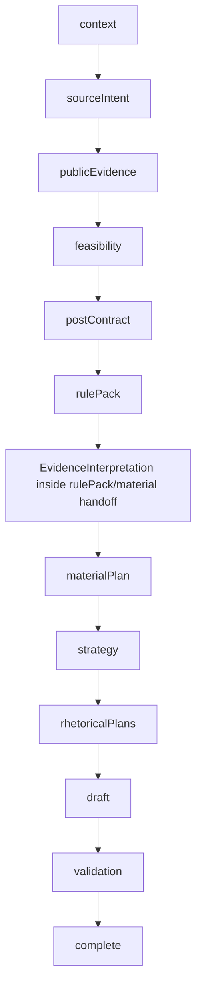
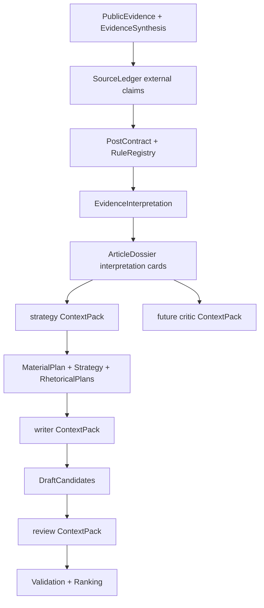

# DraftRun Pipeline TO BE 2.15.3

Target design for Slice 2.15.3: Evidence Interpretation, Not Citation Injection.

This document describes the proposed pipeline state after Slice 2.15.3, based on
the discussion that evidence must shape the argument without letting the model
invent an uncontrolled angle. It is a target design, not current behavior.

AS IS baseline: `docs/architecture/DRAFT_RUN_PIPELINE_AS_IS.md`.

PDF quick-view copy: `docs/architecture/DRAFT_RUN_PIPELINE_TO_BE_2_15_3.pdf`.

Regenerate PDF:

```powershell
python scripts/generate-draft-run-pipeline-pdf.py `
  --source docs/architecture/DRAFT_RUN_PIPELINE_TO_BE_2_15_3.md `
  --output docs/architecture/DRAFT_RUN_PIPELINE_TO_BE_2_15_3.pdf
```

## 1. Target change summary

| Change marker | Meaning |
| --- | --- |
| **NEW in 2.15.3** | New artifact, service, prompt input, trace surface, or test expectation. |
| **CHANGED vs AS IS** | Existing step keeps its name/order but changes artifact shape or context handoff. |
| **UNCHANGED** | Current behavior intentionally stays the same in this slice. |
| **NOT 2.15.3** | Important future idea that must not be implemented in this slice. |

Main target:

**NEW in 2.15.3:** add `EvidenceInterpretation` as the controlled bridge between
external evidence and editorial planning.

**CHANGED vs AS IS:** public evidence must not go to writer prompts as a flat list
of source names, URLs, snippets, or citations. It first becomes source-backed
editorial implications tied to `claimIds`, `sourceIds`, `ruleIds`, `contract`
obligations, topic/fabula rules, and author-position constraints.

**UNCHANGED:** `PublicEvidenceItem`, `EvidenceSynthesis`, `SourceLedger`,
`PostContract`, `RuleRegistrySnapshot`, `MaterialPlan`, `RhetoricalPlans`, and
`DraftCandidates` remain separate concepts.

**NOT 2.15.3:** no new web search provider, no new DraftRun step, no SQLite schema
migration, no critic loop, no alternative-angle tournament, and no final prose
selection rewrite.

## 2. Why this slice exists

The AS IS pipeline can already retrieve public evidence and merge it into
`SourceLedger`. The weak point is the handoff into writing:

- evidence can appear as mechanical source name-dropping;
- writer prompts can see proof material without a clear editorial meaning;
- the model may use citations as decoration instead of as argument material;
- if we ask a planner to "find an angle" freely, it can override the editorial
  model, topic, fabula, and approved post contract.

Slice 2.15.3 fixes the handoff:

**NEW in 2.15.3:** the system asks what each accepted source changes in the
argument before writing begins.

**CHANGED vs AS IS:** the writer receives interpreted implications, tensions,
usable examples, limits, and forbidden overclaims. It does not receive raw public
evidence as an invitation to paste citations.

## 3. Target step order

No new persisted DraftRun step is added. The current step order stays intact.



**CHANGED vs AS IS:** `EvidenceInterpretation` is a new application-level
operation after `rulePack` and before `materialPlan`.

Reason for this placement:

- `publicEvidence` happens before `PostContract` and `RuleRegistry`, so it knows
  what sources say but not the full editorial contract;
- `rulePack` is the first point where source claims, post contract, topic/fabula
  obligations, publisher rules, size contract, and validator bindings are all
  available together;
- `materialPlan`, `strategy`, `rhetoricalPlans`, and `writer` should consume
  interpreted evidence, not raw citations.

## 4. Target role-aware execution map

| Step/operation | Active role | Model selection | Context passed to the role | Output consumed by |
| --- | --- | --- | --- | --- |
| `publicEvidence` retrieval | web search / URL reader | `OPENROUTER_WEB_SEARCH_MODEL` for search | research tasks and queries | evidence synthesis |
| `publicEvidence` synthesis | `research` | `DRAFT_RESEARCH_MODEL`, then default | accepted public evidence and initial ledger | external ledger claims |
| `rulePack` registry | none | no model | contract, ledger, topic/fabula/publisher rules | evidence interpretation |
| **`EvidenceInterpretation`** | **`strategy`** | **`DRAFT_STRATEGY_MODEL`, then default, repair, backup** | **enriched ledger, public evidence, evidence synthesis, post contract, rule registry, topic/fabula rules, author-position evidence, strategy ContextPack** | **material plan, dossier, writer/review/critic packs** |
| `materialPlan` | `strategy` | `DRAFT_STRATEGY_MODEL`, then default, repair, backup | evidence interpretation, usable evidence candidates, contract, registry | strategy |
| `strategy` | `strategy` | `DRAFT_STRATEGY_MODEL`, then default | material plan and interpretation cards | rhetorical plans |
| `draft` | `writer` | `DRAFT_WRITER_MODEL`, then default | writer context pack with interpretation cards, not raw citation dump | validation |
| `validation` | deterministic + `review` | no model, then `DRAFT_REVIEW_MODEL` | candidates, rules, ledger, interpretation cards | ranking/revision |

**CHANGED vs AS IS:** the `strategy` role gets a new controlled subtask. It does
not invent a fresh post angle. It interprets source evidence under already
approved editorial constraints.

## 5. Controlled interpretation algorithm

### 5.1 Inputs

`EvidenceInterpretationService` receives:

- enriched `SourceLedger`;
- accepted `PublicEvidenceItem`s;
- `EvidenceSynthesis` decisions;
- `PostContract`: thesis, audience, value, CTA, allowed claim ids, qualified
  claim ids, forbidden moves, size contract;
- `RuleRegistrySnapshot`: rule ids, severity, validator bindings, repair policy;
- topic settings: purpose, audience value, author stance, rules, forbidden angles;
- fabula settings: dramaturgy, structure, proof requirements, rules, size intent;
- publisher settings: author, audience, position, style, goals, forbidden topics;
- author-position evidence from the context snapshot;
- strategy `ContextPack`.

### 5.2 Guardrails

**NEW in 2.15.3:** interpretation is not free brainstorming.

The service must obey these constraints:

- do not introduce a new thesis outside `PostContract`;
- do not invent public facts beyond `SourceLedger` and accepted evidence;
- do not convert weak source material into direct proof;
- do not override topic/fabula/publisher rules;
- do not produce alternative-angle candidates; that belongs to Slice 2.15.5;
- do not write prose; writer remains responsible for prose.

### 5.3 Output shape

**NEW in 2.15.3:** `EvidenceInterpretation` contains:

| Field | Meaning |
| --- | --- |
| `implications[]` | What this evidence changes in the argument. |
| `tensions[]` | Source-backed conflicts or useful friction with the approved thesis. |
| `usableExamples[]` | Concrete examples the writer may use, with source/claim ids. |
| `limits[]` | What the evidence does not prove or only weakly supports. |
| `forbiddenOverclaims[]` | Statements the writer must not make from this evidence. |
| `authorPositionLinks[]` | How evidence can support or qualify the author's existing stance. |
| `readerValueHooks[]` | Why this evidence matters to the target audience. |
| `recommendedUseByPlan[]` | Which rhetorical plan or plan type can use which implication. |
| `rejectedEvidenceUses[]` | Evidence uses rejected as irrelevant, weak, decorative, or unsafe. |
| `warnings[]` | Missing, ambiguous, stale, or low-confidence interpretation notes. |

Each item must carry stable references:

- `sourceIds`;
- `publicEvidenceItemIds`;
- `claimIds`;
- `ruleIds`;
- `contractObligationIds` where available;
- `confidence`;
- `allowedUse`: `canState`, `canUseAsFraming`, `needsQualification`,
  `doNotState`.

## 6. Target artifact flow



**CHANGED vs AS IS:** ArticleDossier gets interpretation cards, not only evidence
or claim cards.

**CHANGED vs AS IS:** writer context packs include:

- source-backed implication cards;
- tension cards;
- examples with attribution requirements;
- limits and forbidden-overclaim cards;
- rejected decorative source-use cards.

**UNCHANGED:** raw public evidence remains visible in trace. It is still not the
normal writer prompt context.

## 7. Step-by-step TO BE flow

### 7.1 `publicEvidence`

**UNCHANGED:** retrieval and synthesis still happen here.

Output still includes:

- `PublicEvidenceBatch`;
- `EvidenceSynthesis`;
- enriched `SourceLedger`;
- retrieval/search warnings.

**CHANGED vs AS IS:** this step no longer looks like the last evidence-preparation
step. It produces factual/provenance material only. Editorial interpretation
waits until contract and rule registry exist.

### 7.2 `feasibility`

**UNCHANGED:** feasibility still decides whether the run may continue.

**CHANGED vs AS IS:** feasibility may include a warning if public evidence exists
but has not yet produced interpretation. It must not treat interpretation itself
as proof.

### 7.3 `postContract`

**UNCHANGED:** contract remains deterministic.

**CHANGED vs AS IS:** contract becomes a hard input to evidence interpretation.
Interpretation must explain implications inside the contract, not create a new
contract.

### 7.4 `rulePack`

**CHANGED vs AS IS:** after registry compilation, the pipeline calls
`EvidenceInterpretationService`.

The `rulePack` artifact gains a sibling field:

```json
{
  "ruleRegistrySnapshot": {},
  "evidenceInterpretation": {},
  "articleDossier": {},
  "contextPacks": {}
}
```

If provider interpretation fails:

- retry follows JSON discipline: primary -> repair -> optional backup;
- deterministic fallback may create conservative `limits[]` and `warnings[]`;
- fallback must not invent positive implications.

### 7.5 `materialPlan`

**CHANGED vs AS IS:** material planning receives:

- `usableEvidenceCandidates`;
- `EvidenceInterpretation.implications`;
- `limits`;
- `forbiddenOverclaims`;
- `recommendedUseByPlan`;
- selected interpretation cards from strategy `ContextPack`.

MaterialPlan must choose material from interpreted evidence, not from raw source
snippets.

### 7.6 `strategy`

**CHANGED vs AS IS:** strategy builds the argument route from:

- PostContract;
- RuleRegistry;
- MaterialPlan;
- interpretation cards.

Strategy may select or combine interpretation cards. It must not create a new
topic/fabula angle that is not grounded in editorial model settings.

### 7.7 `rhetoricalPlans`

**CHANGED vs AS IS:** rhetorical plans reference interpretation ids:

- `implicationIdsToUse`;
- `tensionIdsToUse`;
- `exampleIdsToUse`;
- `limitIdsToRespect`;
- `forbiddenOverclaimIds`.

The plan still defines execution route. It does not invent source meaning.

### 7.8 `draft`

**CHANGED vs AS IS:** writer prompt receives:

- one rhetorical plan;
- writer `ContextPack`;
- selected interpretation cards;
- required attribution markers;
- forbidden overclaims.

Writer must use evidence through implications, examples, and tensions. It must
not append a decorative citation block.

### 7.9 `validation`

**CHANGED vs AS IS:** deterministic and LLM validators can check whether the draft:

- used interpretation cards correctly;
- made forbidden overclaims;
- converted `needsQualification` into unsupported direct claims;
- dropped required attribution markers;
- used sources as decoration without changing argument.

**NOT 2.15.3:** validation still does not become a full critic loop. That is
Slice 2.15.4.

## 8. Trace contract

`/ai-runs?runId=...` must make the interpretation layer readable.

**NEW in 2.15.3:** semantic trace shows:

- evidence interpretation summary;
- counts by implication/tension/example/limit/overclaim;
- source ids and public evidence ids behind each implication;
- rule ids and contract obligations used as constraints;
- rejected evidence uses and why they were rejected;
- which interpretation cards entered strategy/writer/review context packs;
- model role, selected model, attempts, fallback, and `AiRun ID`.

Trace locations:

| Data | Location |
| --- | --- |
| raw evidence | `publicEvidence.items[]` |
| external ledger claims | `publicEvidence.enrichedSourceLedger.claims[]` |
| evidence synthesis | `publicEvidence.evidenceSynthesis` |
| **evidence interpretation** | `rulePack.evidenceInterpretation` |
| interpretation cards | `articleDossier.cards[]` |
| role context usage | child `AiRun.requestPayload.contextPack` |
| writer evidence use | `draft.candidates[].usedEvidence` and validation findings |

## 9. Acceptance criteria

Slice 2.15.3 is successful when:

- accepted public evidence creates interpretation items tied to source and claim ids;
- weak or irrelevant evidence creates limits/rejections, not proof;
- writer context pack contains implications and limits, not raw citation dumps;
- material planning and rhetorical plans reference interpretation ids;
- validation can report misuse of interpreted evidence;
- trace answers: "what did this source actually change in the editorial argument?";
- no new DraftRun step or SQLite schema migration is introduced.

## 10. Implementation boundaries

**NEW in 2.15.3:** add provider-free domain DTOs:

- `EvidenceInterpretation`;
- `EvidenceImplication`;
- `EvidenceTension`;
- `EvidenceExample`;
- `EvidenceLimit`;
- `ForbiddenOverclaim`;
- `RejectedEvidenceUse`.

**NEW in 2.15.3:** add role-owned application modules:

- `evidence_interpretation_service`;
- `evidence_interpretation_prompts`;
- `evidence_interpretation_audit`;
- `deterministic_evidence_interpretation`;
- `evidence_interpretation_context_cards`.

**UNCHANGED:** keep OpenRouter provider details in infrastructure adapters. Domain
objects stay provider-free.

**UNCHANGED:** API routes stay thin. Pipeline should call a narrow application
interface and should not absorb interpretation logic.

## 11. Explicit non-goals

These ideas are related but not part of Slice 2.15.3:

- prosecutor/editor critic role;
- alternative-angle tournament;
- manual source/citation UI;
- new search provider;
- vector RAG store;
- autonomous multi-agent debate;
- final draft UI comparison;
- changing publication-size contract;
- changing the number of draft candidates.

## 12. Maintenance rule

When Slice 2.15.3 is implemented:

- update `docs/architecture/DRAFT_RUN_PIPELINE_AS_IS.md` to reflect the new actual
  pipeline;
- regenerate `docs/architecture/DRAFT_RUN_PIPELINE_AS_IS.pdf`;
- keep this TO BE document as historical target design, or mark it superseded if
  the implementation deliberately differs.
