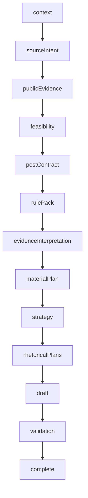
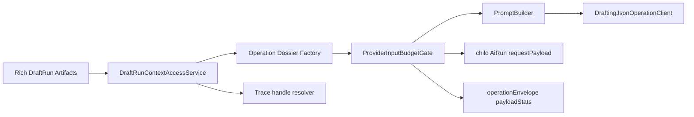

# DraftRun Pipeline TO BE 2.17.4.6.1.3.5

Target design for the DraftRun provider-input treatment track:
`2.17.4.6.1.3.5` through `2.17.4.6.1.3.10`.

This document is the target architecture for fixing oversized provider context
across DraftRun. It is not current behavior. The AS IS baseline remains
`docs/architecture/DRAFT_RUN_PIPELINE_AS_IS.md`.

PDF quick-view copy:
`docs/architecture/DRAFT_RUN_PIPELINE_TO_BE_2_17_4_6_1_3_5.pdf`.

Regenerate PDF:

```powershell
python scripts/generate-draft-run-pipeline-pdf.py `
  --source docs/architecture/DRAFT_RUN_PIPELINE_TO_BE_2_17_4_6_1_3_5.md `
  --output docs/architecture/DRAFT_RUN_PIPELINE_TO_BE_2_17_4_6_1_3_5.pdf
```

## 1. Target change summary

| Change marker | Meaning |
| --- | --- |
| **NEW in 2.17.4.6.1.3.5** | Provider-input audit and hard budget enforcement for every provider-heavy DraftRun child `AiRun`. |
| **NEW in 2.17.4.6.1.3.6** | Deterministic `DraftRunContextAccessService` and typed provider-input dossier factories. |
| **CHANGED vs AS IS** | Provider-heavy prompt builders no longer receive full `rulePack`, `materialPlan`, candidate pools, validation reports, or source ledgers directly. |
| **UNCHANGED** | DraftRun step order, prompt goals, model roles, public HTTP API, SQLite schema, and UI layout. |
| **NOT this track** | Broad prompt-quality rewrite, model replacement policy, autonomous agent loop, or mandatory external MCP server. |

Main target:

Provider-heavy operations must receive a compact operation-specific dossier, not a
large copy of the full DraftRun working set.

The rich artifacts still exist in parent DraftRun storage and diagnostics. The
provider boundary becomes a deliberate projection layer:

`DraftRun artifacts -> ContextAccess -> DossierFactory -> BudgetGate -> PromptBuilder -> Provider`

## 2. Why this track exists

A live audit over six DraftRuns showed that the long `materialPlan` call was only
one symptom. Other steps already send equal or larger provider inputs:

| Operation | Largest observed input | Approx tokens | Direct provider-input budget |
| --- | ---: | ---: | --- |
| `pairwiseRanking` | 626449 chars | 156613 | missing |
| `materialPlan` | 346264 chars | 86566 | missing |
| `alternativeAngleCandidate` | 328412 chars | 82103 | missing |
| `draftCandidate` | 328276 chars | 82069 | missing |
| `strategy` | 323040 chars | 80760 | missing |
| `alternativeAngleRoute` | 320833 chars | 80209 | missing |
| `llmValidation` | 255935 chars | 63984 | missing |
| `rhetoricalPlans` | 168461 chars | 42116 | missing |

The current budget layer exists but is only enforced for representative
operations such as `editorialCritique` and `directedRevision`. Some traces contain
`payloadBudget` only because a previous artifact includes another operation's
budget metadata. That is not the same as a direct budget on the current provider
call.

The risk is not only cost or latency. Oversized context also weakens model focus,
raises timeout and schema-failure risk, and makes quality failures harder to
explain.

## 3. Target step order

No persisted DraftRun step is added. The existing order stays intact:



**CHANGED vs AS IS:** provider-heavy sub-operations inside those steps cross a
new input boundary before prompt messages are built.

## 4. Target role-aware execution map

| Operation family | Active role | Target provider input |
| --- | --- | --- |
| `evidenceInterpretation` | `strategy` | Evidence interpretation dossier with accepted evidence, claim handles, contract constraints, and relevant rules. |
| `materialPlan`, `strategy`, `rhetoricalPlans` | `strategy` | Planning dossier with compact contract, interpreted evidence, selected rule ids, usable evidence handles, and planning constraints. |
| `draftCandidate`, `alternativeAngleCandidate` | `writer` | Writer dossier with one direction, material decisions, evidence handles, allowed claims, forbidden moves, and size/style constraints. |
| `alternativeAngleRoute` | `anotherAngle` | Alternative-angle dossier with selected candidate summaries, critique signals, contract invariants, and rejected-move constraints. |
| `llmValidation`, `editorialCritique` | `review` / `critic` | Review dossier with one candidate, compact deterministic findings, relevant claims/rules, and evidence interpretation summaries. |
| `pairwiseRanking` | `review` | Ranking dossier with compact candidates, scorecard dimensions, validation summaries, material evidence handles, and final selection constraints. |
| `directedRevision`, final repair | `writer` | Revision dossier with selected candidate, repair goals, anti-regression constraints, and referenced evidence/rule handles. |
| `finalQualityGateReview` | `finalGate` | Final-quality dossier with final prose, final quality contract, open issue lifecycle, attribution summary, and repair history. |

## 5. Controlled architecture

### 5.1 Rich working set stays rich

**UNCHANGED:** parent DraftRun artifacts keep full diagnostic data:

- `SourceLedger`;
- `PublicEvidenceBatch`;
- `EvidenceSynthesis`;
- `RuleRegistrySnapshot`;
- `EvidenceInterpretation`;
- `MaterialPlan`;
- `DraftCandidates`;
- validation reports;
- ranking/revision/final quality traces.

Full data is for storage, diagnostics, replay, and human inspection. It is not the
default provider input.

### 5.2 Context access service

**NEW in 2.17.4.6.1.3.6:** add a provider-free
`DraftRunContextAccessService` under `backend.app.drafting.application`.

It exposes deterministic reads such as:

- get compact post contract;
- get relevant claim handles;
- get accepted evidence summaries;
- get rule summaries by scope/severity;
- get candidate summaries;
- get validation issue summaries;
- get final quality issue lifecycle;
- resolve a handle back to the full artifact for trace/debug.

The service does not call providers and does not write DraftRun state.

### 5.3 Dossier factories

**NEW in 2.17.4.6.1.3.6:** add role-owned dossier factories:

- `PlanningDossierFactory`;
- `WriterDossierFactory`;
- `ReviewDossierFactory`;
- `RankingDossierFactory`;
- `RevisionDossierFactory`;
- `FinalQualityDossierFactory`.

Each factory returns a typed DTO or trace-safe payload with:

- `profileId`;
- `operationId`;
- `mustHave`;
- `shouldHave`;
- `diagnosticOnly`;
- `neverSendToProvider`;
- compact data sent to the provider;
- handles for omitted full artifacts;
- sent/trimmed/suppressed counts;
- quality-risk notes.

### 5.4 Budget gate

**NEW in 2.17.4.6.1.3.5:** every provider-heavy operation must pass a direct
`ProviderInputBudgetGate` before `build_*_messages(...)`.

The gate records:

- `payloadBudget.profileId`;
- execution mode;
- max prompt chars and approximate token budget;
- prompt char estimate;
- approximate token estimate;
- sent counts;
- trimmed counts;
- suppressed fields;
- `contextOverBudget` or `payloadTooLarge` incident when applicable.

The gate must inspect the current call, not nested historical artifacts.

## 6. Target artifact flow



Trace principle:

- provider request stores the compact dossier and budget metadata;
- parent artifact stores the rich data;
- trace can resolve handles back to rich artifacts for debugging;
- no prompt builder receives full artifacts unless the operation has an explicit
  temporary debt entry and architecture smoke allows it.

## 7. Step-by-step TO BE flow

### 7.1 Provider operation runtime guard

**NEW in 2.17.4.6.1.3.4:** extend the current queue/staleness repair into a
provider operation runtime guard.

It records:

- current provider operation id;
- operation start time;
- direct prompt char estimate;
- selected model;
- provider wait time;
- slow-but-healthy status;
- stale/timeout reason if the operation exceeds budget.

This prevents a slow model call from looking like an unexplained worker hang.

### 7.2 Provider-input audit and enforcement

**NEW in 2.17.4.6.1.3.5:** add a repeatable audit over stored child `AiRun`
records.

The audit must identify:

- provider-heavy calls missing direct `payloadBudget`;
- calls above operation caps;
- prompt builders that pass full `rulePack`, `sourceLedger`, `materialPlan`,
  candidate pool, validation report, or final quality trace;
- false-positive nested budget metadata.

Architecture smoke should fail new provider-heavy code that bypasses the budget
gate.

### 7.3 Planning dossier migration

**IMPLEMENTED in 2.17.4.6.1.3.7:** migrated runtime provider calls:

- `materialPlan`;
- `strategy`;
- `rhetoricalPlans`.

These operations now receive operation-specific planning dossiers assembled from
persisted DraftRun artifacts through `DraftRunContextAccessService`:

- compact post contract;
- interpreted evidence summaries;
- selected claim/evidence/rule handles;
- material-planning constraints;
- rejected-use summaries.

They should not receive full `rulePack`, full `SourceLedger`, or embedded previous
operation traces.

Each primary, repair, and backup attempt crosses `ProviderInputBudgetGate` after the
dossier is assembled. Child `AiRun.requestPayload` records the actual
`providerInput`, `providerDossier.runtimeMigrated=true`, direct budget proof, and
attempt metadata. Rich artifacts remain available to deterministic fallback and
parent trace, but prompt builders no longer accept them. A `BLOCKED` planning
dossier skips the provider and uses the existing safe fallback; `DEGRADED` is valid
only when all `mustHave` inputs remain present.

Live proof: `c2303e05-e7d0-4cad-a3f9-6ea26fc1a3ed` completed the full pipeline with
all three planning inputs below their standard caps, zero forbidden-field or
unresolved-handle findings, sufficient evidence coverage, and no open editorial
issues. The comparison against baseline `e874fd2b-cfa0-4b6a-815d-c0cf6d9763d2`
is committed under `docs/evidence/draft-runs/<baseline-id>/`.

### 7.4 Writer and alternative-angle dossier migration

**NEW in 2.17.4.6.1.3.8:** migrate:

- `draftCandidate`;
- `alternativeAngleRoute`;
- `alternativeAngleCandidate`.

The writer should receive one route and its supporting handles, not the whole
planning stack. Alternative-angle route should receive compact critique and
candidate summaries, not full candidate bodies plus full validation trace unless
explicitly needed.

### 7.5 Review, ranking, and final gate dossier migration

**NEW in 2.17.4.6.1.3.9:** migrate:

- `llmValidation`;
- `pairwiseRanking`;
- `finalQualityGateReview`;
- remaining final repair review calls.

Ranking must compare compact candidate summaries and score dimensions. It should
not receive full candidate pool plus full material plan plus full validation report
when only candidate ids, short body excerpts, issue summaries, and scorecard
dimensions are needed.

### 7.6 Tool-mediated context access pilot

**NEW in 2.17.4.6.1.3.10:** pilot a tool-mediated context access path for one
operation after the deterministic context service exists.

The tool or MCP adapter is optional. It must call deterministic context access
methods and must not expose raw full DraftRun JSON to the model.

## 8. Trace contract

Every migrated provider-heavy child `AiRun.requestPayload` must show:

```json
{
  "draftRunStep": "materialPlan",
  "operationId": "materialPlan",
  "providerInput": {
    "dossierId": "planningDossier:standard",
    "sent": {},
    "handles": {}
  },
  "payloadBudget": {
    "profileId": "materialPlan",
    "executionMode": "standard",
    "promptCharEstimate": 24000,
    "approxTokenEstimate": 6000,
    "sentCounts": {},
    "trimmedCounts": {},
    "suppressedFields": [],
    "qualityRisk": "none"
  }
}
```

Every parent step artifact may keep the full source data. `/ai-runs?runId=...`
should show both:

- what the provider actually received;
- which full artifacts can be inspected through handles.

## 9. Acceptance criteria

The provider-input treatment track is successful when:

- every provider-heavy operation has a direct budget profile or an explicit
  temporary debt entry;
- prompt builders no longer receive full `rulePack`, `SourceLedger`,
  `materialPlan`, candidate pool, validation report, or final quality trace by
  default;
- `pairwiseRanking`, `draftCandidate`, `alternativeAngle*`, `strategy`,
  `materialPlan`, `llmValidation`, and `rhetoricalPlans` all show lower,
  operation-specific prompt estimates in child `AiRun.requestPayload`;
- full parent artifacts remain available for diagnostics;
- live DraftRun proof shows no loss of required claims/rules/evidence handles;
- quality/fidelity diagnostics remain at least as strict as before;
- architecture smoke fails new provider-heavy operations that bypass the budget
  gate.

## 10. Implementation boundaries

Allowed:

- typed provider-input DTOs;
- deterministic context access service;
- operation-specific dossier factories;
- budget gate enforcement;
- trace-safe handle references;
- smoke/audit checks;
- replay and live proof diagnostics.

Not allowed:

- public HTTP contract changes;
- SQLite schema migration;
- changing DraftRun step order;
- changing model selection policy;
- broad prompt-quality rewrite;
- replacing OpenRouter adapter;
- hiding quality warnings by trimming context.

## 11. Explicit non-goals

This track does not promise that every final draft becomes publishable. It fixes
the provider-input architecture so later quality work is not fighting uncontrolled
context bloat.

It also does not make MCP mandatory. Tool-mediated context access is a later pilot
after the deterministic context access service exists.

## 12. Maintenance rule

When any slice in this track is implemented:

- update this TO BE if the target changes;
- update `docs/architecture/DRAFT_RUN_PIPELINE_AS_IS.md` only when runtime behavior
  actually changes;
- update `docs/architecture/BACKEND_ARCHITECTURE_TARGET.md` and
  `backend/app/drafting/README.md` when new owners are introduced;
- regenerate this PDF after changing the TO BE;
- run `npm run test:architecture`, roadmap `render/export/check`, and
  `git diff --check`.
