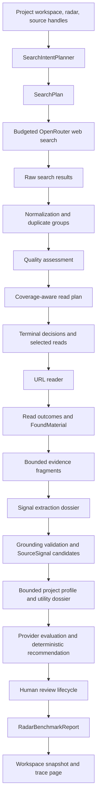

# RadarRun Pipeline AS IS

Current as of Slice `2.17.4.7.1`.

This document is the factual runtime contract for the current RadarRun pipeline. It
describes what the product does today, what evidence proves it, and which boundaries
must be protected when future search, signal, and candidate slices change the system.

The broader upstream architecture map stays in
`docs/architecture/UPSTREAM_SEARCH_AND_SIGNAL_ARCHITECTURE.md`. This file is the
dedicated RadarRun pipeline AS IS source, symmetric to `DRAFT_RUN_PIPELINE_AS_IS.md`.

PDF quick view: `docs/architecture/RADAR_RUN_PIPELINE_AS_IS.pdf`.

Regenerate with:

```powershell
python scripts/generate-draft-run-pipeline-pdf.py `
  --source docs/architecture/RADAR_RUN_PIPELINE_AS_IS.md `
  --output docs/architecture/RADAR_RUN_PIPELINE_AS_IS.pdf
```

## How AS IS Participates in DoD

For any complex RadarRun, upstream search, source signal, scoring, benchmark, or
candidate assembly slice, this document must be used twice:

1. Before implementation, as a requirement source for the slice DoD.
2. After implementation, as a validator for what changed or stayed invariant.

A DoD for a RadarRun slice must explicitly state:

- which AS IS invariants are preserved;
- which AS IS behavior is intentionally changed;
- which TO BE or ADR document authorizes the change;
- which runtime artifacts prove the result;
- whether this document and PDF must be updated after the slice.

Use the same lifecycle as other complex pipeline work:
`AS IS -> Change Intent -> TO BE -> DoD -> Implementation -> AS IS Update`.

Required DoD evidence for RadarRun/search work comes from structured artifacts, not
from subjective inspection:

- `searchPlan.strategy`, `language`, `intents`, `queries`, `sourceStrategy`,
  `skippedIntents`, and `skippedIntentDetails`;
- planned and executed coverage: `plannedCoverage`, `executedCoverage`, and
  `skippedRequiredCoverage`;
- operation timeline: provider query operations, skipped operations, warnings, and
  errors;
- `rawResults`, `selectedForRead`, `rejectedBeforeRead`, URL-read outcomes, and
  `foundMaterialIds`;
- `FoundMaterial` records stored in the project workspace;
- `run.signalExtraction`, `run.signalScoring`, source-signal utility reports, and
  immutable review events;
- `benchmarkReport` when a matching scenario exists;
- `/radar-runs?runId=<id>` trace page rendering for human diagnostics.

If a slice changes RadarRun behavior but does not update this AS IS contract or state
why the contract remained valid, the slice is not ready to close.

## Core Concepts

| Concept | Current role | Does not own |
| --- | --- | --- |
| `SourceHandle` | Project-scoped descriptor for a source that may be searchable, readable-only, paused, or needs review. | Provider execution, signal approval, candidate ranking. |
| `RadarDefinition` | User-facing radar settings: scope, source handles, trigger rules, filters, source-language policy, execution mode, and budget caps. | Search result storage or downstream drafting. |
| `RadarLanguageContext` | Bounded project/radar contract: canonical editorial language, source-language policy, query languages, allowed source languages, unknown-language policy, and legacy fallback reason. | Full project metadata, translation of evidence, or project-utility scoring. |
| `SearchPlan` | Deterministic provider-free campaign plan with strategy, editorial language, per-intent/query language, language context, source strategy, budget, and skipped intents. | Provider calls or quality scoring. |
| `SearchIntent` | One planned evidence direction such as broad discovery, case/example, benchmark/paper, OSS/tooling, limitation/critique, or freshness. | URL reading or material acceptance. |
| `SearchQuery` | One provider-executable web-search query derived from an intent and eligible source strategy. | Search result quality judgment. |
| `RadarRun` | One execution attempt: status, budget usage, operations, search plan, raw results, read decisions, material ids, extraction/scoring revisions, warnings, errors, and optional benchmark report. | Human signal approval, `PostCandidate`, plan slot, or `DraftRun` creation. |
| `RadarRunOperation` | One provider/search/read operation with status and trace-safe payload. | Editorial approval. |
| `RawSearchResult` | Normalized provider search result with query/run provenance. | Durable source memory or signal ownership. |
| `SearchTriageReport` | Deterministic normalization, duplicate groups, six-dimensional quality assessment, read plan, coverage gaps, terminal decisions, and read outcomes. | Provider search, URL parsing, or editorial approval. |
| `selectedForRead` | Search results chosen for URL reading within budget. | Proof that the material is accepted. |
| `rejectedBeforeRead` | Results rejected before URL reading, including duplicates, budget skips, and noise. | Permanent deletion from future search memory. |
| `FoundMaterial` | Retrieval output with provenance, title, URL/source ref, snippet/summary, bounded evidence fragments, warnings, and captured timestamp. | Topic/fabula ownership or final post candidate approval. |
| `SignalExtractionReport` | Versioned decisions for every inspected material, provider attempts, grounding incidents, budgets, usage and downstream-leak proof. | Project usefulness recommendation or human review decisions. |
| `SourceSignal` candidate | Evidence-backed fact, change, tension, case, data point, practice, failure mode, observation, question or pattern in `reviewStatus=candidate`. | Topic/fabula/audience/value/goal/platform/channel ownership or automatic approval. |
| `ProjectEditorialOpportunityProfile` | Bounded projection of active project rules, author positions, topics, radar filters and history fingerprints. | Full workspace, fabulas, content plan, publications, or provider trace. |
| `SignalUtilityReport` | Backend-owned dimension results, resolvable setting/evidence references, deterministic recommendation, warnings and provider proof. | Human approval or mutation of source evidence. |
| `SourceSignalReviewEvent` | Immutable authenticated transition with actor, time, reason, revision and changed editorial fields. | Rewriting evidence, mechanism, outcome, limitations, or provenance. |
| `RadarBenchmarkReport` | Recorded or live evaluation against a golden scenario. | Search execution or UI-side scoring. |
| `RadarRunTracePage` | Frontend read model for inspecting one run. | Recomputing live quality or mutating the run. |

## Runtime Topology



The current implementation stores RadarRun and FoundMaterial data in the workspace
snapshot. There is no dedicated RadarRun SQLite table and no separate HTTP trace
endpoint in this AS IS state.

## Current Step Order

1. Resolve project, workspace, radar, source handles, canonical editorial language
   from `BlogProject.language`, source-language policy, research depth, and execution
   mode. Legacy requests use an explicit trace-visible fallback.
2. Classify source handles by eligibility:
   - searchable;
   - readable-only;
   - paused;
   - needs review;
   - unavailable or unsupported.
3. Build a deterministic `SearchPlan`:
   - source strategy;
   - campaign trace;
   - planned intents;
   - query families;
   - evidence types;
   - budget caps;
   - skipped intents and reasons.
   Query families receive bounded query languages according to the radar policy;
   this allocation does not increase the number of provider operations.
4. Apply `maxExternalQueries` and produce provider-executable `queries[]`.
5. Apply the direct `openWebQuery` input budget and final serialized-message guard.
6. Run provider web-search operations for executable queries and record provider usage
   when OpenRouter returns it.
7. Normalize and bound provider citations into `rawResults[]` with `queryId`
   provenance. Inspect bounded title/snippet text for source language, confidence,
   mixed-language state, and reason codes.
8. Build stable duplicate groups that retain every query, intent, family, and evidence
   handle.
9. Assess representatives by relevance, evidence fit, project fit, source quality,
   novelty, and noise risk.
10. Build a coverage-aware read plan within the active `1/2/4` read cap. A confidently
    detected disallowed language is rejected before reading; `unknown` and `mixed`
    continue with a warning.
11. Give every raw result exactly one terminal decision: selected, rejected,
   duplicate, invalid, or deferred by budget.
12. Read selected URLs when the format is supported and URL reading is available.
13. Record each read outcome. Successful text becomes a readable `FoundMaterial`;
   failed or unsupported reads become `metadataOnly` and do not count as readable.
14. Preserve bounded, hashed `contentFragments` with stable offsets for every
    readable material before the full page text is discarded.
15. Build a bounded signal-extraction dossier from readable materials, radar scope,
    active rules and enabled filter references.
16. Run `signalExtraction` through primary, same-model repair, backup, or a safe
    no-signal fallback. Validate exact material/fragment handles, quotations,
    numbers, dates, confidence, and editorial language before accepting signals.
    Editorial interpretation fields use the project language; source title and exact
    evidence quote remain original.
    The dossier reserves bounded capacity inside the existing provider-input cap for
    structured correction context. Repair and backup receive only applicable
    validation codes and compact correction instructions; full failed responses are
    never copied into the next attempt.
17. Give every inspected material one extraction decision and persist zero or more
    `SourceSignal` candidates with `reviewStatus=candidate`.
18. Build a bounded project opportunity profile and score eligible signals in batches
    through primary, same-model repair, backup, or terminal `inconclusive`.
19. Validate signal, setting and evidence handles, then compute the categorical
    recommendation in deterministic backend policy. The provider cannot approve or
    reject a signal.
20. Persist utility revisions independently from the reversible human review status.
    Manual rescore reuses stored signals/materials and performs no search, read, or
    extraction operations.
21. Attach `benchmarkReport` when the run matches a golden scenario.
22. Persist the updated workspace snapshot.
23. Render compact radar trace and, when opened, the dedicated `/radar-runs` trace
    page.

## Context Handoff and Execution Contract

RadarRun does not pass hidden state between roles. The handoff is persisted in the
workspace snapshot and in the run payload.

| Stage | Input artifacts | Output artifacts | Required proof |
| --- | --- | --- | --- |
| Source eligibility | Project workspace, `RadarDefinition`, source handles | `searchPlan.sourceStrategy`, skipped source reasons | Trace shows searchable, readable-only, paused, and needs-review handles. |
| Language context | Bounded `projectContext`, `BlogProject.language`, `RadarDefinition.sourceLanguagePolicy` | `languageContext`, per-intent/query language, fallback reason | Editorial and source languages remain separate; legacy fallback is visible and no full project enters provider input. |
| Campaign planning | Radar scope, editorial language, topics/fabulas as context, publisher/editorial rules, source strategy, budget mode | `searchPlan.intents`, `queries`, `skippedIntentDetails`, language coverage gaps, campaign trace | Planned intents, query languages, skipped reasons, and language gaps are visible in `searchPlan`. |
| Query budgeting | Planned intents, `maxExternalQueries` | Bounded `queries[]`, skipped intent reasons | Required directions skipped by budget appear as skipped coverage. |
| Provider search | Executable `queries[]`, provider config, upstream budget profile | `RadarRunOperation`, provider citations, raw results | Direct `providerInput`, `payloadBudget`, `messageCharCount`, operation status, provider usage, errors, warnings, and provenance. |
| Triage and dedupe | Bounded `rawResults[]`, read budget, project/search/language context | `searchTriage`, `selectedForRead`, `rejectedBeforeRead` | Stable duplicate groups, language eligibility, dimension scores, one terminal decision per raw result, coverage, and gaps. |
| URL read | Selected reads, supported-format policy, URL reader adapter | read outcomes, readable or `metadataOnly` material | URL-read operation status, `readable`, failure reason, and material warnings. |
| Material output | Search/read payloads | `FoundMaterial`, `contentFragments`, `foundMaterialIds` | Workspace contains the material, bounded fragments retain offsets/hash, and run links it by id. |
| Signal extraction | Readable materials, bounded radar/language context, extraction taxonomy | terminal material decisions, localized candidate `SourceSignal`, extraction revision | Direct dossier/budget/message proof, provider attempts, exact original evidence, editorial-language validation, localization status, grounding incidents and downstream-leak counters. |
| Signal utility scoring | Candidate signals, bounded project opportunity profile, active typed filters, evidence handles, bounded relationship candidates | Compact provider aliases resolved into `SignalUtilityReport v2`, `radarCriteria`, `projectCriteria`, type-aware `qualityChecks`, `SignalRelationshipReport`, scoring revision and terminal recommendation | Direct dossier/budget/message proof, provider attempts/usage, one result per retained criterion, resolvable signal/setting/evidence aliases, deterministic decision-policy result and no retrieval/extraction operations during rescore. |
| Human signal review | Current signal, authenticated actor, expected review revision, action/reason and optional editorial patch | immutable review event, new review status/revision | Evidence hash-equivalence, actor/time/reason, optimistic concurrency and utility rescore after correction. |
| Benchmark evaluation | Scenario, run, found materials | `benchmarkReport` | Recorded/live status, provider health, coverage, missing expectations, and noise hits. |

## Hard Output Boundaries

RadarRun is a retrieval, evidence extraction, project-utility recommendation and
trace pipeline. It may create `FoundMaterial`, unreviewed `SourceSignal` candidates,
and backend-owned utility reports through dedicated owners.

It must not create:

- `PostCandidate`;
- plan slots;
- `DraftRun`;
- final topic/fabula/audience/value/goal/platform/channel ownership for raw material
  or signal candidates;
- automatic signal approval.

Those downstream artifacts belong to separate review, scoring, candidate assembly, and
planning slices. A RadarRun may expose affinity context, but it must not silently turn
raw search results into approved editorial work.

## Trace Contract

The current RadarRun trace contract is intentionally explicit. Future work must not
collapse it into a single "results" blob.

| Trace field | Meaning | Why it matters |
| --- | --- | --- |
| `searchPlan.strategy` | Campaign strategy chosen by the deterministic planner. | Explains why this run searched in this shape. |
| `searchPlan.language` | Compatibility editorial-language field. | Keeps old readers working without hiding per-query language. |
| `searchPlan.languageContext` | Editorial language, source policy, allowed/query languages, unknown-language rule and fallback reason. | Proves which language contract governed the run. |
| `searchPlan.intents[]` | Planned evidence directions. | Proves what the radar wanted to cover. |
| `searchPlan.intents[].queryLanguage` and `queries[].queryLanguage` | Actual language assigned to each planned/executable direction. | Proves that the query text and trace follow the selected policy. |
| `searchPlan.queries[]` | Provider-executable queries. | Proves what could actually run under budget. |
| `searchPlan.sourceStrategy` | Source handle eligibility and use. | Explains searchable versus readable-only sources. |
| `searchPlan.skippedIntents[]` and `skippedIntentDetails[]` | Directions not executed and why. | Makes budget and source gaps visible. |
| `operations[]` | Provider and read operations. | Separates provider/runtime health from quality. |
| `rawResults[]` | Normalized provider citations. | Shows what the provider returned before triage. |
| `rawResults[].sourceLanguage` | Deterministic bounded source-language assessment. | Explains eligibility without sending or storing full pages in triage. |
| `searchTriage` | Versioned candidates, scores, duplicate groups, read plan, coverage gaps, decisions, counts, and read outcomes. | Proves that no result disappeared and explains why each read slot was allocated. |
| `selectedForRead[]` | Raw results chosen for URL reading. | Shows read-budget choices. |
| `rejectedBeforeRead[]` | Raw results rejected before read. | Shows duplicates, noise, and budget skips. |
| `operations[].providerInput` and `payloadBudget` | Direct current-call provider input and limits. | Prevents nested metadata from masquerading as budget proof. |
| `operations[].messageCharCount` and `providerUsage` | Actual serialized message size and provider-reported usage when available. | Separates Glavred context size from provider-owned web-tool usage. |
| `foundMaterialIds[]` | Materials created by this run. | Links run trace to stored source material. |
| `FoundMaterial.contentFragments[]` | Bounded evidence text with offsets and hashes. | Lets extraction cite durable evidence without retaining or sending full pages. |
| `FoundMaterial.sourceLanguage` | Source language, confidence, mixed state and reason codes. | Keeps original-source language separate from editorial localization. |
| `run.signalExtraction` | Versioned extraction report and current revision. | Separates retrieval health from extraction health and records every material decision. |
| `signalExtraction.providerAttempts[]` | Primary/repair/backup outcomes, budgets and usage. | Proves recovery and prevents a rejected payload from becoming a trusted signal. |
| `sourceSignals[].evidenceRefs[]` | Exact material and fragment handles. | Makes every accepted signal resolvable to retained evidence. |
| `sourceSignals[].editorialLanguage`, `sourceLanguage`, and `localizationStatus` | Language of editorial interpretation, original source, and localization outcome. | Prevents a mixed-language card from being accepted silently. |
| `run.signalScoring` | Versioned scoring report, batch count, provider attempts, references, recommendation distribution and downstream-leak proof. | Separates scoring availability from retrieval/extraction health and human status. |
| `sourceSignals[].utilityReport.radarCriteria[]` | One mode-aware result for each retained enabled radar filter. | Shows what the radar explicitly required and why the signal matches, partially matches, lacks proof, or conflicts. |
| `sourceSignals[].utilityReport.projectCriteria[]` | Applicable author, audience, positioning, goal, topic and prohibition checks. | Separates project fit from radar-specific selection. |
| `sourceSignals[].utilityReport.qualityChecks[]` | Type-aware grounding, mechanism/result support, source posture and freshness checks. | Separates system evidence hygiene from user-configured filters and distinguishes observed, reported, capability-only and expected outcomes. |
| `sourceSignals[].relationshipReport` | Exact duplicate, same claim, related same-source claim, corroboration, contradiction, distinct or inconclusive relationships plus canonical signal id. | Replaces the unsupported default `duplicateRisk=low` and preserves provenance when aliases share one visible card. |
| `sourceSignals[].reviewRevision` and `reviewHistory[]` | Current optimistic-concurrency revision and immutable human decisions. | Proves that automation did not silently approve or rewrite evidence. |
| `warnings[]` and `errors[]` | Runtime and quality warnings/errors. | Prevents silent degradation. |
| `benchmarkReport` | Golden scenario verdict when available. | Gives a stable quality signal for matching runs. |

The `/radar-runs?runId=<id>` page is a read-only view over this trace. It does not
compute live quality in React.

## Benchmark and Live Evaluation Contract

There are two benchmark modes:

- `recorded`: deterministic fixture-backed regression. It does not call providers.
- `live`: provider-backed run evaluated against golden expectations.

The live report must distinguish planned coverage from executed coverage:

- `plannedCoverage`: directions present in `searchPlan.intents[]`;
- `executedCoverage`: directions that produced executable queries, successful search
  operations, raw results, selected reads, or found materials;
- `skippedRequiredCoverage`: required directions that were planned but skipped or not
  actually executed, including reasons such as `budget-max-external-queries`.

Status vocabulary:

| Status | Meaning |
| --- | --- |
| `passed` | Provider was usable, required coverage was actually executed, trace is complete, enough material/domain diversity exists, and known noise was not accepted. |
| `warning` | Provider was usable and useful material exists, but there are non-blocking gaps such as required planned directions skipped by budget, optional family gaps, provider degradation, or narrow read coverage. |
| `failed` | Provider was usable, but quality failed: required coverage/material/domain checks missed or accepted material contains known noise. |
| `inconclusive` | Provider/runtime state prevents a fair quality verdict: provider disabled, missing configuration, rate limit, network failure, or no honest execution trace. |

`passed` means the search actually covered enough of the golden scenario. It does not
mean only that the plan looked good.

## Reading a RadarRun Trace

Use:

```text
/radar-runs?runId=<RadarRun ID>
```

The trace should be read in this order:

1. Summary cards: status, budget, source coverage, material output, warnings/errors.
2. Campaign plan: strategy, editorial and query languages, source-language policy,
   source strategy, intent families, language gaps, and skipped intents.
3. Operations: provider query and URL-read statuses.
4. Search triage: result scores, duplicate groups, terminal decisions, read coverage,
   and gaps.
5. Raw results: bounded provider citations before triage.
6. Selected and rejected reads: what the run read and why every other result was
   rejected, duplicated, invalid, or deferred.
7. Found materials and read outcomes: what became readable upstream material and what
   remained metadata-only.
8. Evidence fragments, extraction decisions, signal candidates, extraction/scoring
   provider attempts, message budgets and actual usage.
9. Radar criteria, project criteria, type-aware quality checks, signal relationships,
   recommendation, human status and review history. Product UI resolves handles to
   setting text, source title/domain, exact quote and links; raw ids remain trace-only.
10. Benchmark report: whether the golden scenario verdict is `passed`, `warning`,
   `failed`, or `inconclusive`.
11. Raw JSON fallback when a legacy/minimal run lacks richer fields.

## Known AS IS Limitations

These are current facts, not target architecture:

- Golden evaluation currently has one primary industrial AI scenario. More scenarios
  are needed before it becomes a broad quality gate.
- Search results are not yet stored in a reusable cross-run search memory. Rejected or
  unread results may be useful later, but current logic does not own that cache.
- The live query budget can skip required families such as limitation/critique. The
  report exposes this as warning-class coverage debt; the planner/budget tuning is a
  future product-quality slice.
- URL-read budget is intentionally narrow. A run may produce many raw results but read
  only a small subset.
- The current URL reader accepts text/HTML. Obvious PDF URLs are rejected before
  allocation; a binary or unsupported response is preserved only as metadata. A
  dedicated PDF/document reader is future adapter work.
- Glavred directly limits query text, provider input, serialized messages, and total
  local RadarRun input. OpenRouter may report much larger prompt-token usage because
  its web-search tool adds provider-owned retrieval context; production cost controls
  and reuse belong to Slice `2.17.4.6.6`.
- Query family wording can still be too similar across broad discovery, case/example,
  and benchmark/paper directions.
- Source-language inspection is deliberately deterministic and bounded. It reliably
  separates Russian, English, mixed, unknown, and other writing systems for current
  policy enforcement, but it is not a general linguistic classifier for every
  language that uses the Latin alphabet.
- Project-specific utility scoring and human review are implemented, but candidate
  assembly and plan handoff remain downstream. A positive recommendation is not a
  human approval and does not create a `PostCandidate`.
- Relationship classification is bounded to the active scoring set. Deterministic
  exact/same-source evidence remains available during provider failure, while an
  ambiguous semantic pair stays `inconclusive`; cross-run relationship memory remains
  future work.
- Search queries are not yet aligned one-to-one with every typed utility filter. That
  useful-yield repair belongs to Slice `2.17.4.7.1.1`.
- Successful extraction retry replaces the current signal revision. Stable IDs are
  preserved only when type and exact evidence handles still describe the same signal;
  semantically different model output receives new IDs instead of a false match.
- The authorized trace client prefers the backend portfolio and persists retries there;
  a local trace is used only when the backend is unavailable. This prevents a locally
  successful retry from disappearing after navigation back to the project workspace.
- The frontend trace page can display historical/minimal runs, but older runs may not
  contain all enriched fields.

Known limitations must be linked to roadmap slices rather than treated as successful
target behavior.

## Maintenance Rules

- Keep this document factual. Put future designs in TO BE documents or ADRs.
- If a RadarRun slice changes runtime order, trace shape, benchmark semantics, or output
  boundaries, update this Markdown and regenerate the PDF in the same slice.
- If a slice only changes code organization without changing runtime behavior, state
  that this AS IS remains valid in the final report.
- Do not use this document to bless hidden state, unbounded provider payloads, or
  downstream artifact creation inside RadarRun.
