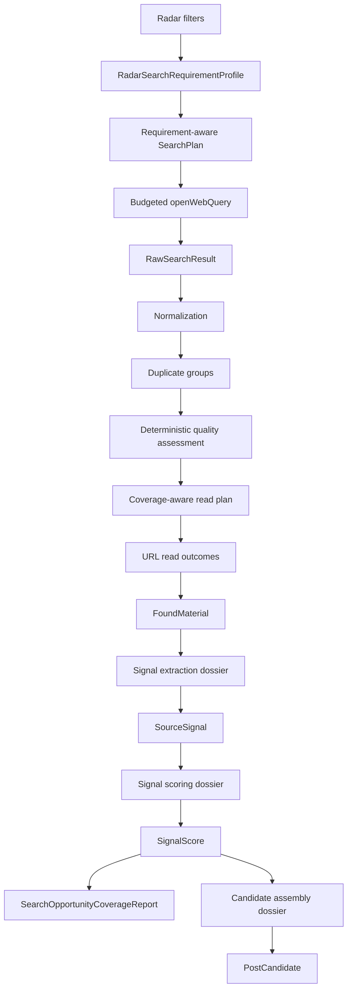

# Radar-to-Candidate Pipeline TO BE 2.17.4.6.2

Status: Slices `2.17.4.6.2`, `2.17.4.7`, and `2.17.4.7.0.2` define the implemented
retrieval, extraction, language, and evidence boundary. Slice `2.17.4.7.1` adds the
approved project-utility scoring and human review lifecycle. Slice `2.17.4.7.1.1`
defines the approved search-requirement projection and useful-signal yield boundary.
Slice `2.17.4.7.1.1.1` repairs evidence-target delivery and makes source ownership,
claim corroboration, utility criteria, and benchmark verdicts use one consistent
backend-owned contract.
Candidate assembly and ranking remain the next target and are not part of scoring.

AS IS sources:

- `docs/architecture/RADAR_RUN_PIPELINE_AS_IS.md`;
- `docs/architecture/UPSTREAM_SEARCH_AND_SIGNAL_ARCHITECTURE.md`.

Regenerate PDF:

```powershell
python scripts/generate-draft-run-pipeline-pdf.py `
  --source docs/architecture/RADAR_TO_CANDIDATE_PIPELINE_TO_BE_2_17_4_6_2.md `
  --output docs/architecture/RADAR_TO_CANDIDATE_PIPELINE_TO_BE_2_17_4_6_2.pdf
```

## 1. Change Intent

The current RadarRun can plan and execute web search, but its pre-read triage is too
dependent on provider order, keyword overlap, exact URL equality, and a first-domain
rule. The target pipeline must preserve every discovery decision while reading only
the strongest bounded set of sources.

The same architecture must prevent the later signal and candidate stages from
repeating the DraftRun context-growth problem. Rich upstream artifacts remain stored
for replay and accountability. A provider receives only an operation-specific,
budgeted projection with handles back to those artifacts.

## 2. Target Flow



Nodes through `FoundMaterial` are implemented by Slice `2.17.4.6.2`. Slice
`2.17.4.7` implements `Signal extraction dossier -> SourceSignal`. Slice
`2.17.4.7.1` implements `SourceSignal -> Signal scoring dossier -> SignalScore`
and the human review lifecycle. Candidate assembly and ranking remain
`NOT THIS SLICE` and must be implemented by their tracker-backed slices.
Slice `2.17.4.7.1.1` inserts the deterministic requirement profile before
`SearchPlan` and the useful-yield report after signal scoring. It does not add a
provider call or change the downstream human-review boundary.

## 3. AS IS to TO BE Mapping

| Item | Status | TO BE | Proof |
| --- | --- | --- | --- |
| Search requirement projection | NEW | Enabled radar filters become bounded required, optional, exclusion, tension, or explicitly non-search-applicable requirements. | Filter-mode, bounds, stable-id, and forbidden-context tests in Slice `2.17.4.7.1.1`. |
| Search campaign planning | CHANGED vs AS IS | Deterministic intents and queries carry requirement handles and distinct evidence targets; required coverage is allocated before optional breadth. | Planner/allocation tests and trace in Slice `2.17.4.7.1.1`. |
| Provider search | CHANGED vs AS IS | Every `openWebQuery` has a direct current-call budget and final serialized-message proof. | Operation trace, boundary tests, architecture smoke. |
| Citation normalization | CHANGED vs AS IS | URL, title, and snippet are bounded and normalized without deleting meaningful query parameters. | Normalization tests. |
| Duplicate handling | CHANGED vs AS IS | Stable duplicate groups retain all query, intent, family, and evidence handles. | Permutation and duplicate-group tests. |
| Pre-read scoring | CHANGED vs AS IS | Six deterministic dimensions and an explicit quality floor replace keyword-order selection. | Policy tests and readable score trace. |
| Read allocation | CHANGED vs AS IS | Required-family coverage is allocated first, then quality and bounded diversity. | Allocation and stress tests. |
| Read failure | CHANGED vs AS IS | Failed reads are failed operations; metadata-only material is not treated as readable. | Integration tests and live trace. |
| Read-format capability | NEW | The read plan does not spend a slot on an obvious unsupported PDF; unexpected binary responses fail safely into metadata-only evidence. | Reader capability tests and final live trace. |
| Found material provenance | NEW | `discoveryTrace` stores resolvable handles without copying rich snippets or full trace objects. | Handle-resolution tests. |
| Evidence fragments | NEW | Readable materials retain bounded, hashed fragments with offsets before full page text is discarded. | Fragment stability, bounds, and replay tests in Slice `2.17.4.7`. |
| Signal extraction | CHANGED vs AS IS | A backend-owned provider operation receives a bounded extraction dossier, validates exact grounding, and emits zero or more candidate SourceSignals. | Recorded benchmark, provider trace, retry replay, and live proof in Slice `2.17.4.7`. |
| Extraction retry | NEW | A new extraction revision reuses persisted fragments and cannot repeat search or URL reading. | API integration and idempotency proof in Slice `2.17.4.7`. |
| Editorial language context | NEW | `BlogProject.language` is passed as a bounded project context and remains distinct from source-search languages. | Request-contract, fallback, and trace tests in Slice `2.17.4.7.0.2`. |
| Source-language policy | NEW | Each radar selects editorial-only, editorial-and-English, or unrestricted source eligibility without increasing query count. | Planner allocation, language inspection, triage, and live trace proof in Slice `2.17.4.7.0.2`. |
| Signal localization | CHANGED vs AS IS | Editorial interpretation fields use the project language while source titles and exact evidence quotes remain original. A failed localization emits no mixed-language signal. | Primary/repair/backup language-validation tests and live evidence in Slice `2.17.4.7.0.2`. |
| Project editorial opportunity profile | NEW | A bounded, versioned projection exposes only active project settings and history fingerprints needed for signal utility. | Profile caps, forbidden-field tests, handle resolution, and cross-project benchmark in Slice `2.17.4.7.1`. |
| Signal scoring | CHANGED vs AS IS | Backend-owned batch scoring receives a bounded signal dossier, validates setting/evidence references, and applies a deterministic recommendation policy. | Provider recovery, budget, golden corpus, replay, and live proof in Slice `2.17.4.7.1`. |
| Human signal review | NEW | Utility recommendation and human status remain separate; reversible review events preserve actor, time, reason, revisions, and immutable evidence. | Lifecycle, optimistic-concurrency, API, and authenticated UI tests in Slice `2.17.4.7.1`. |
| Legacy signal integrity | NEW | Old client-evaluated signals are explicitly marked for re-extraction and never displayed as current backend verdicts. | Legacy normalization and UI recovery tests in Slice `2.17.4.7.1`. |
| Useful-signal yield | NEW | A post-scoring report connects search requirements to materials, signals, recommendations, and the first stage responsible for zero eligible output. | Recorded stage-failure fixtures, live comparison, and trace UI in Slice `2.17.4.7.1.1`. |
| Evidence-target delivery | CHANGED vs AS IS | Requirement coverage advances through `planned`, `queryExecuted`, `resultFound`, `selectedForRead`, `readableEvidence`, `usedBySignal`, and `corroborated`; query execution alone is not delivered evidence. | Stage-transition, lineage, allocation, replay, and live trace proof in Slice `2.17.4.7.1.1.1`. |
| Source credibility consistency | CHANGED vs AS IS | One backend policy separates source ownership from claim support and reconciles source-credibility criteria, system checks, recommendations, and benchmark verdicts. | First-party/vendor/independent/corroborated fixtures and iFactory replay in Slice `2.17.4.7.1.1.1`. |
| Candidate assembly and ranking | NOT THIS SLICE | Future assembly receives bounded approved-signal projections. | Slices `2.17.4.8` and `2.17.4.8.1`. |
| Cross-run search memory | NOT THIS SLICE | Reuse of discovered results is owned by a separate durable memory policy. | Slice `2.17.4.6.6`. |

## 4. Search Result Triage Contract

The deterministic triage chain is:

`rawResults -> normalized candidates -> duplicate groups -> dimension scores -> read plan -> read outcomes`.

Each raw result receives exactly one terminal decision:

- `selected`;
- `rejected`;
- `duplicate`;
- `invalid`;
- `deferredByBudget`.

No result may disappear because of list slicing, duplicate replacement, provider
order, or an exception.

### 4.1 Bounded candidate projection

The triage projection contains only:

- URL, capped at 2048 characters;
- title, capped at 300 characters;
- snippet, capped at 1200 characters;
- query, intent, family, and evidence handles;
- deterministic score dimensions and short reason codes;
- diagnostic explanation, capped at 320 characters.

Full page bodies, complete search responses, source ledgers, previous operation
envelopes, and nested budgets are forbidden.

### 4.2 Normalization and duplicates

Canonical URL normalization removes only known tracking parameters: `utm_*`,
`gclid`, `fbclid`, and `ref`. Other query parameters remain because they may identify
different documents or views.

Duplicate groups are stable under input permutation. They may be formed by canonical
URL, tracking variants, or normalized title/snippet fingerprints. The representative
is chosen by deterministic quality and lexical tie-break rules, never by provider
position. A group preserves the union of all discovery handles.

### 4.3 Quality dimensions

Each representative receives scores from 0 to 100 for:

- relevance;
- evidence fit;
- project fit;
- source-quality signals;
- novelty;
- noise risk.

The ordering score is:

`0.30 relevance + 0.20 evidence fit + 0.20 project fit + 0.15 source quality + 0.15 novelty - noise penalty up to 30`.

The quality floor is 45. Unknown domains are neutral. Vendor sources are not rejected
only for being vendors; pricing and generic promotional noise are penalized through
observable content signals.

### 4.4 Coverage-aware reading

The read allocator first gives every executable required family the best available
representative above the quality floor. Remaining capacity is filled by score.
Within a score difference of 10, a new evidence type and then a new domain are
preferred. Diversity never promotes a candidate below the quality floor.

Read caps remain `1/2/4` for `smoke/standard/full`. Any required direction that could
not receive a read is listed in `readCoverageGaps` with a stable reason.

## 5. Read Outcome and Material Contract

A successful URL read creates a normal readable `FoundMaterial`. A failed read:

- produces a failed URL-read operation;
- preserves the discovery metadata in a `metadataOnly` material;
- records a structured read outcome and warning;
- does not count as a successful readable material.

If every produced material is metadata-only, RadarRun status is no better than
`partial`.

`FoundMaterial.discoveryTrace` stores IDs and handles only: raw-result IDs, query IDs,
intent IDs, families, evidence types, duplicate-group ID, decision reason, and read
outcome. It does not copy snippets, page bodies, or the full `searchTriage` report.

### 5.1 Evidence fragment persistence

Before normalized page text is discarded, the reader derives bounded
`contentFragments`. Each fragment has a stable ID, ordinal, text, normalized-text
offsets, hash, and semantic kind. Fragments are the smallest persisted evidence unit
that a signal may cite. The complete page body remains forbidden in downstream
provider input.

A legacy material without fragments may expose its bounded summary as one synthetic
fragment. This path is marked `legacy-summary-only`, has `DEGRADED` readiness, and
cannot produce a trusted high-confidence signal. `metadataOnly`, unreadable, and empty
materials are never sent to the extraction provider.

## 6. Provider Input Budget Boundary

`openWebQuery` is the first upstream provider-heavy operation governed by a direct
budget contract.

Per call:

| Measure | Limit |
| --- | ---: |
| Query text | 1000 characters |
| Provider input | 1500 characters |
| Serialized messages | 4000 characters |
| Approximate input tokens | 1000 |

Per RadarRun:

| Mode | Input characters | Approximate input tokens | Max results per query |
| --- | ---: | ---: | ---: |
| smoke | 4000 | 1000 | 3 |
| standard | 12000 | 3000 | 5 |
| full | 20000 | 5000 | 8 |

The effective result count cannot exceed `OPENROUTER_WEB_SEARCH_MAX_RESULTS`.
Before the provider call, the direct input gate checks the current query and run
totals. After message construction, a provider-neutral message guard measures the
actual serialized messages. An over-limit operation is not sent and records
`provider-input-over-budget` plus a structured incident.

The operation trace contains the actual `providerInput`, `payloadBudget`,
`inputStats`, `payloadStats`, `messageCharCount`, model selection, and provider usage
when returned. Nested metadata from an older artifact never counts as proof.

Provider-reported prompt tokens can exceed the local message estimate because the
OpenRouter web-search tool adds its own retrieval context. This value is preserved as
usage/cost telemetry, but it is not confused with the Glavred-controlled provider
input. Production limits for provider-owned search cost and reuse belong to Slice
`2.17.4.6.6`.

### 6.1 Editorial and source language boundary

The project-owned editorial language and the radar-owned source-language policy are
separate inputs. The API passes only `projectId` and `editorialLanguage`; a provider
never receives the complete portfolio project. A legacy request without this bounded
context uses a trace-visible fallback rather than silently claiming canonical project
metadata.

Each radar resolves one policy:

- `editorialOnly`: all query families use the editorial language and a confidently
  detected different source language is ineligible;
- `editorialAndEnglish`: broad discovery, limitations, and freshness use the
  editorial language, while case, benchmark, and OSS families use English; when the
  editorial language is English, all families use English;
- `any`: the same bounded query allocation is used, but source language does not
  restrict eligibility.

The allocation never duplicates a query family and never increases
`maxExternalQueries`. A budget that cannot execute every planned query language
records `languageCoverageGaps`. A deterministic inspector classifies bounded search
metadata and retained fragments as a primary language, confidence, and mixed/unknown
state. Only a high-confidence disallowed language is rejected; mixed and unknown
content continue with a warning so that detection uncertainty cannot silently remove
evidence.

## 7. Signal Extraction Contract

Signal extraction is a backend upstream operation owned separately from project
utility scoring. It answers what evidence-backed fact, change, tension, case, data
point, practice, failure mode, observation, question, or recurring pattern exists in
the material. It does not choose a topic, fabula, audience, value, goal, platform, or
publication channel.

The rich input is the persisted set of readable `FoundMaterial` records and their
fragments. `SignalExtractionContextFactory` produces a bounded radar context from
scope, active rules, source intent, evidence types, filter references, and the
language context.
`SignalExtractionDossierFactory` then retains only:

- material IDs, source metadata, and selected bounded fragments;
- radar rule/filter references needed to understand the search scope;
- the extraction taxonomy and required output contract;
- handles back to persisted material and fragment artifacts.

Full workspace snapshots, complete pages, topics, fabulas, plans, publication
history, previous envelopes, and nested budget artifacts are
`neverSendToProvider`.

### 7.1 Terminal material decisions

Every inspected material receives exactly one decision: `signalProducing`,
`insufficient`, `duplicate`, `corroborating`, `contradiction`, `noise`, or
`extractionFailed`.

One material may produce zero, one, or several signals. Several materials may support
or contradict a canonical signal. Signal count is never a target. Every accepted
signal must resolve to at least one exact retained fragment.

### 7.2 Grounding and recovery

`SignalGroundingPolicy` rejects unknown handles, quotations absent from retained
fragments, changed numbers or dates, unsupported certainty, and invented actors,
mechanisms, outcomes, or limitations. A malformed primary response is repaired by the
same model using only structured errors, then attempted with the backup model. If all
provider paths fail, the terminal fallback emits no substantive signals and marks the
affected materials `extractionFailed`.

Retrieval and extraction statuses are independent. Successful search and reading
remain successful when extraction is partial, failed, or not run. A manual retry
creates a new report revision from persisted fragments and performs no search or URL
read operations.

### 7.3 Extraction budget boundary

| Mode | Materials | Fragments per material | Fragment characters | Provider input | Serialized messages | Approximate input tokens | Max output tokens |
| --- | ---: | ---: | ---: | ---: | ---: | ---: | ---: |
| smoke | 1 | 3 | 700 | 6000 | 9000 | 2250 | 1200 |
| standard | 2 | 4 | 900 | 12000 | 16000 | 4000 | 2200 |
| full | 4 | 5 | 900 | 24000 | 30000 | 7500 | 3500 |

Primary, repair, and backup attempts each pass a direct current-call input gate and a
final serialized-message guard. Repair context is at most 1200 characters and is
included in both checks. An over-budget attempt never calls the provider. Actual
OpenRouter usage is stored when supplied; missing provider usage remains explicitly
unknown.

### 7.4 Editorial localization and original evidence

`title`, `summary`, `uncertainty`, `mechanism`, `outcome`, and `limitations` are
editorial interpretation fields and must use `editorialLanguage`. Source titles and
exact evidence quotations remain in the original source language and are never
translated by this operation.

A deterministic language policy validates non-empty editorial prose while ignoring
URLs, IDs, numbers, model names, and short technical abbreviations. A language
violation is a structured payload error: primary is followed by same-model repair and
then backup under the existing attempt and budget policy. If all attempts violate the
contract, no `SourceSignal` is emitted; the material remains in the extraction report
as `extractionFailed` with `editorial-language-not-satisfied` and can be retried from
persisted fragments.

Accepted signals expose editorial language, detected source language, localization
status, and reason codes. Evidence IDs include signal, material, fragment, and quote
identity so multiple exact quotes from one fragment remain stable and unique.

## 8. Signal Utility Scoring and Review Contract

Signal scoring answers whether an extracted, evidence-backed signal is useful for a
specific editorial project. It does not change source evidence, approve the signal,
select a topic or fabula, create a `PostCandidate`, or reserve a plan slot.

The runtime chain is:

`SourceSignal -> ProjectEditorialOpportunityProfile -> SignalUtilityDossier -> provider evaluation -> deterministic decision policy -> SignalUtilityReport -> human review lifecycle`.

### 8.1 Bounded project profile and signal dossier

`ProjectEditorialOpportunityProfileFactory` derives a traceable projection from the
canonical workspace. Standard mode retains at most 24 active editorial rules, 16
confirmed author-position assertions, 12 active topics, and 20 fingerprints from
previous signals, candidates, and publications. Every retained setting has a stable
ID that resolves to the workspace. Disabled settings are not silently promoted.

`SignalUtilityDossierFactory` adds at most six signals per standard batch and four
evidence references per signal. The provider sees only editorial language, a short
project profile, active bounded settings, filter contracts, signal interpretation
fields, and resolvable evidence handles. The full workspace, fabulas, content plan,
complete publications, old traces, and provider envelopes are forbidden.

Each utility dimension has one owner and one result status: `matched`, `partial`,
`notProven`, or `conflict`. The supported dimensions cover evidence strength,
factual specificity, source credibility, mechanism, observable outcome,
actionability, topic/author/audience/positioning/goal fit, novelty, productive
tension, freshness, duplication/banality, promotional noise, and prohibited
content. Legacy dimensions are mapped to these owners only for compatibility.

### 8.2 Deterministic recommendation policy

The provider performs semantic comparison and returns dimension evidence. It cannot
approve, reject, archive, or correct a signal. The backend validates signal IDs,
setting IDs, material/fragment evidence handles, dimension ownership, and required
reasons before computing one terminal recommendation:

- `recommended`: evidence is sufficient and all blocking criteria are satisfied;
- `reviewWithCaution`: no proven blocker exists, but evidence, source independence,
  optional fit, or uncertainty needs editorial attention;
- `notRecommended`: an active blocking criterion has a proven `conflict`;
- `inconclusive`: provider recovery failed or references are insufficient for an
  honest decision.

Filter modes determine importance: `mustMatch` and `mustNotMatch` are blocking,
`shouldMatch` is weighted, and `seekTension` is diagnostic. `notProven` is never a
blocking rejection by itself. No aggregate percentage may hide blockers, missing
proof, or uncertainty.

### 8.3 Provider recovery and budget boundary

Scoring uses one bounded provider batch per revision, followed when necessary by a
same-model repair and backup attempt. Repair context contains only structured
validation errors and is capped at 1200 characters. Exhausted recovery yields
`inconclusive`; retrieval and extraction remain successful.

| Mode | Signals | Provider input | Serialized messages | Approximate input tokens | Max output tokens |
| --- | ---: | ---: | ---: | ---: | ---: |
| smoke | 1 | 6000 | 9000 | 2250 | 1200 |
| standard | 6 | 16000 | 22000 | 5500 | 3200 |
| full | 12 | 28000 | 36000 | 9000 | 5000 |

Every primary, repair, and backup attempt has direct current-call input proof and a
final serialized-message check. An over-budget or blocked dossier never calls the
provider. Trace stores the exact bounded provider input, profile/dossier metadata,
retained/trimmed/suppressed counts, message size, actual provider usage when
available, validation incidents, unresolved-reference counts, and policy result.

The provider response uses compact aliases declared by the dossier: `signalKey`,
`criterionKey`, and `evidenceKeys`. The backend resolves them to persisted signal,
setting, material, and fragment handles before accepting the response. Aliases reduce
output growth but never weaken identity validation or allow positional inference.

### 8.4 Human review lifecycle

Human status is independent of utility recommendation. The initial status is
`candidate` (`На проверке`). Allowed transitions are candidate or corrected to
approved/rejected/archived, approved or rejected back to candidate, and archived
back to candidate. Correction changes only editorial title, summary, and author
comment. Rejection, archive, and correction require a reason.

Each immutable event records ID, authenticated actor, timestamp, action, from/to
status, reason, changed fields, and expected review revision. Evidence, exact quotes,
mechanism, outcome, limitations, and provenance cannot be edited. A correction marks
the utility report stale and triggers a bounded rescore; failed rescore does not undo
the saved correction.

### 8.5 Legacy and presentation integrity

Loading a legacy signal never triggers a hidden provider call. A signal without the
language/scoring contract is marked `needsReExtraction`; any old client keyword
evaluation is retained only as explicitly historical diagnostics. It cannot be
rendered as the current recommendation or human decision.

The Signals UI keeps source, evidence, extraction semantics, utility dimensions,
and review history visible while editing. Only editorial title, summary, and author
comment are editable. Source titles, quotations, and radar names wrap inside their
owners and remain fully reachable at supported desktop and mobile widths. Radar
rows present full title/status, description, and operational metadata as separate
layout levels rather than squeezing them into one line.

### 8.6 Explainable criteria and signal relationships

`SignalUtilityReport` version 2 no longer presents one flat list of dimensions as if
all checks had the same origin. It separates:

- one criterion for every enabled radar filter;
- applicable author, audience, positioning, project-goal, topic, and prohibition
  criteria from the bounded project profile;
- type-aware system checks for evidence grounding, result support, source posture,
  freshness, and relationship integrity.

Every criterion snapshots its human-readable title, statement, mode, verdict, effect,
explanation, setting handles, evidence handles, and uncertainty. Retained settings
that are not applicable to signal utility are listed explicitly as `notApplicable`
or `notThisStage`. Style, channel, fabula, and plan mechanics remain downstream.

The signal type owns which semantic fields and system checks are applicable. A
non-empty `mechanism` or `outcome` is not proof by itself. Result support distinguishes
`observed`, `reported`, `capabilityOnly`, `expected`, `missing`, and `notApplicable`.
Absence of a known vendor marker never proves source independence; source posture is
reported as `independent`, `corroborated`, `firstParty`, `vendor`, or `unknown`.

Internal material, fragment, and setting IDs remain trace handles. The user-facing
report resolves them to the criterion text, source title/domain, exact quotation,
source URL, and trace link. An unresolved handle makes the affected result
`inconclusive`; raw IDs are not presented as editorial evidence.

Signal relationship analysis is independent from project utility. A bounded hybrid
policy classifies candidate pairs as `exactDuplicate`, `sameClaim`,
`relatedSameSource`, `corroborates`, `contradicts`, `distinct`, or `inconclusive`.
Exact duplicates and same-claim aliases share one canonical presentation while all
source records and evidence remain persisted. Related claims from the same material
remain separate and visibly linked. Missing relationship proof is `notChecked` or
`inconclusive`, never an invented low duplicate risk.

Relationship candidates reuse the existing scoring provider attempt and budget.
They do not add an unbounded provider call or raise the current provider-input and
serialized-message limits.

### 8.7 Search requirements and useful-signal yield

The deterministic `RadarSearchRequirementProfileFactory` projects every enabled
radar filter into exactly one of these search roles:

- `required` for `mustMatch` evidence that search can reasonably target;
- `optional` for `shouldMatch` evidence;
- `exclusion` for `mustNotMatch` noise or forbidden-source characteristics;
- `tension` for `seekTension` criticism, limitations, or counter-evidence;
- `notSearchApplicable` when the setting belongs only to project-utility scoring.

The profile contains stable filter handles, bounded terms, evidence types, source
hints, language policy, and priority. Full project settings, publications, fabulas,
content plans, prior traces, and provider envelopes are never search-provider input.

Each planned intent and executable query records `requirementIds`, one distinct
`evidenceTarget`, bounded `sourceHints`, `queryLanguage`, and priority rationale.
Allocation covers required requirements first, then distinct evidence types, then
optional breadth. A required requirement that cannot execute is persisted in
`uncoveredRequiredSearchRequirements` with the exact budget, source, language, or
provider reason. Normalized duplicate required queries are invalid plan output.

The standard industrial campaign prioritizes `caseExample`, `benchmarkPaper`, and
`limitationCritique`; broad discovery and OSS/tooling are optional breadth. Smoke
runs execute only the highest-priority eligible requirement and full runs may add the
optional families. The existing provider-call and message limits do not increase.

After extraction and scoring, `SearchOpportunityCoverageReport` records planned,
executed, and uncovered requirements; family/evidence coverage; readable material,
extracted signal, and recommendation counts; count/denominator/ratio yield values;
recommendation and reason distributions; and the first failed stage. Review-eligible
means `recommended` or `reviewWithCaution`; it never changes human review status.

The first failed stage is deterministic: `providerSearch` when no query executed,
`triage` when no usable result survived, `read` when no material was readable,
`signalExtraction` when no signal was grounded, and `signalScoring` when signals exist
but none are review-eligible. Provider/runtime unavailability is `inconclusive`.
A zero-yield known high-fit benchmark is a quality failure, not a clean run.

### 8.8 Evidence-target delivery and source posture consistency

Slice `2.17.4.7.1.1.1` distinguishes discovery lineage from evidence suitability.
`discoveredRequirementIds` records which query requirements led to a result.
`supportedRequirementIds` records which requirements the result's bounded
title/snippet, evidence target, and deterministic quality signals can actually
support. A vendor page returned by a benchmark query does not thereby become
independent benchmark evidence.

The bounded read allocator first selects the strongest result covering required core
case evidence, then gives a suitable independent or benchmark result above the
quality floor explicit competition for the next slot. Remaining slots maximize
tension and optional evidence diversity. The `1/2/4` read caps and provider-call caps
do not change. If corroborating evidence is unavailable, the allocator uses the slot
for the next strongest eligible result and records the exact gap.

Each searchable requirement has a typed delivery record with a furthest stage:
`planned`, `queryExecuted`, `resultFound`, `selectedForRead`, `readableEvidence`,
`usedBySignal`, or `corroborated`. It also stores resolvable query, raw-result,
read-decision, material, fragment, and signal handles plus a deterministic stop
reason. Required evidence is delivered only when a readable fragment is used by a
review-eligible signal. Optional delivery and corroboration gaps remain visible but
do not become fabricated required failures.

Source credibility uses two independent axes:

- ownership posture: `independent`, `firstParty`, `vendor`, or `unknown`;
- claim support: `singleSource`, `corroborated`, `contradicted`, or `notChecked`.

The compatibility value `sourcePosture=corroborated` is emitted only when materially
independent evidence supports the same claim. Multiple URLs controlled by the same
publisher are not corroboration. Domain/publisher identity, product or subject
ownership, material provenance, and cross-material evidence are deterministic
inputs. Provider semantic output may add evidence but cannot silently upgrade
`firstParty` or `vendor` to `independent`.

A deterministic consistency policy reconciles the source-credibility radar criterion
with the source-posture system check before the final recommendation. A first-party
or vendor-reported outcome without independent corroboration remains useful but
carries caution and cannot become `recommended` only from its own reported metrics.
Missing corroboration is not a blocking conflict unless an active blocking criterion
explicitly requires it.

## 9. Future Provider Context Rule

Every future upstream provider-heavy stage must declare before implementation:

1. a typed rich input artifact;
2. an operation-specific dossier/input owner;
3. `mustHave`, `shouldHave`, `diagnosticOnly`, and `neverSendToProvider` fields;
4. a direct current-call budget profile;
5. a final serialized-message guard;
6. handles back to persisted artifacts;
7. a stress test proving bounded growth;
8. a trace-safe outcome and fallback/incident policy.

Architecture smoke rejects a new operation that does not satisfy this inventory or
carry an explicit tracker-backed debt exception.

## 10. Trace Contract

RadarRun keeps existing fields and adds `searchTriage`:

- policy version;
- normalized candidates and dimension scores;
- duplicate groups;
- read plan and terminal decisions;
- required-family coverage and gaps;
- read outcomes;
- terminal decision counts.

Existing `rawResults`, `selectedForRead`, and `rejectedBeforeRead` remain compatible.
Old runs without `searchTriage` remain readable in the UI.

Slice `2.17.4.7.0.2` additionally records the bounded language context, per-intent and
per-query language, source-language inspection, eligibility reasons, query-language
coverage gaps, and signal localization status. Compatibility `searchPlan.language`
continues to mean editorial language.

Slice `2.17.4.7` additionally stores `run.signalExtraction`,
`signalExtractionReport`, and `sourceSignals`. The report includes revision history,
material decisions, grounding violations, duplicate/corroboration/contradiction
links, provider attempts, direct budgets, final message sizes, usage, and suppressed
fields. `FoundMaterial.contentFragments` are persisted evidence artifacts, not copied
trace prose.

Slice `2.17.4.7.1` additionally stores `run.signalScoring`,
`signalScoringReport`, source-signal utility reports, review revisions, and immutable
review events. Manual scoring reuses stored signals/materials and performs no search,
URL read, or extraction. Legacy heuristic results remain explicitly historical.

Slice `2.17.4.7.1.1` additionally stores the bounded requirement profile inside
`searchPlan`, requirement handles on intents and queries,
`uncoveredRequiredSearchRequirements`, and `run.searchOpportunityCoverage`. Every
selected material and scored signal resolves through requirement, query, raw result,
read decision, material, and exact evidence fragment. Extraction/scoring retry
rebuilds yield and benchmark reports from stored artifacts without repeating search
or URL reading.

Slice `2.17.4.7.1.1.1` upgrades `run.searchOpportunityCoverage` to v2 with
`requirementCoverage`, delivered requirement ids, required/optional delivery gaps,
corroboration coverage, and planned/executed/readable/used-by-signal family and
evidence coverage. Read decisions expose both discovery and supported requirement
handles. Signal quality trace stores source ownership and claim-support metadata
without exposing technical handles as user-facing evidence. Legacy v1 reports remain
readable and are explicitly marked as not fully delivery-verified.

## 11. Success Criteria

- Every raw result has one terminal decision.
- Selection and duplicate representatives are invariant under provider result order.
- No duplicate group schedules more than one URL read.
- Required-family coverage is maximized inside the read cap and gaps are explicit.
- Known generic-news and pricing noise does not displace a suitable alternative.
- Failed reads remain failed and metadata-only results are not counted as readable.
- One hundred raw results cannot grow provider calls, provider messages, or read count
  beyond the active profile.
- `openWebQuery` has direct input and final-message budget proof.
- Retrieval may create candidate `SourceSignal` artifacts only through the extraction
  owner. It still creates no `PostCandidate`, plan slot, editorial work item, or
  DraftRun.
- Every inspected material has one terminal extraction decision and every accepted
  signal resolves to exact material and fragment handles.
- Manual extraction retry is idempotent and never repeats search or URL reading.
- Unsupported certainty, altered numbers/dates, and unresolved evidence handles are
  zero in the accepted benchmark and live proof.
- The canonical editorial language comes from `BlogProject.language`; source search
  policy and source language are separate trace fields.
- Language policy changes actual bounded query allocation without adding provider
  calls, and every skipped query language has an explicit coverage gap.
- Accepted editorial fields use the project language while exact source titles and
  evidence quotes remain original.
- A terminal localization failure creates no mixed-language signal, and every
  displayed evidence item resolves to a safe source URL plus material/fragment trace.
- Every scored signal has one terminal recommendation or explicit `inconclusive`;
  every dimension has a specific reason and resolvable setting/evidence references.
- A signal is `notRecommended` only for a proven conflict with an active blocking
  criterion. Missing keyword overlap and `notProven` never become automatic rejection.
- Vendor-only evidence, credible off-project evidence, weak evidence, productive
  tension, and prohibited content remain distinguishable outcomes.
- Utility recommendations never change human review status. Review transitions are
  authenticated, reversible, revision-checked, and preserve evidence exactly.
- Provider scoring remains within direct input and final-message caps, and manual
  rescore performs no retrieval or extraction work.
- Legacy client evaluations are not displayed as current backend recommendations.
- Signals and radar rows preserve complete readable information without page-level
  horizontal overflow at the supported five viewport widths.
- Recorded and comparable live proof show no quality regression relative to the
  pre-change industrial-AI baseline.
- Every enabled radar filter has a search role, and every required search requirement
  is executed or explicitly uncovered with a concrete reason.
- Required query families have semantically distinct query text, evidence targets,
  and requirement handles; duplicate required queries are zero.
- A known high-fit industrial corpus produces at least one `recommended`, one
  `reviewWithCaution`, and one `notRecommended` result without accepting generic-news,
  pricing, or model-leaderboard noise.
- Zero useful yield names the first failed stage; provider unavailability remains
  `inconclusive` and cannot hide a search/extraction/scoring quality failure.
- Requirement projection and lineage do not raise provider-call, provider-input,
  serialized-message, or total-run caps.

## 12. Implementation Status

- Slice `2.17.4.6.2`: triage v2, selective reading, read-outcome trace, upstream budget
  boundary, UI trace, recorded/live proof. `IMPLEMENTED`.
- Slice `2.17.4.7`: evidence fragments, bounded provider extraction, grounding,
  material decisions, retry, UI trace, recorded/live proof. `IMPLEMENTED`.
- Slice `2.17.4.7.0.2`: project/editorial language handoff, radar source-language
  policy, query allocation, source-language eligibility, signal localization, and
  evidence presentation. `IMPLEMENTED`; accepted live proof is recorded below.
- Slice `2.17.4.7.1`: bounded project profile, utility dossier, backend-owned scoring,
  deterministic recommendation, human review lifecycle, legacy/UI integrity repair.
  `IMPLEMENTED`; accepted runtime proof is recorded in
  `docs/evidence/radar-runs/2.17.4.7.1/`.
- Slice `2.17.4.7.1.1`: filter-to-search requirement projection, requirement-aware
  allocation, end-to-end lineage, and useful-signal yield diagnostics. `IMPLEMENTED`;
  accepted runtime proof is recorded in
  `docs/evidence/radar-runs/2.17.4.7.1.1/`.
- Slice `2.17.4.7.1.1.1`: evidence-target delivery stages and source-posture
  consistency repair. `IMPLEMENTED`; accepted proof is recorded in
  `docs/evidence/radar-runs/2.17.4.7.1.1.1/`.
- Candidate assembly, candidate ranking, and cross-run search memory: `NOT THIS SLICE`.

## 13. Implementation Proof

The final live proof on 2026-07-13 returned 52 raw results and exactly 52 terminal
decisions: 2 selected, 7 rejected, 17 duplicate, and 26 deferred by budget. It built
35 stable duplicate groups and produced two readable materials from two domains with
no read warnings, accepted noise, or metadata-only output.

All three `openWebQuery` operations were directly budgeted. Serialized messages used
1,185 characters in total, local approximate input was 297 tokens, and no budget
incident was recorded. The benchmark remained `warning` only because the existing
three-query campaign budget skipped required `limitationCritique`; required coverage
was not lost by triage.

Trace-safe pre/post evidence is committed in
`docs/evidence/radar-runs/2.17.4.6.2/COMPARISON.md` and `comparison.json`.

The accepted extraction proof on 2026-07-14 is
`radar-run-ai-pattern-radar-industrial-cases-8`. It returned 60 raw results, read two
materials from two domains, and created three grounded signal candidates. Both
materials received a terminal extraction decision; unresolved evidence handles and
downstream artifacts were zero.

The initial extraction used 12,496 serialized characters against the 16,000 standard
cap and 3,743 provider-reported tokens. A forced retry did not add search or URL-read
operations. Its first response was rejected for an ungrounded number, same-model
repair was accepted, and both attempts remained below the message cap. The live
retrieval benchmark stayed `warning` only because the existing three-query budget
skipped `limitationCritique`.

Trace-safe evidence is committed in
`docs/evidence/radar-runs/2.17.4.7/BASELINE.md` and `LIVE_PROOF.md` with JSON peers.

The accepted language-policy proof is RadarRun
`radar-run-ai-pattern-radar-industrial-cases-3`, extraction revision `4`. The bounded
project context resolved `editorialLanguage=ru` and
`sourceLanguagePolicy=editorialAndEnglish`. The unchanged three-query budget assigned
Russian to broad discovery and English to case and benchmark families; it added no
provider call and reported no language coverage gap.

The run retained one Russian and one English readable material. The English source
produced three Russian candidate signals while preserving the original source title,
exact English quotes, URLs, and resolvable material/fragment handles. The first
extraction response was rejected because one quote did not exactly match its source
fragment. Same-model repair was accepted after receiving a 304-character structured
correction context. The two attempts used 11,972 and 12,337 serialized characters
against the unchanged 16,000 cap, with 8,367 actual tokens in total and no budget
incident. The rejected grounding incident remains visible in attempt diagnostics,
while the accepted signals have no unresolved or unsupported evidence handles.

The authorized UI proof also verified backend persistence, `На проверке`, the
unscored utility state, original source navigation, deep trace navigation, and the
localized demo radar. Trace-safe evidence is committed in
`docs/evidence/radar-runs/2.17.4.7.0.2/`.

The accepted scoring/explainability proof on 2026-07-22 uses fresh RadarRun
`radar-run-ai-pattern-radar-industrial-cases-9`. It produced three Russian signals;
all three matched the industrial radar and received `reviewWithCaution`. Automatic
scoring was accepted on the primary attempt with 17,166 serialized characters against
the 22,000 cap and 4,502/1,308 input/output tokens. Setting and evidence references
resolved with zero errors. Manual rescore created revision 2 without search, read, or
extraction work, and one authenticated review event approved a signal without mutating
its evidence.

Retrieval was `partial` because one search response contained malformed JSON and one
OpenReview URL returned HTTP 403. Both incidents remain explicit in operation and
benchmark trace; they did not turn successful extraction or scoring into a false clean
retrieval result.

Replay `radar-run-ai-pattern-radar-industrial-cases-7` classified the digital-advisor
result as `capabilityOnly`, kept source posture `unknown`, and linked it to the separate
automated-risk thesis as `relatedSameSource`. Product UI hid raw handles, opened source
and trace links, and stayed within the page width at 390, 1180, 1440, 1904, and 2048
pixels. Trace-safe evidence is committed in
`docs/evidence/radar-runs/2.17.4.7.1/`.

The accepted search-alignment proof on 2026-07-23 uses fresh RadarRun
`radar-run-ai-pattern-radar-industrial-cases-2`. Eight enabled radar filters received
explicit search roles. Six searchable requirements were executed through three
distinct `caseExample`, `benchmarkPaper`, and `limitationCritique` queries; no required
requirement was left uncovered. The bounded read plan selected one implementation case
and one limitation source, both reads succeeded, and one of the two materials produced
a grounded Russian signal with recommendation `reviewWithCaution`.

`SearchOpportunityCoverageReport.status=sufficient`, `firstFailureStage=null`, and
all requirement, query, material, and fragment handles resolved. The run processed 60
raw results into 2 selected, 10 rejected, 10 duplicate, and 38 budget-deferred
decisions. Search/extraction/scoring message caps were unchanged and no budget incident
occurred. Extraction required primary, repair, and accepted backup attempts because
the first responses violated editorial-language and numeric-grounding rules; this
provider cost remains visible rather than being reported as context efficiency.

Compared with pre-slice RadarRun `radar-run-ai-pattern-radar-industrial-cases-9`, the
new run replaced generic family labels with requirement-bearing queries, restored the
previously uncovered limitation direction, completed all three search operations, and
reported useful yield explicitly. Full trace-safe comparison, token accounting, and
authenticated screenshots are committed in
`docs/evidence/radar-runs/2.17.4.7.1.1/`.

The accepted evidence-delivery proof on 2026-07-23 uses fresh RadarRun
`radar-run-ai-pattern-radar-industrial-cases-4`. The unchanged three-query campaign
and two-read cap produced 34 raw results, two readable materials, and one
review-eligible signal. The core implementation case came from
`global.andersen.com`; an `arxiv.org` result independently competed for the second
read slot instead of being hidden behind query-executed coverage.

Coverage v2 delivered three required requirements with zero required gaps and kept
four optional gaps explicit. Every requirement, query, raw result, read decision,
material, fragment, and signal handle resolved. The independent arXiv material did
not support the same concrete Andersen claim, so the report retained
`corroboration-not-found` instead of fabricating corroboration.

The accepted signal has ownership `firstParty`, claim support `singleSource`, and
outcome support `reported`. Both the source-credibility criterion and the system
source-posture check apply `caution`; the final recommendation is
`reviewWithCaution` and the benchmark consistency check is true. Provider and read
caps were unchanged, all message budgets passed, and no budget incident occurred.
Full comparison, token accounting, and authenticated screenshots are committed in
`docs/evidence/radar-runs/2.17.4.7.1.1.1/`.
