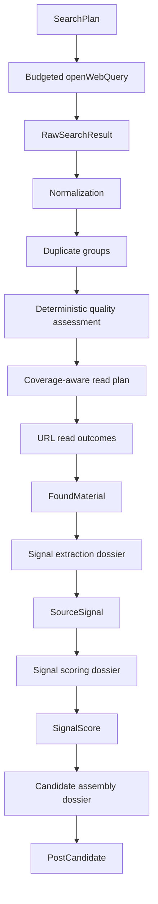

# Radar-to-Candidate Pipeline TO BE 2.17.4.6.2

Status: Slices `2.17.4.6.2` and `2.17.4.7` define the implemented retrieval and
evidence-backed signal-extraction boundary. Project-utility scoring and candidate
assembly remain the approved target. Slice `2.17.4.7.0.2` adds the approved
editorial-language, source-language eligibility, localization, and evidence
presentation contract without changing project-utility scoring.

AS IS sources:

- `docs/architecture/RADAR_RUN_PIPELINE_AS_IS.md`;
- `docs/architecture/UPSTREAM_SEARCH_AND_SIGNAL_ARCHITECTURE.md`.

Regenerate PDF:

```powershell
python scripts/generate-draft-run-pipeline-pdf.py `
  --source docs/architecture/RADAR_TO_CANDIDATE_PIPELINE_TO_BE_2_17_4_6_2.md `
  --output docs/architecture/RADAR_TO_CANDIDATE_PIPELINE_TO_BE_2_17_4_6_2.pdf
```

## 1. Change Intent

The current RadarRun can plan and execute web search, but its pre-read triage is too
dependent on provider order, keyword overlap, exact URL equality, and a first-domain
rule. The target pipeline must preserve every discovery decision while reading only
the strongest bounded set of sources.

The same architecture must prevent the later signal and candidate stages from
repeating the DraftRun context-growth problem. Rich upstream artifacts remain stored
for replay and accountability. A provider receives only an operation-specific,
budgeted projection with handles back to those artifacts.

## 2. Target Flow



Nodes through `FoundMaterial` are implemented by Slice `2.17.4.6.2`. Slice
`2.17.4.7` implements `Signal extraction dossier -> SourceSignal`. Scoring,
candidate assembly, and candidate ranking remain `NOT THIS SLICE` and must be
implemented by their tracker-backed slices.

## 3. AS IS to TO BE Mapping

| Item | Status | TO BE | Proof |
| --- | --- | --- | --- |
| Search campaign planning | UNCHANGED | Deterministic intents, queries, source strategy, and budget skips remain authoritative. | Existing planner tests and trace. |
| Provider search | CHANGED vs AS IS | Every `openWebQuery` has a direct current-call budget and final serialized-message proof. | Operation trace, boundary tests, architecture smoke. |
| Citation normalization | CHANGED vs AS IS | URL, title, and snippet are bounded and normalized without deleting meaningful query parameters. | Normalization tests. |
| Duplicate handling | CHANGED vs AS IS | Stable duplicate groups retain all query, intent, family, and evidence handles. | Permutation and duplicate-group tests. |
| Pre-read scoring | CHANGED vs AS IS | Six deterministic dimensions and an explicit quality floor replace keyword-order selection. | Policy tests and readable score trace. |
| Read allocation | CHANGED vs AS IS | Required-family coverage is allocated first, then quality and bounded diversity. | Allocation and stress tests. |
| Read failure | CHANGED vs AS IS | Failed reads are failed operations; metadata-only material is not treated as readable. | Integration tests and live trace. |
| Read-format capability | NEW | The read plan does not spend a slot on an obvious unsupported PDF; unexpected binary responses fail safely into metadata-only evidence. | Reader capability tests and final live trace. |
| Found material provenance | NEW | `discoveryTrace` stores resolvable handles without copying rich snippets or full trace objects. | Handle-resolution tests. |
| Evidence fragments | NEW | Readable materials retain bounded, hashed fragments with offsets before full page text is discarded. | Fragment stability, bounds, and replay tests in Slice `2.17.4.7`. |
| Signal extraction | CHANGED vs AS IS | A backend-owned provider operation receives a bounded extraction dossier, validates exact grounding, and emits zero or more candidate SourceSignals. | Recorded benchmark, provider trace, retry replay, and live proof in Slice `2.17.4.7`. |
| Extraction retry | NEW | A new extraction revision reuses persisted fragments and cannot repeat search or URL reading. | API integration and idempotency proof in Slice `2.17.4.7`. |
| Editorial language context | NEW | `BlogProject.language` is passed as a bounded project context and remains distinct from source-search languages. | Request-contract, fallback, and trace tests in Slice `2.17.4.7.0.2`. |
| Source-language policy | NEW | Each radar selects editorial-only, editorial-and-English, or unrestricted source eligibility without increasing query count. | Planner allocation, language inspection, triage, and live trace proof in Slice `2.17.4.7.0.2`. |
| Signal localization | CHANGED vs AS IS | Editorial interpretation fields use the project language while source titles and exact evidence quotes remain original. A failed localization emits no mixed-language signal. | Primary/repair/backup language-validation tests and live evidence in Slice `2.17.4.7.0.2`. |
| Signal scoring | NOT THIS SLICE | Future scoring receives a bounded signal dossier and direct budget proof. | Slice `2.17.4.7.1`. |
| Candidate assembly and ranking | NOT THIS SLICE | Future assembly receives bounded approved-signal projections. | Slices `2.17.4.8` and `2.17.4.8.1`. |
| Cross-run search memory | NOT THIS SLICE | Reuse of discovered results is owned by a separate durable memory policy. | Slice `2.17.4.6.6`. |

## 4. Search Result Triage Contract

The deterministic triage chain is:

`rawResults -> normalized candidates -> duplicate groups -> dimension scores -> read plan -> read outcomes`.

Each raw result receives exactly one terminal decision:

- `selected`;
- `rejected`;
- `duplicate`;
- `invalid`;
- `deferredByBudget`.

No result may disappear because of list slicing, duplicate replacement, provider
order, or an exception.

### 4.1 Bounded candidate projection

The triage projection contains only:

- URL, capped at 2048 characters;
- title, capped at 300 characters;
- snippet, capped at 1200 characters;
- query, intent, family, and evidence handles;
- deterministic score dimensions and short reason codes;
- diagnostic explanation, capped at 320 characters.

Full page bodies, complete search responses, source ledgers, previous operation
envelopes, and nested budgets are forbidden.

### 4.2 Normalization and duplicates

Canonical URL normalization removes only known tracking parameters: `utm_*`,
`gclid`, `fbclid`, and `ref`. Other query parameters remain because they may identify
different documents or views.

Duplicate groups are stable under input permutation. They may be formed by canonical
URL, tracking variants, or normalized title/snippet fingerprints. The representative
is chosen by deterministic quality and lexical tie-break rules, never by provider
position. A group preserves the union of all discovery handles.

### 4.3 Quality dimensions

Each representative receives scores from 0 to 100 for:

- relevance;
- evidence fit;
- project fit;
- source-quality signals;
- novelty;
- noise risk.

The ordering score is:

`0.30 relevance + 0.20 evidence fit + 0.20 project fit + 0.15 source quality + 0.15 novelty - noise penalty up to 30`.

The quality floor is 45. Unknown domains are neutral. Vendor sources are not rejected
only for being vendors; pricing and generic promotional noise are penalized through
observable content signals.

### 4.4 Coverage-aware reading

The read allocator first gives every executable required family the best available
representative above the quality floor. Remaining capacity is filled by score.
Within a score difference of 10, a new evidence type and then a new domain are
preferred. Diversity never promotes a candidate below the quality floor.

Read caps remain `1/2/4` for `smoke/standard/full`. Any required direction that could
not receive a read is listed in `readCoverageGaps` with a stable reason.

## 5. Read Outcome and Material Contract

A successful URL read creates a normal readable `FoundMaterial`. A failed read:

- produces a failed URL-read operation;
- preserves the discovery metadata in a `metadataOnly` material;
- records a structured read outcome and warning;
- does not count as a successful readable material.

If every produced material is metadata-only, RadarRun status is no better than
`partial`.

`FoundMaterial.discoveryTrace` stores IDs and handles only: raw-result IDs, query IDs,
intent IDs, families, evidence types, duplicate-group ID, decision reason, and read
outcome. It does not copy snippets, page bodies, or the full `searchTriage` report.

### 5.1 Evidence fragment persistence

Before normalized page text is discarded, the reader derives bounded
`contentFragments`. Each fragment has a stable ID, ordinal, text, normalized-text
offsets, hash, and semantic kind. Fragments are the smallest persisted evidence unit
that a signal may cite. The complete page body remains forbidden in downstream
provider input.

A legacy material without fragments may expose its bounded summary as one synthetic
fragment. This path is marked `legacy-summary-only`, has `DEGRADED` readiness, and
cannot produce a trusted high-confidence signal. `metadataOnly`, unreadable, and empty
materials are never sent to the extraction provider.

## 6. Provider Input Budget Boundary

`openWebQuery` is the first upstream provider-heavy operation governed by a direct
budget contract.

Per call:

| Measure | Limit |
| --- | ---: |
| Query text | 1000 characters |
| Provider input | 1500 characters |
| Serialized messages | 4000 characters |
| Approximate input tokens | 1000 |

Per RadarRun:

| Mode | Input characters | Approximate input tokens | Max results per query |
| --- | ---: | ---: | ---: |
| smoke | 4000 | 1000 | 3 |
| standard | 12000 | 3000 | 5 |
| full | 20000 | 5000 | 8 |

The effective result count cannot exceed `OPENROUTER_WEB_SEARCH_MAX_RESULTS`.
Before the provider call, the direct input gate checks the current query and run
totals. After message construction, a provider-neutral message guard measures the
actual serialized messages. An over-limit operation is not sent and records
`provider-input-over-budget` plus a structured incident.

The operation trace contains the actual `providerInput`, `payloadBudget`,
`inputStats`, `payloadStats`, `messageCharCount`, model selection, and provider usage
when returned. Nested metadata from an older artifact never counts as proof.

Provider-reported prompt tokens can exceed the local message estimate because the
OpenRouter web-search tool adds its own retrieval context. This value is preserved as
usage/cost telemetry, but it is not confused with the Glavred-controlled provider
input. Production limits for provider-owned search cost and reuse belong to Slice
`2.17.4.6.6`.

### 6.1 Editorial and source language boundary

The project-owned editorial language and the radar-owned source-language policy are
separate inputs. The API passes only `projectId` and `editorialLanguage`; a provider
never receives the complete portfolio project. A legacy request without this bounded
context uses a trace-visible fallback rather than silently claiming canonical project
metadata.

Each radar resolves one policy:

- `editorialOnly`: all query families use the editorial language and a confidently
  detected different source language is ineligible;
- `editorialAndEnglish`: broad discovery, limitations, and freshness use the
  editorial language, while case, benchmark, and OSS families use English; when the
  editorial language is English, all families use English;
- `any`: the same bounded query allocation is used, but source language does not
  restrict eligibility.

The allocation never duplicates a query family and never increases
`maxExternalQueries`. A budget that cannot execute every planned query language
records `languageCoverageGaps`. A deterministic inspector classifies bounded search
metadata and retained fragments as a primary language, confidence, and mixed/unknown
state. Only a high-confidence disallowed language is rejected; mixed and unknown
content continue with a warning so that detection uncertainty cannot silently remove
evidence.

## 7. Signal Extraction Contract

Signal extraction is a backend upstream operation owned separately from project
utility scoring. It answers what evidence-backed fact, change, tension, case, data
point, practice, failure mode, observation, question, or recurring pattern exists in
the material. It does not choose a topic, fabula, audience, value, goal, platform, or
publication channel.

The rich input is the persisted set of readable `FoundMaterial` records and their
fragments. `SignalExtractionContextFactory` produces a bounded radar context from
scope, active rules, source intent, evidence types, filter references, and the
language context.
`SignalExtractionDossierFactory` then retains only:

- material IDs, source metadata, and selected bounded fragments;
- radar rule/filter references needed to understand the search scope;
- the extraction taxonomy and required output contract;
- handles back to persisted material and fragment artifacts.

Full workspace snapshots, complete pages, topics, fabulas, plans, publication
history, previous envelopes, and nested budget artifacts are
`neverSendToProvider`.

### 7.1 Terminal material decisions

Every inspected material receives exactly one decision: `signalProducing`,
`insufficient`, `duplicate`, `corroborating`, `contradiction`, `noise`, or
`extractionFailed`.

One material may produce zero, one, or several signals. Several materials may support
or contradict a canonical signal. Signal count is never a target. Every accepted
signal must resolve to at least one exact retained fragment.

### 7.2 Grounding and recovery

`SignalGroundingPolicy` rejects unknown handles, quotations absent from retained
fragments, changed numbers or dates, unsupported certainty, and invented actors,
mechanisms, outcomes, or limitations. A malformed primary response is repaired by the
same model using only structured errors, then attempted with the backup model. If all
provider paths fail, the terminal fallback emits no substantive signals and marks the
affected materials `extractionFailed`.

Retrieval and extraction statuses are independent. Successful search and reading
remain successful when extraction is partial, failed, or not run. A manual retry
creates a new report revision from persisted fragments and performs no search or URL
read operations.

### 7.3 Extraction budget boundary

| Mode | Materials | Fragments per material | Fragment characters | Provider input | Serialized messages | Approximate input tokens | Max output tokens |
| --- | ---: | ---: | ---: | ---: | ---: | ---: | ---: |
| smoke | 1 | 3 | 700 | 6000 | 9000 | 2250 | 1200 |
| standard | 2 | 4 | 900 | 12000 | 16000 | 4000 | 2200 |
| full | 4 | 5 | 900 | 24000 | 30000 | 7500 | 3500 |

Primary, repair, and backup attempts each pass a direct current-call input gate and a
final serialized-message guard. Repair context is at most 1200 characters and is
included in both checks. An over-budget attempt never calls the provider. Actual
OpenRouter usage is stored when supplied; missing provider usage remains explicitly
unknown.

### 7.4 Editorial localization and original evidence

`title`, `summary`, `uncertainty`, `mechanism`, `outcome`, and `limitations` are
editorial interpretation fields and must use `editorialLanguage`. Source titles and
exact evidence quotations remain in the original source language and are never
translated by this operation.

A deterministic language policy validates non-empty editorial prose while ignoring
URLs, IDs, numbers, model names, and short technical abbreviations. A language
violation is a structured payload error: primary is followed by same-model repair and
then backup under the existing attempt and budget policy. If all attempts violate the
contract, no `SourceSignal` is emitted; the material remains in the extraction report
as `extractionFailed` with `editorial-language-not-satisfied` and can be retried from
persisted fragments.

Accepted signals expose editorial language, detected source language, localization
status, and reason codes. Evidence IDs include signal, material, fragment, and quote
identity so multiple exact quotes from one fragment remain stable and unique.

## 8. Future Provider Context Rule

Every future upstream provider-heavy stage must declare before implementation:

1. a typed rich input artifact;
2. an operation-specific dossier/input owner;
3. `mustHave`, `shouldHave`, `diagnosticOnly`, and `neverSendToProvider` fields;
4. a direct current-call budget profile;
5. a final serialized-message guard;
6. handles back to persisted artifacts;
7. a stress test proving bounded growth;
8. a trace-safe outcome and fallback/incident policy.

Architecture smoke rejects a new operation that does not satisfy this inventory or
carry an explicit tracker-backed debt exception.

## 9. Trace Contract

RadarRun keeps existing fields and adds `searchTriage`:

- policy version;
- normalized candidates and dimension scores;
- duplicate groups;
- read plan and terminal decisions;
- required-family coverage and gaps;
- read outcomes;
- terminal decision counts.

Existing `rawResults`, `selectedForRead`, and `rejectedBeforeRead` remain compatible.
Old runs without `searchTriage` remain readable in the UI.

Slice `2.17.4.7.0.2` additionally records the bounded language context, per-intent and
per-query language, source-language inspection, eligibility reasons, query-language
coverage gaps, and signal localization status. Compatibility `searchPlan.language`
continues to mean editorial language.

Slice `2.17.4.7` additionally stores `run.signalExtraction`,
`signalExtractionReport`, and `sourceSignals`. The report includes revision history,
material decisions, grounding violations, duplicate/corroboration/contradiction
links, provider attempts, direct budgets, final message sizes, usage, and suppressed
fields. `FoundMaterial.contentFragments` are persisted evidence artifacts, not copied
trace prose.

## 10. Success Criteria

- Every raw result has one terminal decision.
- Selection and duplicate representatives are invariant under provider result order.
- No duplicate group schedules more than one URL read.
- Required-family coverage is maximized inside the read cap and gaps are explicit.
- Known generic-news and pricing noise does not displace a suitable alternative.
- Failed reads remain failed and metadata-only results are not counted as readable.
- One hundred raw results cannot grow provider calls, provider messages, or read count
  beyond the active profile.
- `openWebQuery` has direct input and final-message budget proof.
- Retrieval may create candidate `SourceSignal` artifacts only through the extraction
  owner. It still creates no `PostCandidate`, plan slot, editorial work item, or
  DraftRun.
- Every inspected material has one terminal extraction decision and every accepted
  signal resolves to exact material and fragment handles.
- Manual extraction retry is idempotent and never repeats search or URL reading.
- Unsupported certainty, altered numbers/dates, and unresolved evidence handles are
  zero in the accepted benchmark and live proof.
- The canonical editorial language comes from `BlogProject.language`; source search
  policy and source language are separate trace fields.
- Language policy changes actual bounded query allocation without adding provider
  calls, and every skipped query language has an explicit coverage gap.
- Accepted editorial fields use the project language while exact source titles and
  evidence quotes remain original.
- A terminal localization failure creates no mixed-language signal, and every
  displayed evidence item resolves to a safe source URL plus material/fragment trace.
- Recorded and comparable live proof show no quality regression relative to the
  pre-change industrial-AI baseline.

## 11. Implementation Status

- Slice `2.17.4.6.2`: triage v2, selective reading, read-outcome trace, upstream budget
  boundary, UI trace, recorded/live proof. `IMPLEMENTED`.
- Slice `2.17.4.7`: evidence fragments, bounded provider extraction, grounding,
  material decisions, retry, UI trace, recorded/live proof. `IMPLEMENTED`.
- Slice `2.17.4.7.0.2`: project/editorial language handoff, radar source-language
  policy, query allocation, source-language eligibility, signal localization, and
  evidence presentation. `IMPLEMENTED`; accepted live proof is recorded below.
- Signal scoring, candidate assembly, candidate ranking, and cross-run search memory:
  `NOT THIS SLICE`.

## 12. Implementation Proof

The final live proof on 2026-07-13 returned 52 raw results and exactly 52 terminal
decisions: 2 selected, 7 rejected, 17 duplicate, and 26 deferred by budget. It built
35 stable duplicate groups and produced two readable materials from two domains with
no read warnings, accepted noise, or metadata-only output.

All three `openWebQuery` operations were directly budgeted. Serialized messages used
1,185 characters in total, local approximate input was 297 tokens, and no budget
incident was recorded. The benchmark remained `warning` only because the existing
three-query campaign budget skipped required `limitationCritique`; required coverage
was not lost by triage.

Trace-safe pre/post evidence is committed in
`docs/evidence/radar-runs/2.17.4.6.2/COMPARISON.md` and `comparison.json`.

The accepted extraction proof on 2026-07-14 is
`radar-run-ai-pattern-radar-industrial-cases-8`. It returned 60 raw results, read two
materials from two domains, and created three grounded signal candidates. Both
materials received a terminal extraction decision; unresolved evidence handles and
downstream artifacts were zero.

The initial extraction used 12,496 serialized characters against the 16,000 standard
cap and 3,743 provider-reported tokens. A forced retry did not add search or URL-read
operations. Its first response was rejected for an ungrounded number, same-model
repair was accepted, and both attempts remained below the message cap. The live
retrieval benchmark stayed `warning` only because the existing three-query budget
skipped `limitationCritique`.

Trace-safe evidence is committed in
`docs/evidence/radar-runs/2.17.4.7/BASELINE.md` and `LIVE_PROOF.md` with JSON peers.

The accepted language-policy proof is RadarRun
`radar-run-ai-pattern-radar-industrial-cases-3`, extraction revision `4`. The bounded
project context resolved `editorialLanguage=ru` and
`sourceLanguagePolicy=editorialAndEnglish`. The unchanged three-query budget assigned
Russian to broad discovery and English to case and benchmark families; it added no
provider call and reported no language coverage gap.

The run retained one Russian and one English readable material. The English source
produced three Russian candidate signals while preserving the original source title,
exact English quotes, URLs, and resolvable material/fragment handles. The first
extraction response was rejected because one quote did not exactly match its source
fragment. Same-model repair was accepted after receiving a 304-character structured
correction context. The two attempts used 11,972 and 12,337 serialized characters
against the unchanged 16,000 cap, with 8,367 actual tokens in total and no budget
incident. The rejected grounding incident remains visible in attempt diagnostics,
while the accepted signals have no unresolved or unsupported evidence handles.

The authorized UI proof also verified backend persistence, `На проверке`, the
unscored utility state, original source navigation, deep trace navigation, and the
localized demo radar. Trace-safe evidence is committed in
`docs/evidence/radar-runs/2.17.4.7.0.2/`.
