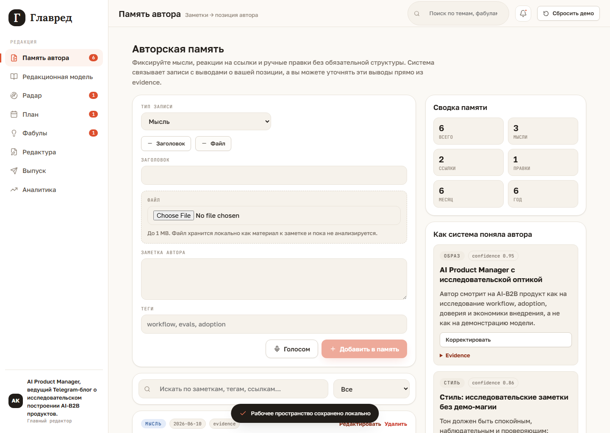
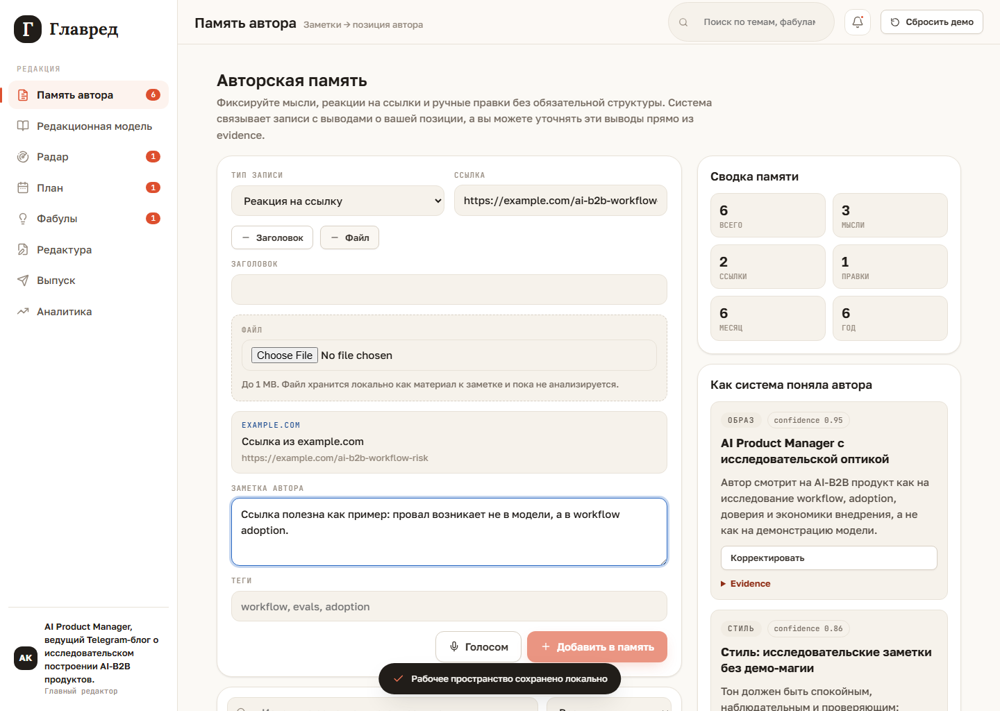
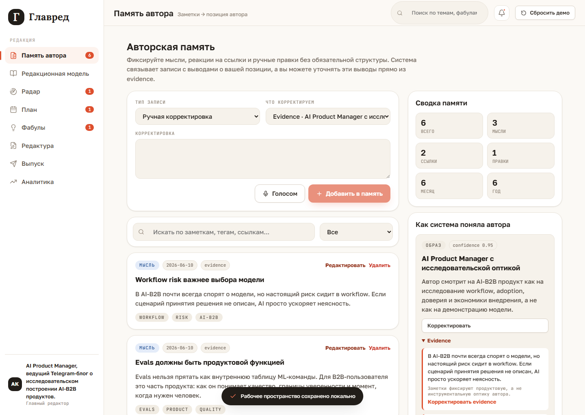

# Память автора

`Память автора` - главный вход в продукт. Здесь автор фиксирует поток мыслей,
реакции на ссылки, локальные материалы и ручные корректировки того, как система его
поняла.

## Быстро добавить мысль

Для обычной мысли достаточно выбрать тип `Мысль`, написать текст и нажать
`Добавить в память`. Заголовок не обязателен: если он не задан, интерфейс показывает
автозаголовок из начала заметки.

Кнопки `+ Заголовок` и `+ Файл` раскрывают дополнительные поля только когда они
нужны.

## Реакция на ссылку

Для ссылки выберите `Реакция на ссылку`, вставьте URL и добавьте свою мысль. Preview
строится локально в браузере: система показывает домен, нормализованный URL и
fallback-title. OpenGraph-метаданные пока не загружаются.

## Корректировка выводов

В правой панели `Как система поняла автора` каждая карточка вывода и каждый evidence
имеют действие `Корректировать`. При клике форма переключается в режим ручной
корректировки и подставляет конкретный target.

Если корректировка явно спорит с текущим evidence, интерфейс показывает HITL-выбор:
`Смержить`, `Заменить вывод` или `Откатить корректировку`.

## Управление лентой

Над лентой есть поиск и фильтр по типам: все, мысли, ссылки, правки. Длинные заметки
сворачиваются, а большая лента открывается постепенно через `Показать еще`.

У каждой заметки есть действия `Редактировать` и `Удалить`. Если заметка участвует в
evidence, удаление требует подтверждения, чтобы автор понимал, что это влияет на
выводы системы.

## Что важно помнить

- Файлы хранятся локально в demo-режиме и пока не анализируются.
- Голосовой ввод работает только если браузер поддерживает Speech Recognition.
- Все выводы deterministic: реальная AI-классификация будет подключаться позже.
