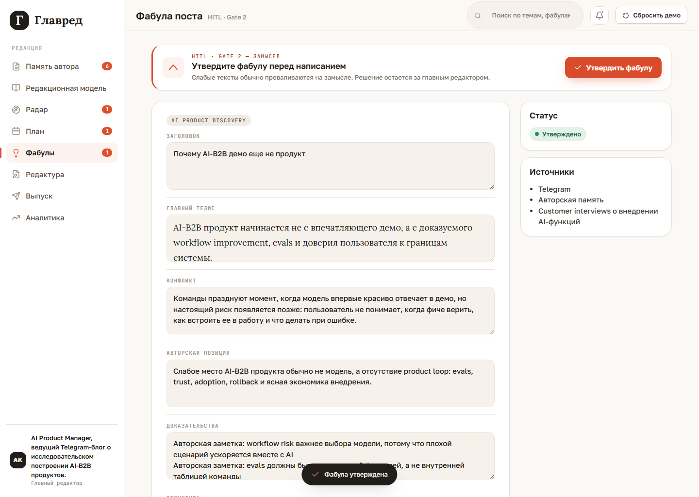

# Production flow

Production flow начинается после авторской памяти. В текущем demo он показывает, как
сигнал превращается в инсайт, элемент плана, редакционный пост, утвержденный текст,
визуальное решение и состояние готовности к выпуску.

Рабочая цепочка:

`Сигналы -> Кандидаты постов -> Инсайт -> Сетка вещания -> Редактура -> Фабула -> Драфт -> Визуал -> Готов к выпуску`

Note: this page documents the current local-first demo flow. `Сигналы` is implemented
as a radar, signal-review, and first post-candidate workspace. `Кандидаты постов`
creates deterministic review cards from approved signals with filtering, search,
grouping, edit/reject, and approve actions; the current grid remains a working
prototype for slot approval and downstream production.

Slice 1.8.1 note: `План` now follows the same cabinet list pattern as review queues.
Filters/search and `Список / Группы` sit above slots, expanded slots keep candidate
context visible, and `Настройка сетки` uses a clickable mini-calendar for selecting
explicit publish slots before rebuilding.

Slice 1.8.2 note: the same filter toolbar now also has `Календарь`. It reuses the
week/month/quarter period from grid settings, shows candidate counts on publish dates,
and opens the same broadcast slot rows below the clicked date.

## Сигналы

В `Сигналы` пользователь видит радары, найденные сигналы и `Кандидаты постов`. В демо
это материал из памяти автора, архива, внешних источников и ручного исследования про
AI-B2B adoption, evals, trust loop и rollout.

Сигнал можно утвердить, отредактировать, отправить в архив или отклонить. Только
утвержденный сигнал попадает в candidate assembly.

В `Кандидаты постов` Glavred показывает 2-3 deterministic сборки: сигнал, тема, фабула,
аудитория, ценность, цель, платформа, confidence и risks. Пользователь может
фильтровать, искать, группировать, редактировать или отклонять кандидатов, затем
утверждает один кандидат; он становится текущим концептом для `Собрать инсайт`.

Кнопка `Собрать инсайт` создает deterministic insight card из утвержденного кандидата:
почему это важно, для кого релевантно, где позиция автора и какие риски или фактические
gaps видны.

## План

Из инсайта создается гибридная сетка вещания: `Настройка сетки` задает период, темп,
дни/время публикаций, платформу, лимиты кандидатов и политику выбора сигналов, а
deterministic planning заполняет publish-window slots темой и фабулой. Gate 1 остается
человеческим: пользователь раскрывает конкретный слот и явно нажимает `Утвердить`.

Правая панель `Сетка вещания` показывает распределение тем/фабул и advisory warnings,
если ручная сетка выходит за declared weights или нарушает матрицу совместимости. Она
также разделяет доступных кандидатов и утвержденные концепты, чтобы показать
дефицит/профицит для выбранной сетки.

## Фабула

После утверждения слота система готовит `PostBrief`: тезис, конфликт, позицию автора,
evidence, примеры, структуру, CTA, источники и риски.

Gate 2 останавливает flow на утвержденной фабуле. Это важно: система может
предложить режиссуру поста, но автор утверждает ее сам.

Slice 1.9 note: approved plan slots now enter `Редактура` as an editorial work queue.
The selected-post workbench sits below the queue and owns production work for the
chosen post.

Slice 1.10 note: approving a plan slot now creates or updates the editorial work item
and prepares the initial post brief immediately. `Редактура` is split into `Посты`
and `Рабочий стол`: use `Посты` for queue review and `К рабочему столу`, then edit the
selected post inside the workbench.

Slice 1.10.4 note: the `Фабула` stage shows read-only candidate/slot context and lets
the author edit the `PostBrief` fields before approval. Editing an already approved
fabula invalidates stale draft, checks, final text, release, and learning artifacts,
then returns the selected post to `Фабула`.

Slice 1.10.5-1.10.7 note: `Финал` is no longer the target user-facing stage. Text is
edited and approved in `Драфт`; after text approval the post moves to `Визуал`.
Visual modes follow `Бриф -> Подготовить варианты -> Выбрать -> Утвердить визуал`;
`Мем + генерация` splits the middle step into `Подготовить мемы -> Выбрать мем ->
Сгенерировать кастом -> Выбрать`; `без визуала` remains the only direct shortcut.
The post becomes `готов к выпуску` only when text is approved and the visual is
approved or explicitly skipped.

Slice 1.11 note: `Выпуск` is a publication log, not a preparation workbench. It records
ready posts, publication attempts, statuses, external links, platform errors, and
retry notes. Until platform integrations exist, manual export remains compatibility
behavior.

Slice 2.6 note: draft generation is visible and auditable through a queued `DraftRun`.
After fabula approval, `Драфт` shows queued/running progress until the worker finishes.
`POST /api/draft-runs` receives the approved brief plus a read-only `draftContext`
snapshot of the selected post: plan slot, candidate when available, source signal,
topic, fabula, publisher rules, and author-position evidence. Use
`/api/draft-runs/{id}` to inspect the context summary and `sourceLedger` in the
`context` step, `SourceIntent` plus `ResearchPlan` in `sourceIntent`, the quality gate
in `feasibility`, the locked `PostContract`, the compiled `RulePack` plus
`ruleRegistrySnapshot`, `MaterialPlan`, `DraftStrategy`, `RhetoricalPlans`, draft
candidates and deterministic selection, final draft, and safe errors.
Planning and candidate provider calls link child `AiRun` ids for prompt/provider
traces.

Post-2.10 quality note: the drafting work is not a generic validator loop. Glavred
creates a `SourceLedger` inside `steps[0].artifactPayload.sourceLedger`, then runs
`feasibility` and `postContract` before rule-pack/planning/draft generation. A
quality-blocked run is a valid outcome: no final draft is produced, and the editor sees
the reason plus a trace link. Only after SourceLedger, FeasibilityReport, and
PostContract exist can validators and directed revisions judge whether a candidate
draft is truly acceptable.

Post-2.11 rule note: the `rulePack` artifact now also contains
`ruleRegistrySnapshot`. This registry gives future validators stable rule ids,
severity, scope, observable criteria, validator type, and repair policy. The visible
editor flow is unchanged; the new artifact is inspected through `/ai-runs?runId=...`
or `GET /api/draft-runs/{id}`.

Post-2.11.1 size note: publication length is a contract layer. Plan settings own
editable publication size profiles, plan slots may lock a profile, and fabulas own
only scale intent. The final range is resolved in `PostContract` and exposed to
`RuleRegistrySnapshot`. The backend resolves these inputs into
`PostContract.publicationSizeContract`, and the rule registry emits deterministic
rules for hard max length, target range, paragraph/section range, and density.
Candidates do not get `format` or size fields, and fabulas are not duplicated per
platform.

Post-2.12 rhetorical planning note: candidates now execute explicit rhetorical plans.
`steps[7].artifactPayload.rhetoricalPlanSet` contains 2-3 routes with moves, claims to
use, claims to avoid, CTA route, size intent, risks, and rationale. `steps[8]` contains
draft candidates, and each candidate references the `rhetoricalPlanId` it executed.

Post-2.12.3 source intent note: the approved `Фабула` now has `Источники и
исследовательские поручения`. These lines are not dumped into one prompt and are not
sent directly as search keywords. URLs, named sources, plain requests such as "нужно
мнение лидеров мнений по этой теме", proof checks, framing hints, and exclusions
become `SourceIntent`, then a local `ResearchPlan`. Public evidence extraction,
enriched `SourceLedger`, and `EvidenceSynthesis` remain the next backend layer.

## Ограничения текущего demo

- Инсайт, план и фабула создаются deterministic-сервисами.
- Реального мониторинга источников пока нет.
- Реальных AI-вызовов пока нет.
- Редакционная модель уже использует manual validator cards: после `Проверить`
  видны score, red/yellow/green status, evidence и suggested fixes для авторской
  позиции, anti-AI стиля, ценности аудитории, целей и матрицы тем/фабул.
