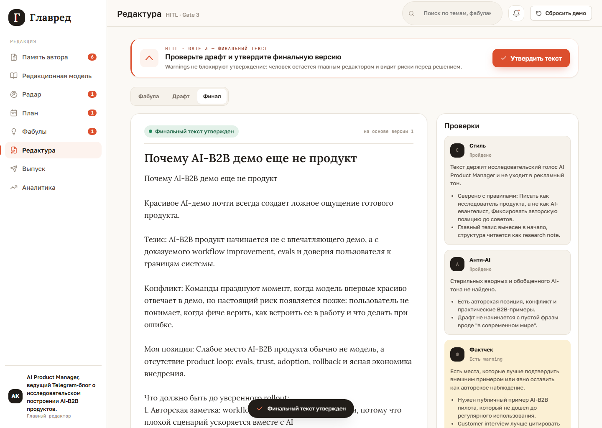
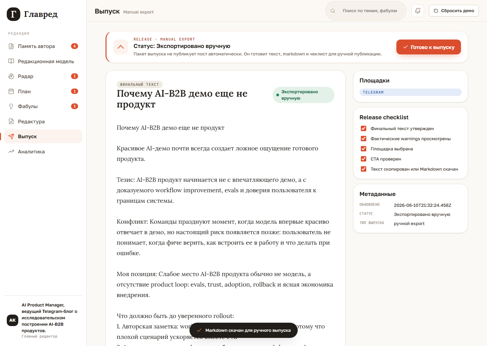
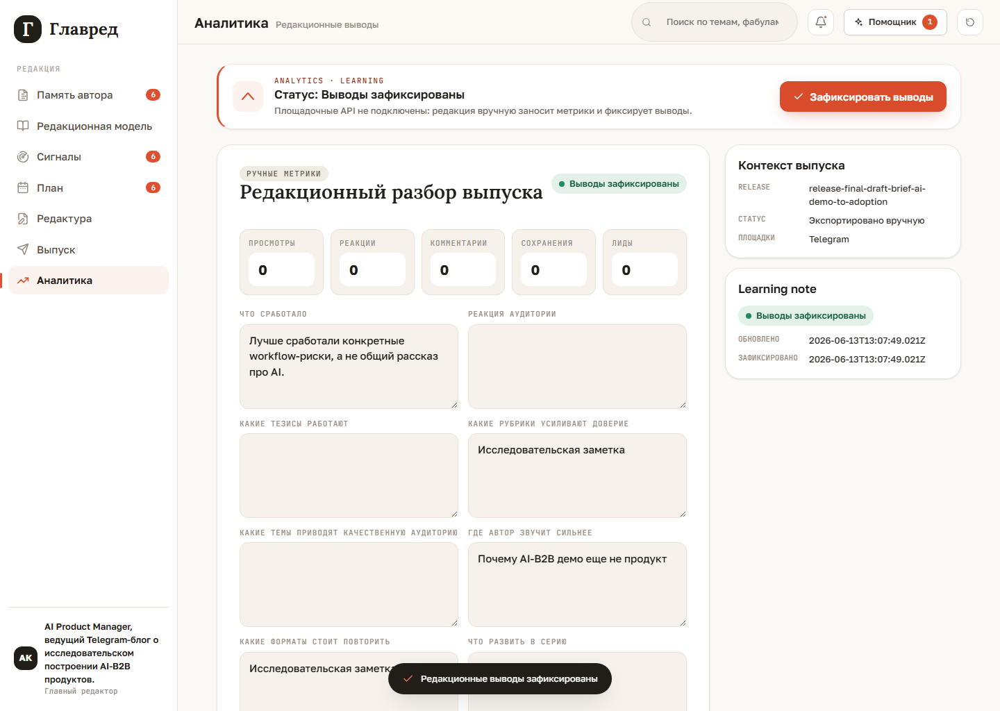

# Выпуск и аналитика

После утвержденной фабулы пользователь проходит редакционную подготовку внутри
`Редактура`: драфт, утверждение текста, визуальное решение и состояние
`готов к выпуску`. `Выпуск` не является редактором и не готовит контент; он становится
журналом публикаций и попыток доставки.

## Редактура

В `Редактуре` есть выбранный рабочий пост. Целевая цепочка стадий:

`Фабула -> Драфт -> Визуал -> Готов к выпуску`

После `Утвердить фабулу` Glavred создает backend `DraftRun`, показывает очередь и
текущий шаг в `Драфт`, а затем применяет завершенный deterministic-драфт к выбранному
посту. Старый синхронный `/api/drafts/generate` остается compatibility fallback.

Slice 2.6 adds the full `draftContext` snapshot and compiled `RulePack` to this run.
The backend trace now
shows which work item, plan slot, candidate when available, signal, topic, fabula,
publisher rules, and author-position evidence were used to build the draft context.
`steps[1].artifactPayload` shows the explicit hard/soft constraints, evidence,
dramaturgy, topic-fit, forbidden moves, and quality rubric that later planning and
generation steps must consume. The backend still does not own workspace persistence;
React sends the selected-post snapshot with the run request.

Slice 2.7 adds planning artifacts to the same trace. `steps[2].artifactPayload`
contains `MaterialPlan`; `steps[3].artifactPayload` contains `DraftStrategy`. Each
planning step links to a child `AiRun` with the OpenRouter prompt/response trace or
deterministic fallback record.

Slice 2.8 changes the `draft` step from one deterministic draft into a branching
candidate generation step. `steps[4].artifactPayload` contains deterministic
directions, 2-3 draft candidates, child `AiRun` ids, and a deterministic v1 selection
scorecard. The UI still applies one selected draft; alternative candidates are
available through trace/debug until a future review UI exists.

Slice 2.10 adds feasibility and post-contract artifacts after `SourceLedger`. The
runner can stop before prose when evidence is too weak; that blocked state is a
quality outcome, not a release failure. `PostContract` now locks the approved thesis,
audience value, CTA, platform constraints, allowed claims, forbidden moves, and fabula
obligations. Validator reports and directed revision should consume those artifacts
instead of judging generated text in isolation.

The `Фабула` stage also displays read-only candidate and slot context. The author edits
only the `PostBrief` production artifact there. If an approved fabula is edited,
Glavred clears stale draft, checks, final text, release, and learning artifacts before
the updated fabula is approved again.

Редакторский pipeline показывает четыре проверки:

- стиль;
- anti-AI;
- fact-check;
- policy.

Автор может вручную изменить драфт и утверждает текст прямо в `Драфт`. Отдельная
закладка `Финал` больше не нужна как пользовательский шаг; `FinalText` остается только
compatibility-артефактом до отдельного domain cleanup.

После утверждения текста пользователь переходит к `Визуал`. Это локальный
review-flow: пользователь выбирает `Сгенерировать`, `Найти мем`, `Мем + генерация`
или `Без визуала`. `Сгенерировать` и `Найти мем` используют одно поле `Бриф`,
затем `Подготовить варианты`, выбор одного placeholder-варианта и `Утвердить
визуал`. `Мем + генерация` работает в два шага: `Подготовить мемы`, `Выбрать мем`,
`Сгенерировать кастом`, выбрать финальный remix-вариант и только затем утвердить
визуал. Режим `Без визуала` не требует дополнительных полей или вариантов. Реальная
генерация, интернет-поиск мемов и hybrid image transformation остаются будущими
adapter slices. Только после утвержденного текста и визуального решения пост
становится `готов к выпуску`.

## Выпуск

`Выпуск` не редактирует текст, визуал, фабулу или candidate context. Его целевая роль:
журнал готовых и опубликованных постов.

В release log фиксируются:

- готовый пост (`ReadyPost`);
- попытка публикации (`PublicationLogEntry`);
- площадка;
- статус доставки;
- внешняя ссылка или id публикации;
- ошибка платформы или adapter error;
- retry notes.

До появления platform integrations раздел может оставаться пустым release log или
показывать compatibility/manual-export surface. Этот compatibility surface не должен
снова становиться редакционным workbench.

## Аналитика

`Аналитика` открывается после publication log entry или compatibility manual export.
Здесь нет real-time dashboard и автоматического сбора метрик: пользователь вводит
показатели вручную и фиксирует редакционные выводы.

Learning note нужен не для красивой отчетности, а для следующего редакционного цикла:
что сработало, какие тезисы цепляют аудиторию, где автор звучит сильнее, что развить
в серию.

