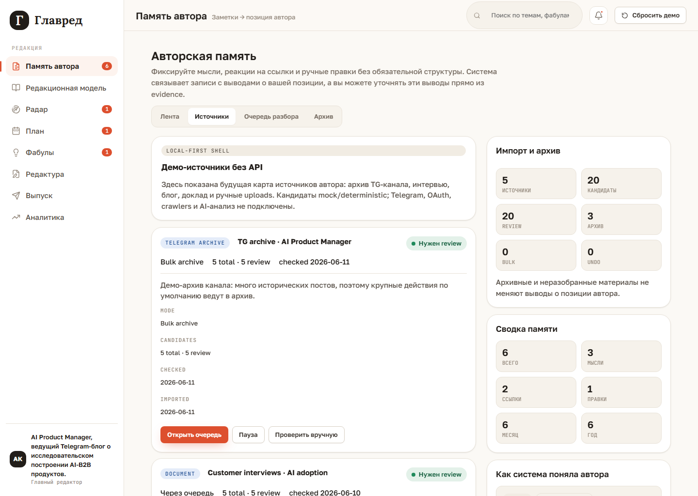
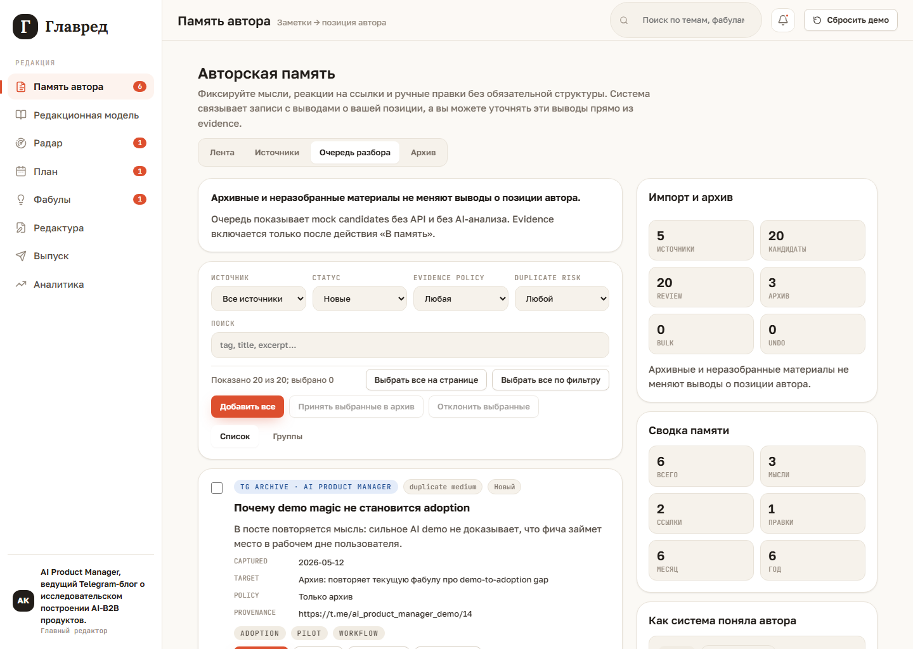

# External Sources

External sources are visible as a local-first UI shell inside `Память автора`.

This layer is intentionally not a real integration. It uses a demo source list and deterministic mock candidates for the AI Product Manager example. Telegram API, OAuth, crawlers, backend workers, scheduled ingestion, document parsing, and AI analysis are not connected.

## Internal Tabs

`Память автора` has four internal tabs:

- `Лента`: manual thoughts, links, files, and corrections.
- `Источники`: demo source list with expandable rows.
- `Очередь разбора`: imported mock candidates that need review.
- `Архив`: accepted historical material with provenance.

The right panel keeps the memory summary, `Как система поняла автора`, and import summary. The key rule is explicit in the UI: archive-only and unreviewed materials do not change author-position assertions.

## Demo Sources

The seeded AI Product Manager demo includes:

- `TG archive · AI Product Manager`;
- `Customer interviews · AI adoption`;
- `Blog essays · Evals and trust`;
- `Talk notes · Confidence boundaries`;
- `Manual research uploads`.

Each source row shows type, status, import mode, candidate count, and last checked date. Expanding a row shows import details and author notes. Actions are local/mock only: open queue, pause/resume, and manual check.

## Review Queue

Candidates show title, excerpt, source, captured date, detected tags, duplicate risk, suggested target, provenance, and evidence policy.

Individual actions:

- `В память`: creates an `AuthorNote` and can affect future author-position inference.
- `В архив`: creates an `ArchiveRecord`, not an `AuthorNote`.
- `Отклонить`: marks the candidate rejected.
- `Не evidence`: keeps the item out of evidence.

## Bulk Actions

The queue supports large-archive work:

- checkbox per candidate;
- `Выбрать все на странице`, which switches to `Снять выделение со страницы`;
- `Выбрать все по фильтру`, which switches to `Снять выделение по фильтру`;
- `Сбросить выделение`;
- `Добавить все`;
- `Принять выбранные в архив`;
- `Отклонить выбранные`;
- latest bulk action undo.

Before a bulk action, Glavred shows a confirmation panel with item count, active filters, high duplicate-risk count, destination, and evidence impact. The default destination for large batches is archive, not active memory.

## Archive

Archive records keep source, title, excerpt, original date, accepted date, acceptance mode, and evidence policy.

Archive records are actionable:

- `Добавить в память` turns a specific archive record into an active `AuthorNote`.
- `Вернуть в очередь` sends the record back to review as a candidate.
- `Не evidence` keeps it out of evidence.
- `Открыть источник` opens the original URL when available.
- `Удалить из архива` removes the local archive record.

The queue status filters `Принятые из очереди` and `Bulk archive из очереди` show candidates that were processed from the queue. The `Архив` tab can also contain seeded or historical records that never existed as queue candidates, so the two views are not expected to be identical.

Archive records are useful context for future search, uniqueness, and evidence review, but they do not rewrite `Как система поняла автора` until a specific item is accepted into active memory.
