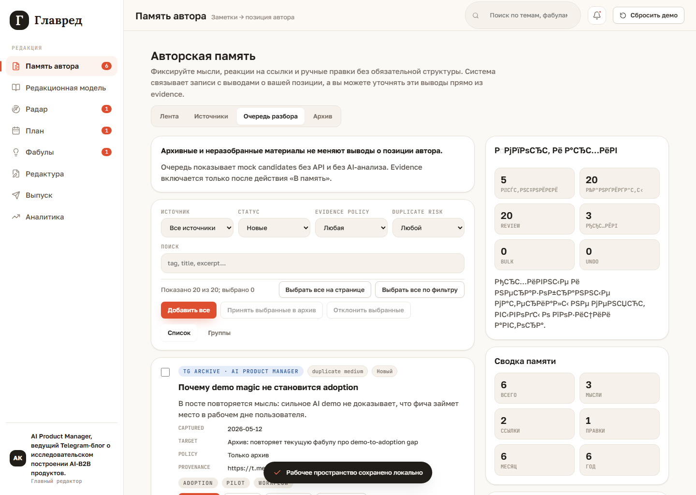

# External sources

External sources are now visible as a local-first UI shell inside `Память автора`.

The current layer is intentionally not a real integration. It uses demo source cards
and deterministic mock candidates for the AI Product Manager example. Telegram API,
OAuth, crawlers, backend workers, scheduled ingestion, document parsing, and AI
analysis are not connected.

## Internal tabs

`Память автора` now has four internal tabs:

- `Лента`: manual thoughts, links, files, and corrections.
- `Источники`: demo source cards.
- `Очередь разбора`: imported mock candidates that need review.
- `Архив`: accepted historical material with provenance.

The right panel keeps the memory summary and `Как система поняла автора`, plus an
import summary. The key rule is shown in the UI: archive-only and unreviewed materials
do not change author-position assertions.

## Demo sources

The seeded AI Product Manager demo includes:

- `TG archive · AI Product Manager`;
- `Customer interviews · AI adoption`;
- `Blog essays · Evals and trust`;
- `Talk notes · Confidence boundaries`;
- `Manual research uploads`.

Each source card shows type, status, import mode, candidate count, last checked/imported
date, and author notes. Actions are local/mock only: open queue, pause/resume, and
manual check.

## Review queue

Candidates show:

- title and excerpt;
- source and captured date;
- detected tags;
- duplicate risk;
- suggested target;
- provenance;
- evidence policy.

Individual actions:

- `В память`: creates an `AuthorNote` and can affect future author-position inference.
- `В архив`: creates an `ArchiveRecord`, not an `AuthorNote`.
- `Отклонить`: marks the candidate rejected.
- `Не evidence`: keeps the item out of evidence.

## Bulk actions

The queue supports large-archive work:

- checkbox per candidate;
- `Выбрать все на странице`;
- `Выбрать все по фильтру`;
- `Добавить все`;
- `Принять выбранные в архив`;
- `Отклонить выбранные`;
- latest bulk action undo.

Before a bulk action, Glavred shows a confirmation panel with item count, active
filters, high duplicate-risk count, destination, and evidence impact. The default
destination for large batches is archive, not active memory.

## Archive

Archive records keep source, title, excerpt, original date, accepted date, acceptance
mode, and evidence policy.

Archive records are useful context for future search, uniqueness, and evidence review,
but they do not rewrite `Как система поняла автора` until a specific item is accepted
into active memory.
