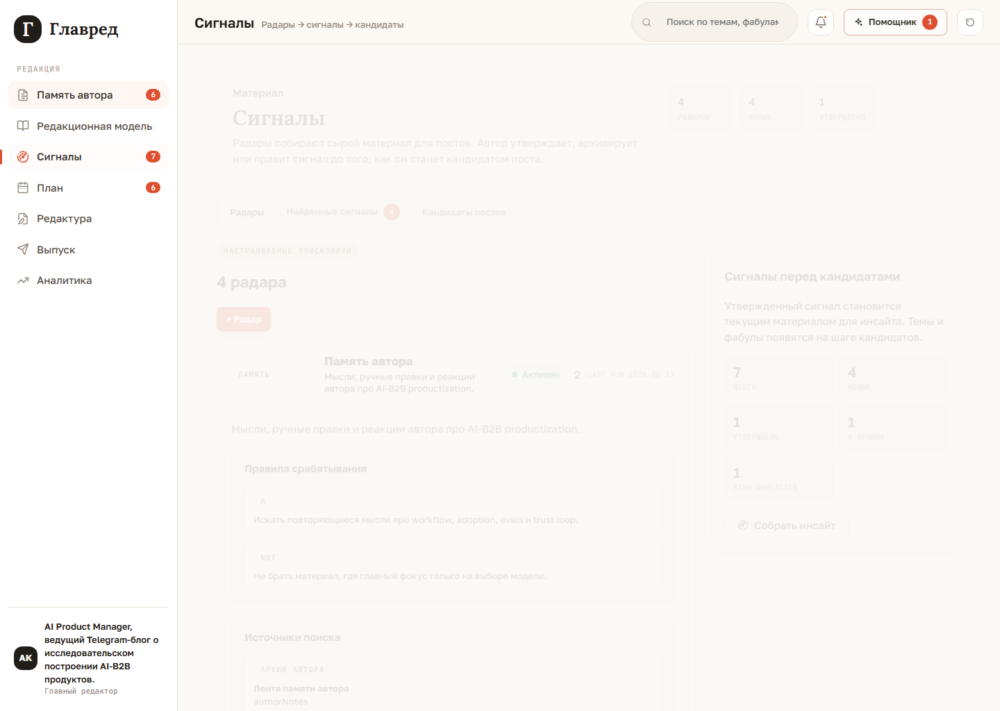
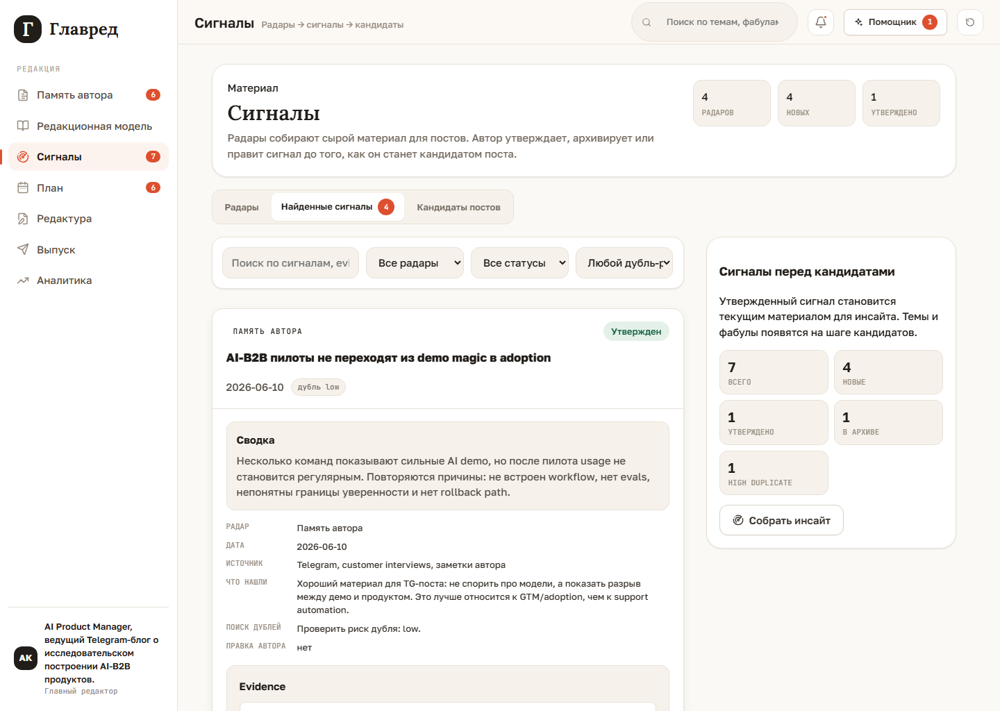

# Signals

`Сигналы` is the local-first workspace between author memory/archive/source material and approved post concepts.

## Radars

Radars are configurable search procedures. Each radar row is a framed cabinet card: rules, sources, settings, metadata, and actions belong to the same visible entity.

## Found Signals

Found signals are raw material. They do not own topic/fabula/audience/value matching; that starts in `Кандидаты постов`.
Expanded signals now show deterministic editorial filter evaluations from the source
radar. These evaluations explain whether a signal passed, needs attention, was
filtered out, or intentionally creates tension with the author's position. Filtered
signals remain visible for human review.

## Post Candidates

`Кандидаты постов` assembles 2-3 deterministic concepts only from approved source
signals. Each card shows the source signal, topic, fabula, audience, value, goal,
platform, confidence, evidence summary, and risks.

The tab follows the same cabinet-list pattern as `Память автора -> Очередь разбора`:
filter card, full-width search, list/group toggle, framed rows, and bottom-left row
actions. The author can edit candidate fields inline, reject weak candidates, or
approve one candidate. Approval saves the selected `PostCandidate`, switches the
current source signal to the candidate's signal, clears stale downstream artifacts,
and makes `Собрать инсайт` use the candidate title, thesis, value, topic, fabula, and
risks.

Candidate editing shows the source signal and proposed topic as readonly context. The
fabula can be changed; incompatible topic/fabula choices show a warning. Candidate
format is intentionally absent because fabula is the editorial shape and broadcast
formats are owned by the plan layer.

Request-more variants, bulk actions, and direct calendar binding are future candidate
controls.

## Radar Filters

Radar setup separates:

- trigger rules;
- search sources;
- source discovery mode;
- editorial filters for author, audience, positioning, goals, forbidden topics, and topics.

Style is not a radar filter. It belongs to draft editing and editorial checks.

## UX Rule

Rows must stay framed, chips must not wrap by letters, and expanded details must remain inside the same entity card.
The workspace also keeps an explicit section header above tabs, separated action
footers, and measured visual guardrails for spacing, edit forms, and main/side column
overlap.
Large entity lists must use `filter card -> search -> list/group toggle -> framed rows
-> bottom-left actions`; candidates and import queue now share that rule.
The section header follows the same cabinet pattern as `Редакционная модель`; tab
counters use the shared red badge style instead of being appended as plain text.

Slice 1.5.5 adds the shared action taxonomy: `+ Radar` is a normal white work button,
while red buttons are reserved for validation, approval, save/commit, and HITL
lifecycle steps. Newly added radars keep a visible last-run fallback so metadata rows
do not shift.
