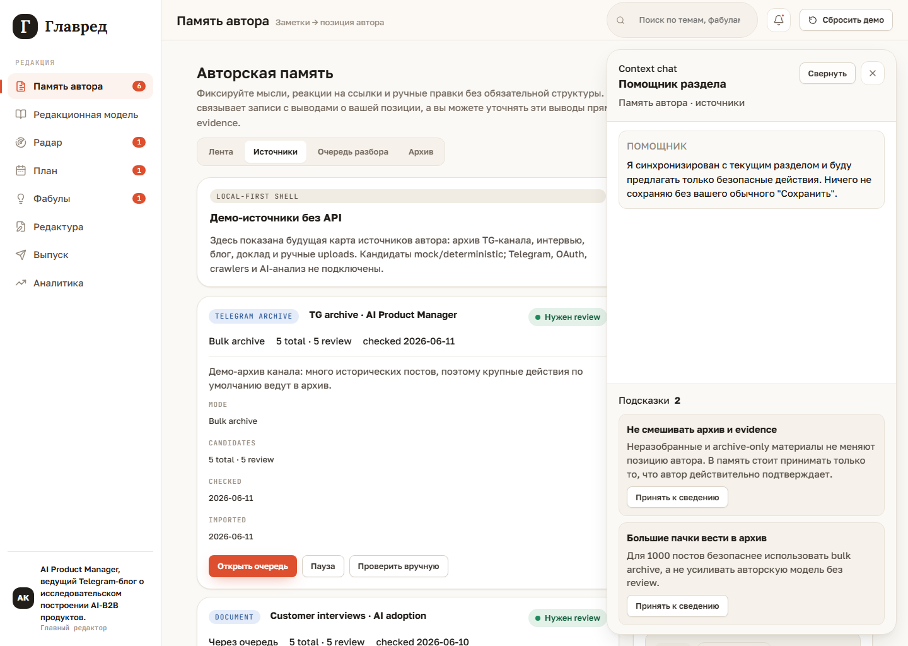

# Glavred Wiki

Glavred is a local-first editorial cabinet for an expert author. The current product shows a full demo loop: the author captures thoughts, the system builds an evidence-backed author position, and that position is used in post production, release, and analytics.

Permanent demo context: a Telegram blog by an AI Product Manager sharing research experience in building AI-B2B products.

## What You Can See

- [Author Memory](01-author-memory): internal feed for thoughts, links, files, and corrections.
- [Production Flow](02-production-flow): path from radar to approved post brief.
- [Release and Analytics](03-release-and-analytics): manual export and learning note.
- [Local-First Demo](04-local-first-demo): launch, reset, localStorage, and screenshot refresh.
- [External Sources](05-external-sources): local source list, review queue, bulk import, and archive-safe `Добавить все`.

## Context Chat

The `Помощник` control opens a collapsible context chat overlay. It is synchronized with
the current section and gives deterministic suggestions for the AI Product Manager demo.
It can open draft forms for rules, topics, and fabulas, but it does not save changes
without the normal `Сохранить` action.

## Core Idea

Glavred should not turn the author into a generic content generator. The central layer is author memory: thoughts, reactions, corrections, and published materials. From that material, the product builds a transparent model of the author's position.

The runtime remains deterministic and local-first for now. There are no real AI provider calls, backend, autoposting, or real metrics ingestion yet.
