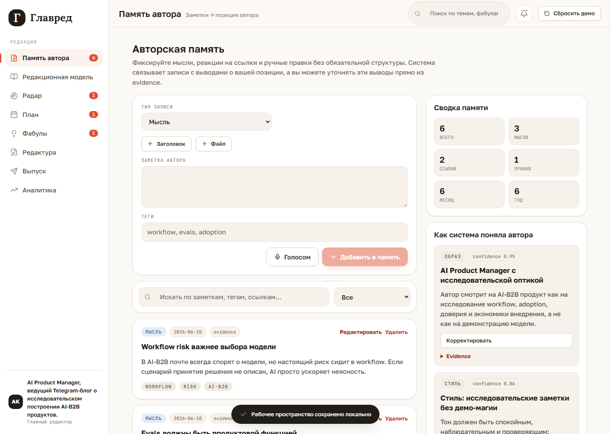

# Glavred Wiki

Glavred - локальный редакционный кабинет для экспертного автора. Сейчас продукт
показывает полный демо-цикл: автор фиксирует мысли, система собирает evidence-backed
позицию, затем эта позиция используется в производстве поста, выпуске и аналитике.

Постоянный демо-контекст: Telegram-блог AI Product Manager, который делится
исследовательским опытом построения AI-B2B-продуктов.

## Что уже можно увидеть

- [Память автора](01-author-memory): внутренняя лента мыслей, ссылок, файлов и
  корректировок.
- [Production flow](02-production-flow): путь от радара до утвержденной фабулы поста.
- [Выпуск и аналитика](03-release-and-analytics): ручной export и learning note.
- [Local-first demo](04-local-first-demo): запуск, reset и пересъемка скриншотов.

## Главная идея

Glavred не должен превращать автора в генератор generic-контента. Центральный слой -
это авторская память: мысли, реакции, правки и опубликованные материалы. Из них
собирается прозрачная модель авторской позиции, а production pipeline должен работать
с этой позицией как с ограничением и источником доказательств.

Текущий runtime остается deterministic и local-first: реальных AI provider calls,
backend, автопостинга и real metrics ingestion пока нет.
